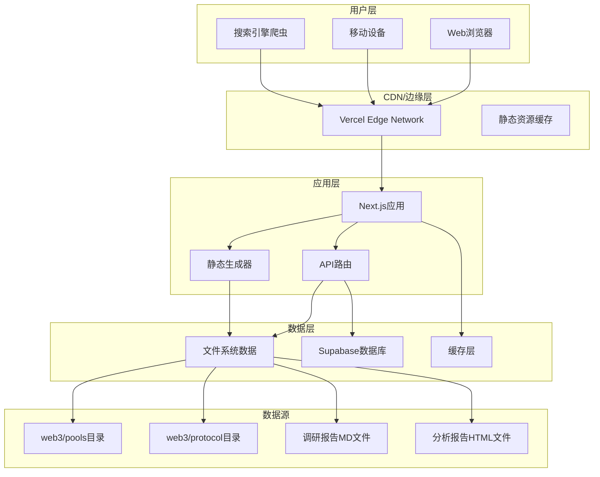
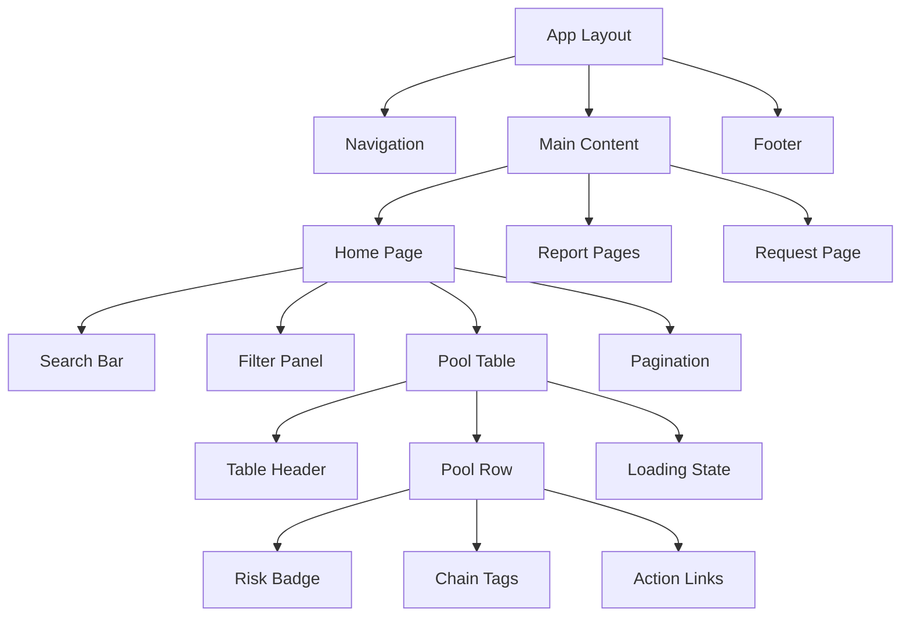
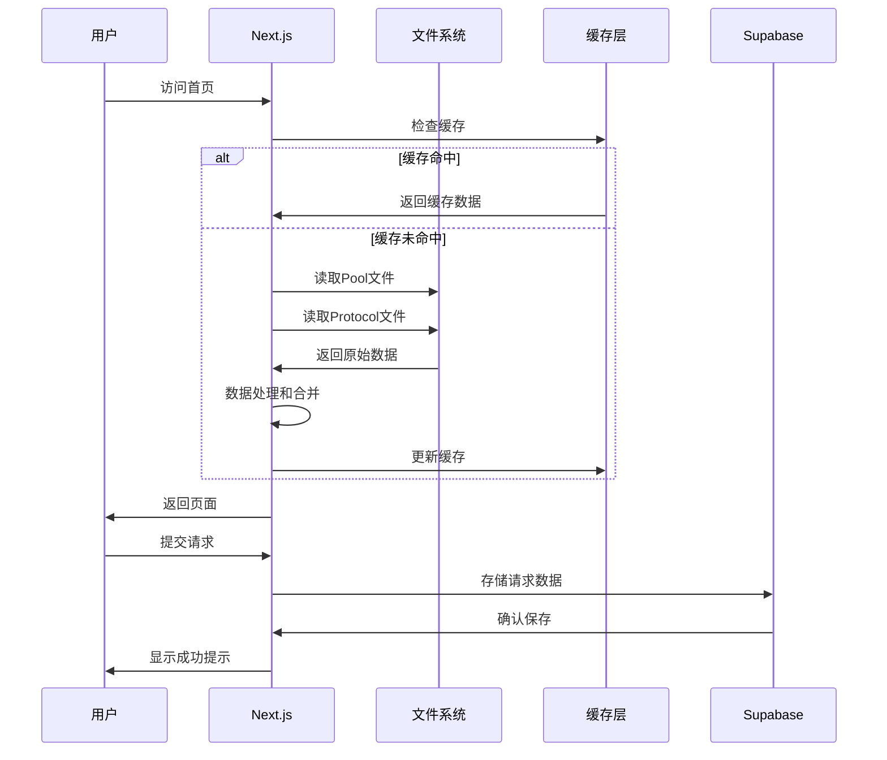
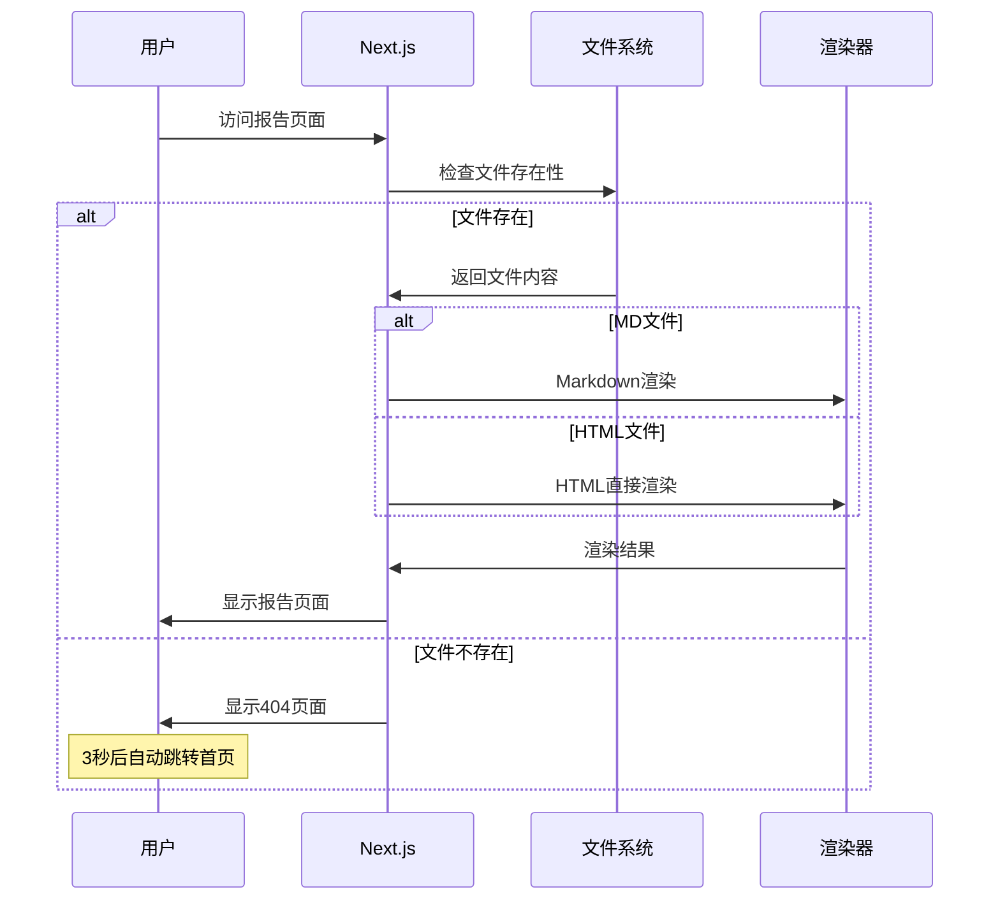
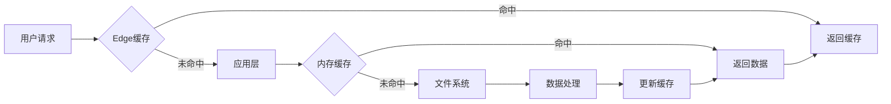

# DeFi收益池聚合信息网站系统 - 项目概述和系统架构

## 版本信息
- **文档版本**: v1.0.0
- **创建日期**: 2025-01-23
- **更新日期**: 2025-01-23
- **设计者**: Claude AI Assistant
- **审核状态**: 设计阶段

## 1. 项目概述

### 1.1 项目背景

DeFi收益池聚合信息网站系统是一个专门为Web3领域DeFi玩家设计的一站式收益策略信息平台。该系统基于现有的Web3 Farm Dashboard架构，继承了其优秀的数据处理逻辑和三层文档架构设计，同时面向更广泛的用户群体提供Web访问服务。

### 1.2 目标用户

- **主要用户**: Web3领域的DeFi投资者和策略研究者
- **次要用户**: 区块链研究机构、DeFi协议开发者
- **潜在用户**: 对DeFi收益感兴趣的传统金融从业人员

### 1.3 核心价值主张

1. **信息聚合**: 集中展示各类DeFi收益池的关键信息
2. **专业分析**: 提供深度调研报告和风险评估
3. **智能过滤**: 支持多维度筛选和个性化需求匹配
4. **实时更新**: 基于文件系统的自动更新机制
5. **易于访问**: 无需安装，通过浏览器即可访问

### 1.4 功能概览

```mermaid
mindmap
  root((DeFi聚合平台))
    数据展示
      收益池列表
      协议信息
      风险评级
      收益范围
    报告系统
      调研报告(MD) - 表格渲染优化
      分析报告(HTML) - 直接跳转，完整交互
      双格式支持，用户体验优先
    交互功能
      智能搜索
      多维过滤
      分页浏览
      提交请求
    SEO优化
      静态生成
      搜索引擎友好
      社交媒体分享
```

## 2. 系统架构设计

### 2.1 架构原则

1. **继承性**: 完全兼容现有Web3 Farm Dashboard的数据结构和处理逻辑
2. **扩展性**: 支持新收益池和协议的动态添加
3. **性能优先**: 多层缓存和静态生成确保快速加载
4. **SEO友好**: 静态资源和服务端渲染优化搜索引擎收录
5. **部署灵活**: 支持多种部署方式，适应不同环境需求

### 2.2 整体架构图



### 2.3 技术栈选择

#### 前端技术栈
- **框架**: Next.js 14 (App Router)
- **语言**: TypeScript
- **样式**: Tailwind CSS + Shadcn/ui
- **状态管理**: React Context + useState
- **数据获取**: Next.js内置数据获取

#### 后端技术栈
- **运行时**: Node.js 18+
- **数据库**: Supabase (PostgreSQL)
- **文件处理**: Node.js fs模块 + gray-matter
- **缓存**: 内存缓存 + Vercel缓存

#### 部署技术栈
- **主要平台**: Vercel (推荐)
- **备选平台**: 自有服务器 (Nginx + PM2)
- **容器化**: Docker (可选)
- **监控**: Vercel Analytics

### 2.4 数据架构设计

#### 2.4.1 三层数据架构

基于现有Web3 Farm Dashboard的成熟架构：

```
第一层: Protocol Layer (协议层)
├── 基础信息: 官网、简称、描述
├── 调研报告: 链接到research目录
└── 稳定性: 变更频率低，主要用于引用

第二层: Pool Layer (收益池层)  
├── 技术参数: APR范围、风险等级、Token类型
├── 协议关联: 强制链接到Protocol文档
└── 配置管理: 集中管理投资标的参数

第三层: Request Layer (请求层)
├── 用户请求: 存储在Supabase数据库
├── 状态管理: pending/processing/completed
└── 通知机制: 邮件通知(可选)
```

#### 2.4.2 文件系统映射

```
web3/
├── protocol/                  # 协议基础信息
│   ├── [Protocol Name].md     # 协议元数据
│   └── research/              # 调研报告目录
│       ├── [nickname].md      # Markdown调研报告
│       └── [nickname].html    # HTML分析报告
└── pools/                     # 收益池配置
    ├── cex/                   # 中心化交易所池
    │   └── [CEX Product].md
    └── chain/                 # 链上DeFi协议池
        └── [Protocol Pool].md
```

### 2.5 组件架构设计

#### 2.5.1 页面层级结构

```
pages/
├── /                          # 首页 - 聚合表格
├── /reports/
│   ├── /research/[nickname]   # 调研报告页面
│   └── /analysis/[nickname]   # 分析报告页面
├── /request                   # 提交请求页面
└── /404                       # 404错误页面
```

#### 2.5.2 组件层次架构



### 2.6 数据流设计

#### 2.6.1 数据加载流程



#### 2.6.2 报告渲染流程



### 2.7 安全架构设计

#### 2.7.1 安全层次

1. **网络层安全**
   - HTTPS强制加密
   - CDN DDoS防护
   - 请求频率限制

2. **应用层安全**
   - 输入验证和清理
   - XSS防护
   - CSRF保护

3. **数据层安全**
   - Supabase行级安全策略
   - 敏感信息脱敏
   - 数据备份策略

#### 2.7.2 安全策略

```typescript
// 安全配置示例
const securityConfig = {
  // 内容安全策略
  contentSecurityPolicy: {
    'default-src': ["'self'"],
    'script-src': ["'self'", "'unsafe-inline'"],
    'style-src': ["'self'", "'unsafe-inline'"],
    'img-src': ["'self'", "data:", "https:"],
  },
  
  // 请求验证
  rateLimit: {
    windowMs: 15 * 60 * 1000, // 15分钟
    max: 100, // 最大100个请求
  },
  
  // 数据验证
  validation: {
    maxRequestSize: '10mb',
    allowedFileTypes: ['.md', '.html'],
  }
};
```

### 2.8 性能架构设计

#### 2.8.1 性能优化策略

1. **静态生成**: 构建时预生成所有可能的页面
2. **增量静态再生成**: 文件变更时触发页面重新生成
3. **边缘缓存**: Vercel Edge Network缓存静态资源
4. **代码拆分**: 按页面和组件进行代码拆分
5. **图片优化**: Next.js Image组件自动优化

#### 2.8.2 缓存策略



### 2.9 扩展性设计

#### 2.9.1 水平扩展能力

1. **无状态设计**: 应用层无状态，支持多实例部署
2. **文件系统解耦**: 通过Git管理数据文件，支持分布式更新
3. **数据库分离**: Supabase提供独立的数据库服务
4. **CDN加速**: 静态资源通过CDN分发

#### 2.9.2 功能扩展点

```typescript
// 扩展接口设计
interface PoolDataProcessor {
  loadPools(): Promise<Pool[]>;
  validatePool(pool: Pool): boolean;
  enrichPoolData(pool: Pool): Promise<Pool>;
}

interface ReportRenderer {
  renderMarkdown(content: string): string;
  renderHTML(content: string): string;
  generateMetadata(content: string): ReportMetadata;
}

interface NotificationService {
  sendEmail(request: UserRequest): Promise<void>;
  sendSlack(message: string): Promise<void>;
  sendWebhook(data: any): Promise<void>;
}
```

## 3. 设计决策记录

### 3.1 关键设计决策

#### 决策1: 选择Next.js而非纯静态网站生成器

**决策**: 使用Next.js 14而不是Gatsby或Hugo等静态网站生成器

**理由**:
- 支持增量静态再生成(ISR)，文件更新时自动重新生成页面
- 内置API路由，支持用户请求提交功能
- 优秀的SEO支持和性能优化
- TypeScript原生支持
- 丰富的生态系统

**权衡**:
- 复杂度相对较高
- 需要Node.js运行时环境
- 但提供了更好的用户体验和功能扩展性

#### 决策2: 继承现有数据架构而非重新设计

**决策**: 完全继承Web3 Farm Dashboard的三层数据架构

**理由**:
- 现有架构经过实战验证，稳定可靠
- 避免数据结构变更的迁移成本
- 保持与现有工具的兼容性
- 减少开发风险

**权衡**:
- 可能存在一定的历史包袱
- 但架构本身设计合理，值得保留

#### 决策3: 采用文件系统而非数据库存储核心数据

**决策**: 继续使用文件系统存储Pool和Protocol数据

**理由**:
- 符合"数据即代码"的理念
- 支持版本控制和协作编辑
- 部署简单，不依赖数据库
- 内容易于迁移和备份

**权衡**:
- 查询性能相对较低
- 但数据量不大，性能可接受

### 3.2 技术选型对比

| 方案 | Next.js | Gatsby | Nuxt.js | 纯静态 |
|------|---------|--------|---------|--------|
| SEO支持 | ⭐⭐⭐⭐⭐ | ⭐⭐⭐⭐⭐ | ⭐⭐⭐⭐⭐ | ⭐⭐⭐⭐ |
| 开发体验 | ⭐⭐⭐⭐⭐ | ⭐⭐⭐⭐ | ⭐⭐⭐⭐ | ⭐⭐ |
| 部署简便 | ⭐⭐⭐⭐⭐ | ⭐⭐⭐⭐ | ⭐⭐⭐ | ⭐⭐⭐⭐⭐ |
| 功能完整 | ⭐⭐⭐⭐⭐ | ⭐⭐⭐ | ⭐⭐⭐⭐ | ⭐⭐ |
| 性能表现 | ⭐⭐⭐⭐⭐ | ⭐⭐⭐⭐⭐ | ⭐⭐⭐⭐ | ⭐⭐⭐⭐⭐ |
| 社区支持 | ⭐⭐⭐⭐⭐ | ⭐⭐⭐⭐ | ⭐⭐⭐⭐ | ⭐⭐ |

**结论**: Next.js在各方面都表现优秀，特别是在开发体验和功能完整性方面领先。

## 4. 风险评估和缓解策略

### 4.1 技术风险

| 风险 | 影响程度 | 概率 | 缓解策略 |
|------|----------|------|----------|
| 文件系统性能瓶颈 | 中 | 低 | 多层缓存+CDN加速 |
| Next.js版本升级兼容性 | 低 | 中 | 版本锁定+渐进升级 |
| Vercel平台依赖 | 中 | 低 | 多平台部署支持 |
| 数据文件损坏 | 高 | 低 | Git版本控制+自动备份 |

### 4.2 业务风险

| 风险 | 影响程度 | 概率 | 缓解策略 |
|------|----------|------|----------|
| 数据更新不及时 | 中 | 中 | 自动化监控+告警 |
| 用户请求处理延迟 | 低 | 中 | Supabase高可用架构 |
| SEO效果不佳 | 中 | 低 | 专业SEO优化策略 |
| 移动端体验问题 | 中 | 低 | 响应式设计+移动优先 |

### 4.3 缓解措施

1. **监控告警**: 实施全面的系统监控和异常告警
2. **备份策略**: 定期备份数据文件和数据库
3. **性能测试**: 定期进行性能测试和优化
4. **用户反馈**: 建立用户反馈机制，及时发现问题

## 5. 质量保证

### 5.1 代码质量

- **TypeScript**: 强类型检查，减少运行时错误
- **ESLint**: 代码风格和质量检查
- **Prettier**: 代码格式化标准
- **单元测试**: Jest + React Testing Library
- **E2E测试**: Playwright自动化测试

### 5.2 性能标准

- **Lighthouse评分**: 90+分
- **首屏加载时间**: <3秒
- **交互响应时间**: <100ms
- **Core Web Vitals**: 全部指标达到Good级别

### 5.3 可访问性标准

- **WCAG 2.1**: AA级合规
- **键盘导航**: 全站支持键盘操作
- **屏幕阅读器**: 兼容主流屏幕阅读器
- **颜色对比度**: 符合标准要求

---

**文档状态**: ✅ 已完成  
**下一步**: 编写技术规范和数据模型文档