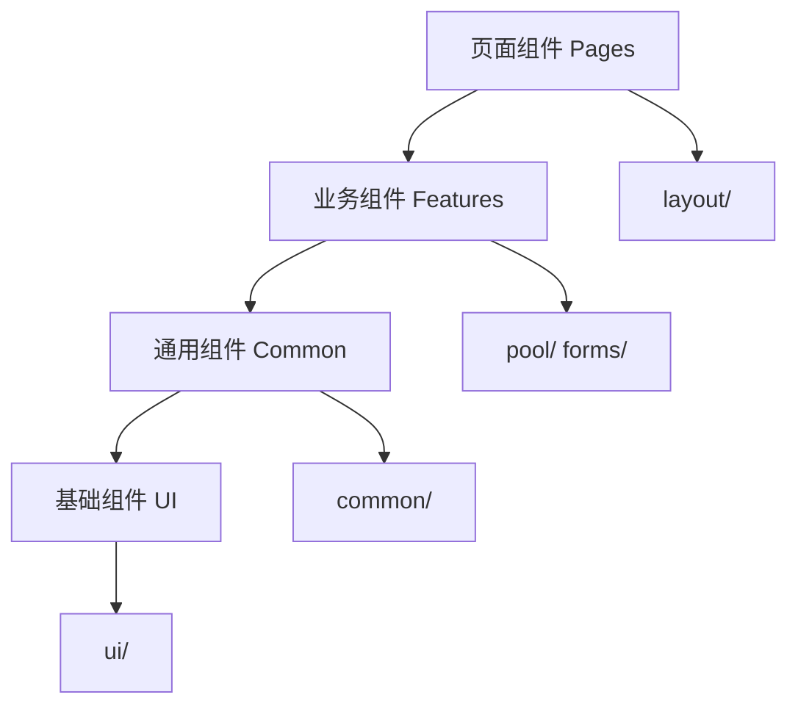

# 组件开发指南

## 📋 概述

本指南提供 DeFi 收益池聚合系统前端组件的开发规范、设计原则和最佳实践，确保组件的一致性、可复用性和可维护性。

## 🏗️ 组件架构

### 目录结构

```
components/
├── ui/                    # 基础 UI 组件
│   ├── badge.tsx         # 标签组件
│   ├── button.tsx        # 按钮组件
│   ├── dialog.tsx        # 弹窗组件
│   ├── input.tsx         # 输入框组件
│   └── table.tsx         # 表格组件
├── layout/               # 布局组件
│   ├── Header.tsx        # 页面头部
│   ├── Footer.tsx        # 页面底部
│   └── Sidebar.tsx       # 侧边栏
├── pool/                 # 收益池相关组件
│   ├── PoolTable.tsx     # 收益池表格
│   ├── PoolDetailDialog.tsx  # 详情弹窗
│   ├── FilterPanel.tsx   # 筛选面板
│   └── SortControl.tsx   # 排序控制
├── common/               # 通用组件
│   ├── SearchBar.tsx     # 搜索栏
│   ├── Pagination.tsx    # 分页组件
│   └── LoadingSpinner.tsx # 加载组件
└── forms/                # 表单组件
    ├── RequestForm.tsx   # 请求提交表单
    └── FormFields.tsx    # 表单字段
```

### 组件分层



## 🎨 设计系统

### 颜色规范

```typescript
// 主色调
const colors = {
  primary: {
    50: '#eff6ff',
    500: '#3b82f6',
    600: '#2563eb',
    700: '#1d4ed8',
  },
  
  // 功能色
  success: '#10b981',
  warning: '#f59e0b', 
  error: '#ef4444',
  info: '#3b82f6',
  
  // 风险等级色
  risk: {
    low: '#10b981',     // 绿色
    medium: '#f59e0b',  // 黄色
    high: '#ef4444',    // 红色
    veryHigh: '#dc2626' // 深红色
  },
  
  // 灰度
  gray: {
    50: '#f9fafb',
    100: '#f3f4f6',
    500: '#6b7280',
    900: '#111827',
  }
};
```

### 间距规范

```typescript
// 基于 4px 的间距系统
const spacing = {
  xs: '0.25rem',  // 4px
  sm: '0.5rem',   // 8px
  md: '1rem',     // 16px
  lg: '1.5rem',   // 24px
  xl: '2rem',     // 32px
  '2xl': '3rem',  // 48px
};
```

### 字体规范

```typescript
const typography = {
  fontSize: {
    xs: '0.75rem',   // 12px
    sm: '0.875rem',  // 14px
    base: '1rem',    // 16px
    lg: '1.125rem',  // 18px
    xl: '1.25rem',   // 20px
    '2xl': '1.5rem', // 24px
  },
  
  fontWeight: {
    normal: '400',
    medium: '500',
    semibold: '600',
    bold: '700',
  },
};
```

## 🧩 基础组件

### Button 组件

**位置**: `components/ui/button.tsx`

```typescript
import React from 'react';
import { cn } from '@/lib/utils';
import { VariantProps, cva } from 'class-variance-authority';

const buttonVariants = cva(
  "inline-flex items-center justify-center rounded-md text-sm font-medium transition-colors focus-visible:outline-none focus-visible:ring-2 focus-visible:ring-ring disabled:pointer-events-none disabled:opacity-50",
  {
    variants: {
      variant: {
        default: "bg-primary text-primary-foreground hover:bg-primary/90",
        destructive: "bg-destructive text-destructive-foreground hover:bg-destructive/90",
        outline: "border border-input bg-background hover:bg-accent hover:text-accent-foreground",
        secondary: "bg-secondary text-secondary-foreground hover:bg-secondary/80",
        ghost: "hover:bg-accent hover:text-accent-foreground",
        link: "text-primary underline-offset-4 hover:underline",
      },
      size: {
        default: "h-10 px-4 py-2",
        sm: "h-9 rounded-md px-3",
        lg: "h-11 rounded-md px-8",
        icon: "h-10 w-10",
      },
    },
    defaultVariants: {
      variant: "default",
      size: "default",
    },
  }
);

export interface ButtonProps
  extends React.ButtonHTMLAttributes<HTMLButtonElement>,
    VariantProps<typeof buttonVariants> {
  asChild?: boolean;
}

const Button = React.forwardRef<HTMLButtonElement, ButtonProps>(
  ({ className, variant, size, asChild = false, ...props }, ref) => {
    return (
      <button
        className={cn(buttonVariants({ variant, size, className }))}
        ref={ref}
        {...props}
      />
    );
  }
);

Button.displayName = "Button";

export { Button, buttonVariants };
```

### Badge 组件

**位置**: `components/ui/badge.tsx`

```typescript
import * as React from "react";
import { cva, type VariantProps } from "class-variance-authority";
import { cn } from "@/lib/utils";

const badgeVariants = cva(
  "inline-flex items-center rounded-full border px-2.5 py-0.5 text-xs font-semibold transition-colors focus:outline-none focus:ring-2 focus:ring-ring focus:ring-offset-2",
  {
    variants: {
      variant: {
        default: "border-transparent bg-primary text-primary-foreground hover:bg-primary/80",
        secondary: "border-transparent bg-secondary text-secondary-foreground hover:bg-secondary/80",
        destructive: "border-transparent bg-destructive text-destructive-foreground hover:bg-destructive/80",
        outline: "text-foreground",
        // 风险等级变体
        'risk-low': "border-green-200 bg-green-100 text-green-800",
        'risk-medium': "border-yellow-200 bg-yellow-100 text-yellow-800", 
        'risk-high': "border-red-200 bg-red-100 text-red-800",
        'risk-very-high': "border-red-700 bg-red-600 text-red-50",
        // 链标签变体
        'chain-ethereum': "border-blue-200 bg-blue-100 text-blue-800",
        'chain-arbitrum': "border-cyan-200 bg-cyan-100 text-cyan-800",
        'chain-sui': "border-teal-200 bg-teal-100 text-teal-800",
      },
    },
    defaultVariants: {
      variant: "default",
    },
  }
);

export interface BadgeProps
  extends React.HTMLAttributes<HTMLDivElement>,
    VariantProps<typeof badgeVariants> {}

function Badge({ className, variant, ...props }: BadgeProps) {
  return (
    <div className={cn(badgeVariants({ variant }), className)} {...props} />
  );
}

export { Badge, badgeVariants };
```

### Dialog 组件

**位置**: `components/ui/dialog.tsx`

```typescript
"use client";

import * as React from "react";
import * as DialogPrimitive from "@radix-ui/react-dialog";
import { X } from "lucide-react";
import { cn } from "@/lib/utils";

const Dialog = DialogPrimitive.Root;
const DialogTrigger = DialogPrimitive.Trigger;
const DialogPortal = DialogPrimitive.Portal;
const DialogClose = DialogPrimitive.Close;

const DialogOverlay = React.forwardRef<
  React.ElementRef<typeof DialogPrimitive.Overlay>,
  React.ComponentPropsWithoutRef<typeof DialogPrimitive.Overlay>
>(({ className, ...props }, ref) => (
  <DialogPrimitive.Overlay
    ref={ref}
    className={cn(
      "fixed inset-0 z-50 bg-black/80 data-[state=open]:animate-in data-[state=closed]:animate-out data-[state=closed]:fade-out-0 data-[state=open]:fade-in-0",
      className
    )}
    {...props}
  />
));
DialogOverlay.displayName = DialogPrimitive.Overlay.displayName;

const DialogContent = React.forwardRef<
  React.ElementRef<typeof DialogPrimitive.Content>,
  React.ComponentPropsWithoutRef<typeof DialogPrimitive.Content>
>(({ className, children, ...props }, ref) => (
  <DialogPortal>
    <DialogOverlay />
    <DialogPrimitive.Content
      ref={ref}
      className={cn(
        "fixed left-[50%] top-[50%] z-50 grid w-full max-w-lg translate-x-[-50%] translate-y-[-50%] gap-4 border bg-background p-6 shadow-lg duration-200 data-[state=open]:animate-in data-[state=closed]:animate-out data-[state=closed]:fade-out-0 data-[state=open]:fade-in-0 data-[state=closed]:zoom-out-95 data-[state=open]:zoom-in-95 data-[state=closed]:slide-out-to-left-1/2 data-[state=closed]:slide-out-to-top-[48%] data-[state=open]:slide-in-from-left-1/2 data-[state=open]:slide-in-from-top-[48%] sm:rounded-lg",
        className
      )}
      {...props}
    >
      {children}
      <DialogPrimitive.Close className="absolute right-4 top-4 rounded-sm opacity-70 ring-offset-background transition-opacity hover:opacity-100 focus:outline-none focus:ring-2 focus:ring-ring focus:ring-offset-2 disabled:pointer-events-none data-[state=open]:bg-accent data-[state=open]:text-muted-foreground">
        <X className="h-4 w-4" />
        <span className="sr-only">Close</span>
      </DialogPrimitive.Close>
    </DialogPrimitive.Content>
  </DialogPortal>
));
DialogContent.displayName = DialogPrimitive.Content.displayName;

const DialogHeader = ({
  className,
  ...props
}: React.HTMLAttributes<HTMLDivElement>) => (
  <div
    className={cn(
      "flex flex-col space-y-1.5 text-center sm:text-left",
      className
    )}
    {...props}
  />
);
DialogHeader.displayName = "DialogHeader";

const DialogTitle = React.forwardRef<
  React.ElementRef<typeof DialogPrimitive.Title>,
  React.ComponentPropsWithoutRef<typeof DialogPrimitive.Title>
>(({ className, ...props }, ref) => (
  <DialogPrimitive.Title
    ref={ref}
    className={cn(
      "text-lg font-semibold leading-none tracking-tight",
      className
    )}
    {...props}
  />
));
DialogTitle.displayName = DialogPrimitive.Title.displayName;

export {
  Dialog,
  DialogPortal,
  DialogOverlay,
  DialogClose,
  DialogTrigger,
  DialogContent,
  DialogHeader,
  DialogTitle,
};
```

## 🏢 业务组件

### PoolTable 组件

**位置**: `components/pool/PoolTable.tsx`

```typescript
'use client';

import React, { useState, useCallback, useMemo } from 'react';
import { Pool } from '@/types';
import { formatAPRRange, getRiskLevelColor, getChainColor } from '@/lib/utils';
import { Badge } from '@/components/ui/badge';
import { Button } from '@/components/ui/button';
import { Table, TableBody, TableCell, TableHead, TableHeader, TableRow } from '@/components/ui/table';
import { ExternalLink, FileText, BarChart3, ChevronDown, ChevronUp, Info } from 'lucide-react';
import { PoolDetailDialog } from './PoolDetailDialog';

interface PoolTableProps {
  pools: Pool[];
  isLoading?: boolean;
  onSort?: (field: string, order: 'asc' | 'desc') => void;
}

export function PoolTable({ pools, isLoading, onSort }: PoolTableProps) {
  // 状态管理
  const [expandedChains, setExpandedChains] = useState<Set<string>>(new Set());
  const [expandedMarkets, setExpandedMarkets] = useState<Set<string>>(new Set());
  const [selectedPool, setSelectedPool] = useState<Pool | null>(null);
  const [isDialogOpen, setIsDialogOpen] = useState(false);
  const [poolContent, setPoolContent] = useState<string>('');

  // 事件处理函数
  const handlePoolNameClick = useCallback(async (pool: Pool) => {
    setSelectedPool(pool);
    setIsDialogOpen(true);
    
    try {
      const fileName = `${pool.protocol.name} ${pool.type}.md`;
      const response = await fetch(`/api/pool-content?fileName=${encodeURIComponent(fileName)}`);
      if (response.ok) {
        const content = await response.text();
        setPoolContent(content);
      } else {
        setPoolContent('');
      }
    } catch (error) {
      console.warn('无法获取收益池文件内容:', error);
      setPoolContent('');
    }
  }, []);

  const handleCloseDialog = useCallback(() => {
    setIsDialogOpen(false);
    setSelectedPool(null);
    setPoolContent('');
  }, []);

  const toggleChainExpanded = useCallback((poolId: string) => {
    setExpandedChains(prev => {
      const newSet = new Set(prev);
      if (newSet.has(poolId)) {
        newSet.delete(poolId);
      } else {
        newSet.add(poolId);
      }
      return newSet;
    });
  }, []);

  const toggleMarketExpanded = useCallback((poolId: string) => {
    setExpandedMarkets(prev => {
      const newSet = new Set(prev);
      if (newSet.has(poolId)) {
        newSet.delete(poolId);
      } else {
        newSet.add(poolId);
      }
      return newSet;
    });
  }, []);

  // 渲染函数
  const renderChainBadges = useCallback((pool: Pool) => {
    const isExpanded = expandedChains.has(pool.id);
    const visibleChains = isExpanded ? pool.chain : pool.chain.slice(0, 2);
    
    return (
      <div className="flex flex-wrap gap-1">
        {visibleChains.map((chain, index) => (
          <Badge key={index} className={`chain-tag text-xs ${getChainColor(chain)}`}>
            {chain}
          </Badge>
        ))}
        {pool.chain.length > 2 && (
          <Button
            variant="ghost"
            size="sm"
            className="h-6 px-1 text-xs text-muted-foreground hover:text-foreground min-w-8"
            onClick={() => toggleChainExpanded(pool.id)}
          >
            {isExpanded ? (
              <ChevronUp className="w-3 h-3" />
            ) : (
              <>
                +{pool.chain.length - 2}
                <ChevronDown className="w-3 h-3 ml-1" />
              </>
            )}
          </Button>
        )}
      </div>
    );
  }, [expandedChains, toggleChainExpanded]);

  const renderMarketBadges = useCallback((pool: Pool) => {
    const isExpanded = expandedMarkets.has(pool.id);
    const visibleMarkets = isExpanded ? pool.market : pool.market.slice(0, 2);
    
    return (
      <div className="flex flex-wrap gap-1">
        {visibleMarkets.map((market, index) => (
          <Badge key={index} variant="secondary" className="text-xs">
            {market}
          </Badge>
        ))}
        {pool.market.length > 2 && (
          <Button
            variant="ghost"
            size="sm"
            className="h-6 px-1 text-xs text-muted-foreground hover:text-foreground min-w-8"
            onClick={() => toggleMarketExpanded(pool.id)}
          >
            {isExpanded ? (
              <ChevronUp className="w-3 h-3" />
            ) : (
              <>
                +{pool.market.length - 2}
                <ChevronDown className="w-3 h-3 ml-1" />
              </>
            )}
          </Button>
        )}
      </div>
    );
  }, [expandedMarkets, toggleMarketExpanded]);

  // 加载状态
  if (isLoading) {
    return <PoolTableSkeleton />;
  }

  // 空状态
  if (pools.length === 0) {
    return (
      <div className="text-center py-12">
        <div className="text-gray-500 mb-4">
          <BarChart3 className="w-12 h-12 mx-auto" />
        </div>
        <h3 className="text-lg font-semibold text-gray-900 mb-2">
          暂无收益池数据
        </h3>
        <p className="text-gray-600">
          没有找到符合条件的收益池，请尝试调整搜索或过滤条件
        </p>
      </div>
    );
  }

  return (
    <div className="table-container">
      <Table>
        <TableHeader className="table-header">
          <TableRow>
            <TableHead className="min-w-[140px] sm:w-[180px]">收益池</TableHead>
            <TableHead className="min-w-[120px] sm:w-[140px]">协议</TableHead>
            <TableHead className="min-w-[60px] sm:w-[80px]">类型</TableHead>
            <TableHead className="min-w-[100px] sm:w-[120px]">所属链</TableHead>
            <TableHead className="min-w-[70px] sm:w-[90px]">风险</TableHead>
            <TableHead className="min-w-[60px] sm:w-[80px]">Token</TableHead>
            <TableHead className="min-w-[100px] sm:w-[120px]">收益范围</TableHead>
            <TableHead className="min-w-[90px] sm:w-[110px] hidden sm:table-cell">适用市场</TableHead>
            <TableHead className="min-w-[100px] sm:w-[120px]">调研报告</TableHead>
            <TableHead className="min-w-[100px] sm:w-[120px]">分析报告</TableHead>
            <TableHead className="min-w-[70px] sm:w-[90px]">官网</TableHead>
          </TableRow>
        </TableHeader>
        <TableBody>
          {pools.map((pool) => (
            <TableRow key={pool.id} className="table-row">
              <TableCell className="font-medium">
                <div className="flex flex-col">
                  <button
                    onClick={() => handlePoolNameClick(pool)}
                    className="font-semibold text-gray-900 text-sm sm:text-base hover:text-blue-600 hover:underline text-left transition-colors duration-200 flex items-center gap-1 group"
                  >
                    {pool.name}
                    <Info className="w-3 h-3 opacity-0 group-hover:opacity-100 transition-opacity duration-200 text-blue-500" />
                  </button>
                  {pool.underlying && (
                    <span className="text-xs text-gray-500 mt-1 hidden sm:block">
                      {pool.underlying}
                    </span>
                  )}
                </div>
              </TableCell>
              
              <TableCell>
                <div className="flex flex-col">
                  <span className="font-medium text-gray-900 text-sm sm:text-base">
                    {pool.protocol.name}
                  </span>
                  {pool.protocol.nickname && (
                    <span className="text-xs text-gray-500 hidden sm:block">
                      @{pool.protocol.nickname}
                    </span>
                  )}
                </div>
              </TableCell>
              
              <TableCell>
                <Badge variant="outline" className="text-xs">
                  {pool.type}
                </Badge>
              </TableCell>
              
              <TableCell>
                {renderChainBadges(pool)}
              </TableCell>
              
              <TableCell>
                <div 
                  className={`inline-flex items-center rounded-full px-2.5 py-0.5 text-xs font-semibold transition-colors ${getRiskLevelColor(pool.risk)}`}
                >
                  <span className="hidden sm:inline">{pool.risk}</span>
                  <span className="sm:hidden">
                    {pool.risk === '低风险' ? '低' : 
                     pool.risk === '中风险' ? '中' : 
                     pool.risk === '高风险' ? '高' : '极'}
                  </span>
                </div>
              </TableCell>
              
              <TableCell>
                <span className="font-mono font-medium text-gray-900 text-sm">
                  {pool.token}
                </span>
              </TableCell>
              
              <TableCell>
                <span className="apr-range text-sm">
                  {formatAPRRange(pool.aprRange.low, pool.aprRange.high)}
                </span>
              </TableCell>
              
              <TableCell className="hidden sm:table-cell">
                {renderMarketBadges(pool)}
              </TableCell>
              
              {/* 报告和链接列 */}
              <TableCell>
                {pool.reports.research?.exists ? (
                  <Button
                    variant="link"
                    size="sm"
                    className="report-link p-0 h-auto"
                    onClick={() => window.open(pool.reports.research?.url, '_blank')}
                  >
                    <FileText className="w-4 h-4 mr-1" />
                    <span className="hidden sm:inline">查看报告</span>
                    <span className="sm:hidden">报告</span>
                  </Button>
                ) : (
                  <span className="text-gray-400 text-xs sm:text-sm">暂无</span>
                )}
              </TableCell>
              
              <TableCell>
                {pool.reports.analysis?.exists ? (
                  <Button
                    variant="link"
                    size="sm"
                    className="report-link p-0 h-auto"
                    onClick={() => window.open(pool.reports.analysis?.url, '_blank')}
                  >
                    <BarChart3 className="w-4 h-4 mr-1" />
                    <span className="hidden sm:inline">查看分析</span>
                    <span className="sm:hidden">分析</span>
                  </Button>
                ) : (
                  <span className="text-gray-400 text-xs sm:text-sm">暂无</span>
                )}
              </TableCell>
              
              <TableCell>
                {pool.protocol.website ? (
                  <Button
                    variant="link"
                    size="sm"
                    className="report-link p-0 h-auto"
                    onClick={() => window.open(pool.protocol.website, '_blank')}
                  >
                    <ExternalLink className="w-4 h-4 mr-1" />
                    <span className="hidden sm:inline">访问</span>
                    <span className="sm:hidden">链接</span>
                  </Button>
                ) : (
                  <span className="text-gray-400 text-xs sm:text-sm">暂无</span>
                )}
              </TableCell>
            </TableRow>
          ))}
        </TableBody>
      </Table>
      
      {/* 收益池详情弹窗 */}
      <PoolDetailDialog
        pool={selectedPool}
        isOpen={isDialogOpen}
        onClose={handleCloseDialog}
        poolContent={poolContent}
      />
    </div>
  );
}

// 骨架屏组件
function PoolTableSkeleton() {
  return (
    <div className="table-container">
      <Table>
        <TableHeader>
          <TableRow>
            <TableHead>收益池</TableHead>
            <TableHead>协议</TableHead>
            <TableHead>类型</TableHead>
            <TableHead>所属链</TableHead>
            <TableHead>风险等级</TableHead>
            <TableHead>Token</TableHead>
            <TableHead>收益范围</TableHead>
            <TableHead className="hidden sm:table-cell">适用市场</TableHead>
            <TableHead>调研报告</TableHead>
            <TableHead>分析报告</TableHead>
            <TableHead>官网</TableHead>
          </TableRow>
        </TableHeader>
        <TableBody>
          {Array.from({ length: 5 }).map((_, i) => (
            <TableRow key={i}>
              {Array.from({ length: 11 }).map((_, j) => (
                <TableCell key={j}>
                  <div className="loading-skeleton h-4 w-20"></div>
                </TableCell>
              ))}
            </TableRow>
          ))}
        </TableBody>
      </Table>
    </div>
  );
}
```

### PoolDetailDialog 组件

**位置**: `components/pool/PoolDetailDialog.tsx`

```typescript
'use client';

import React from 'react';
import { Pool } from '@/types';
import { Badge } from '@/components/ui/badge';
import { 
  Dialog, 
  DialogContent, 
  DialogHeader, 
  DialogTitle,
} from '@/components/ui/dialog';
import { formatAPRRange, getRiskLevelColor, getChainColor } from '@/lib/utils';
import { InfoIcon, AlertTriangle, Target, FileText } from 'lucide-react';

interface PoolDetailDialogProps {
  pool: Pool | null;
  isOpen: boolean;
  onClose: () => void;
  poolContent?: string;
}

export function PoolDetailDialog({ pool, isOpen, onClose, poolContent }: PoolDetailDialogProps) {
  if (!pool) return null;

  return (
    <Dialog open={isOpen} onOpenChange={onClose}>
      <DialogContent className="max-w-2xl max-h-[80vh] overflow-y-auto">
        <DialogHeader>
          <DialogTitle className="text-xl font-bold text-gray-900 flex items-center gap-2">
            <span>{pool.name}</span>
            <div 
              className={`inline-flex items-center rounded-full px-2.5 py-0.5 text-xs font-semibold ${getRiskLevelColor(pool.risk)}`}
            >
              {pool.risk}
            </div>
          </DialogTitle>
          <p className="text-gray-600">
            {pool.protocol.name} - {pool.type}
          </p>
        </DialogHeader>

        <div className="space-y-6">
          {/* 基本信息区域 */}
          <div className="grid grid-cols-1 md:grid-cols-2 gap-4">
            <div className="space-y-2">
              <h4 className="font-semibold text-gray-900">收益范围</h4>
              <div className="text-lg font-mono text-green-600">
                {formatAPRRange(pool.aprRange.low, pool.aprRange.high)}
              </div>
            </div>
            <div className="space-y-2">
              <h4 className="font-semibold text-gray-900">Token</h4>
              <div className="font-mono font-medium text-gray-900">
                {pool.token}
              </div>
            </div>
          </div>

          {/* 所属链 */}
          <div className="space-y-2">
            <h4 className="font-semibold text-gray-900">所属链</h4>
            <div className="flex flex-wrap gap-2">
              {pool.chain.map((chain, index) => (
                <Badge key={index} className={getChainColor(chain)}>
                  {chain}
                </Badge>
              ))}
            </div>
          </div>

          {/* 适用市场 */}
          <div className="space-y-2">
            <h4 className="font-semibold text-gray-900">适用市场</h4>
            <div className="flex flex-wrap gap-2">
              {pool.market.map((market, index) => (
                <Badge key={index} variant="secondary">
                  {market}
                </Badge>
              ))}
            </div>
          </div>

          {/* 底层收益 */}
          {pool.underlying && pool.underlying.trim() !== '' && (
            <div className="space-y-2">
              <h4 className="font-semibold text-gray-900 flex items-center gap-2">
                <InfoIcon className="w-4 h-4 text-blue-500" />
                底层收益
              </h4>
              <div className="bg-blue-50 border border-blue-200 rounded-lg p-3">
                <p className="text-gray-700 text-sm">{pool.underlying}</p>
              </div>
            </div>
          )}

          {/* 风险提示 */}
          {pool.danger && pool.danger.trim() !== '' && (
            <div className="space-y-2">
              <h4 className="font-semibold text-gray-900 flex items-center gap-2">
                <AlertTriangle className="w-4 h-4 text-amber-500" />
                风险提示
              </h4>
              <div className="bg-amber-50 border border-amber-200 rounded-lg p-3">
                <p className="text-gray-700 text-sm">{pool.danger}</p>
              </div>
            </div>
          )}

          {/* 适用场景 */}
          {pool.scenarios && pool.scenarios.trim() !== '' && (
            <div className="space-y-2">
              <h4 className="font-semibold text-gray-900 flex items-center gap-2">
                <Target className="w-4 h-4 text-green-500" />
                适用场景
              </h4>
              <div className="bg-green-50 border border-green-200 rounded-lg p-3">
                <p className="text-gray-700 text-sm">{pool.scenarios}</p>
              </div>
            </div>
          )}

          {/* 附加说明 */}
          {poolContent && poolContent.trim() && (
            <div className="space-y-2">
              <h4 className="font-semibold text-gray-900 flex items-center gap-2">
                <FileText className="w-4 h-4 text-purple-500" />
                附加说明
              </h4>
              <div className="bg-purple-50 border border-purple-200 rounded-lg p-3">
                <div className="text-gray-700 text-sm whitespace-pre-wrap">
                  {poolContent}
                </div>
              </div>
            </div>
          )}

          {/* 协议信息区域 */}
          <div className="border-t pt-4 space-y-2">
            <h4 className="font-semibold text-gray-900">协议信息</h4>
            <div className="grid grid-cols-1 md:grid-cols-2 gap-4 text-sm">
              <div>
                <span className="text-gray-500">协议名称：</span>
                <span className="font-medium">{pool.protocol.name}</span>
              </div>
              {pool.protocol.nickname && (
                <div>
                  <span className="text-gray-500">简称：</span>
                  <span className="font-medium">@{pool.protocol.nickname}</span>
                </div>
              )}
              {pool.protocol.description && (
                <div className="md:col-span-2">
                  <span className="text-gray-500">描述：</span>
                  <span className="font-medium">{pool.protocol.description}</span>
                </div>
              )}
            </div>
          </div>
        </div>
      </DialogContent>
    </Dialog>
  );
}
```

## 📝 开发规范

### 组件命名规范

```typescript
// 组件文件命名：PascalCase
components/
├── PoolTable.tsx         // ✅ 正确
├── poolTable.tsx         // ❌ 错误
├── pool-table.tsx        // ❌ 错误

// 组件导出命名：PascalCase
export function PoolTable() {}  // ✅ 正确
export function poolTable() {}  // ❌ 错误

// Props 接口命名：组件名 + Props
interface PoolTableProps {}     // ✅ 正确
interface PoolTableProperties {}// ❌ 错误
```

### TypeScript 规范

```typescript
// 使用严格的类型定义
interface ComponentProps {
  required: string;          // ✅ 必填属性
  optional?: number;         // ✅ 可选属性
  callback: () => void;      // ✅ 函数类型
  children: React.ReactNode; // ✅ 子元素类型
}

// 使用泛型提高复用性
interface ListProps<T> {
  items: T[];
  renderItem: (item: T) => React.ReactNode;
  keyExtractor: (item: T) => string;
}

// 使用联合类型限制值
type ButtonVariant = 'primary' | 'secondary' | 'ghost';
type Size = 'sm' | 'md' | 'lg';
```

### 性能优化规范

```typescript
// 使用 React.memo 防止不必要的重渲染
export const PoolTable = React.memo(function PoolTable(props: PoolTableProps) {
  // 组件逻辑
});

// 使用 useCallback 缓存函数
const handleClick = useCallback((id: string) => {
  // 处理逻辑
}, [dependency]);

// 使用 useMemo 缓存计算结果
const sortedData = useMemo(() => {
  return data.sort((a, b) => a.name.localeCompare(b.name));
}, [data]);

// 使用懒加载减少初始包大小
const LazyComponent = lazy(() => import('./HeavyComponent'));
```

### 样式规范

```typescript
// 使用 Tailwind CSS 类名
<div className="flex items-center gap-2 px-4 py-2">
  <span className="text-sm font-medium text-gray-900">内容</span>
</div>

// 使用 cn 函数合并类名
import { cn } from '@/lib/utils';

<div className={cn(
  "base-styles",
  {
    "conditional-styles": condition,
    "variant-styles": variant === 'primary'
  },
  className
)}>
```

### 错误处理规范

```typescript
// 使用错误边界包装组件
function ComponentWithErrorBoundary() {
  return (
    <ErrorBoundary fallback={<ErrorFallback />}>
      <MainComponent />
    </ErrorBoundary>
  );
}

// 组件内错误处理
function Component() {
  const [error, setError] = useState<string | null>(null);
  
  const handleAction = async () => {
    try {
      await riskyOperation();
    } catch (err) {
      setError(err instanceof Error ? err.message : '操作失败');
    }
  };
  
  if (error) {
    return <ErrorMessage message={error} onRetry={() => setError(null)} />;
  }
  
  // 正常渲染
}
```

### 无障碍规范

```typescript
// 语义化 HTML 元素
<button 
  aria-label="关闭弹窗"
  aria-expanded={isOpen}
  onClick={handleClose}
>
  <X className="w-4 h-4" />
  <span className="sr-only">关闭</span>
</button>

// 键盘导航支持
const handleKeyDown = (event: KeyboardEvent) => {
  if (event.key === 'Escape') {
    handleClose();
  }
  if (event.key === 'Enter' || event.key === ' ') {
    handleAction();
  }
};

// 焦点管理
useEffect(() => {
  if (isOpen && dialogRef.current) {
    dialogRef.current.focus();
  }
}, [isOpen]);
```

## 🧪 测试规范

### 单元测试

```typescript
// Component.test.tsx
import { render, screen, fireEvent } from '@testing-library/react';
import { PoolTable } from './PoolTable';

describe('PoolTable', () => {
  const mockPools = [
    {
      id: '1',
      name: 'Test Pool',
      // ... 其他属性
    }
  ];

  it('renders pool data correctly', () => {
    render(<PoolTable pools={mockPools} />);
    
    expect(screen.getByText('Test Pool')).toBeInTheDocument();
  });

  it('handles pool name click', () => {
    const onPoolClick = jest.fn();
    render(<PoolTable pools={mockPools} onPoolClick={onPoolClick} />);
    
    fireEvent.click(screen.getByText('Test Pool'));
    expect(onPoolClick).toHaveBeenCalledWith(mockPools[0]);
  });
});
```

### 集成测试

```typescript
// Integration.test.tsx
import { render, screen, waitFor } from '@testing-library/react';
import { PoolPage } from './PoolPage';

describe('Pool Page Integration', () => {
  it('loads and displays pool data', async () => {
    render(<PoolPage />);
    
    await waitFor(() => {
      expect(screen.getByText('Uniswap V3')).toBeInTheDocument();
    });
  });
});
```

## 📚 文档规范

### 组件文档

```typescript
/**
 * 收益池表格组件
 * 
 * @description 显示收益池列表，支持排序、筛选和详情查看
 * @example
 * ```tsx
 * <PoolTable 
 *   pools={pools} 
 *   isLoading={false}
 *   onSort={(field, order) => handleSort(field, order)}
 * />
 * ```
 */
export function PoolTable(props: PoolTableProps) {
  // 组件实现
}
```

### Props 文档

```typescript
interface PoolTableProps {
  /** 收益池数据列表 */
  pools: Pool[];
  
  /** 是否正在加载，显示骨架屏 */
  isLoading?: boolean;
  
  /** 排序回调函数 */
  onSort?: (field: string, order: 'asc' | 'desc') => void;
  
  /** 
   * 自定义样式类名
   * @default undefined
   */
  className?: string;
}
```

---

**文档版本**: v2.0.0  
**最后更新**: 2025-01-25  
**维护者**: Claude Code Assistant