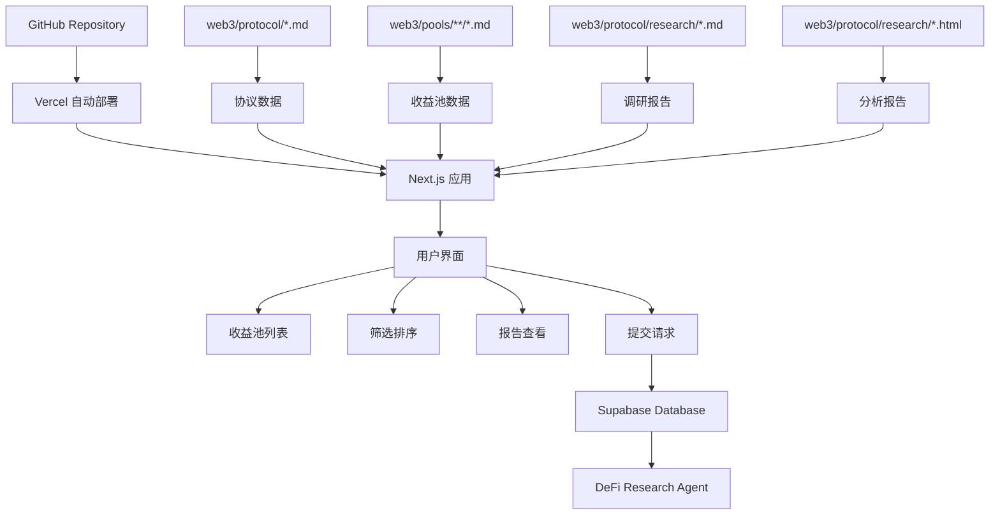

# DeFi收益池聚合信息网站系统设计文档

## 📋 项目概述

### 需求目标
- **目标用户**: Web3领域的DeFi玩家
- **核心目的**: 提供一站式的DeFi收益池（收益策略）聚合信息平台

### 核心功能
1. **收益池信息展示** - 聚合表格显示，支持筛选、排序等操作
2. **调研报告展示** - MD文件在新tab页完整渲染
3. **分析报告展示** - HTML文件在新tab页完整渲染  
4. **提交请求功能** - 用户可提交收录请求，通过Supabase存储
5. **SEO优化** - 符合Google搜索引擎收录规则，提升搜索排名

### 数据来源
- **本地文件**: `web3/pools/` 目录下的收益池数据
- **协议信息**: `web3/protocol/` 目录下的协议基础信息
- **调研报告**: `web3/protocol/research/` 目录下的MD和HTML文件

## 🏗️ 系统架构设计

### 推荐技术栈

**前端框架**: Next.js 14 (App Router)
- **优势**: SEO优化的SSR/SSG、文件系统路由、API路由、Vercel官方支持
- **渲染策略**: 
  - 主页面、筛选页：SSG (静态生成，SEO最佳)
  - 调研报告页面：SSG (支持动态路由)
  - 用户提交页面：CSR (用户交互)

**后端集成**: 
- **API层**: Next.js API路由 + Serverless Functions
- **数据存储**: Supabase (PostgreSQL) 用于用户请求数据
- **文件数据**: 直接读取本地 Markdown 文件(web3/pools/, web3/protocol/)

**部署架构**:
```
GitHub仓库 (defix) 
├── web3/ (现有数据结构)
│   ├── protocol/ (协议信息)
│   ├── pools/ (收益池信息) 
│   └── research/ (调研报告)
├── src/ (新建网站代码)
│   ├── app/ (Next.js app目录)
│   ├── components/ (React组件)
│   ├── lib/ (工具函数)
│   └── styles/ (样式文件)
└── vercel.json (部署配置)
```

### 系统架构图



## 📊 数据模型设计

### 核心数据模型
```typescript
// lib/types/pool.ts
export interface Protocol {
  id: string
  website: string
  nickname: string
  report?: string  // 链接到调研报告
  description?: string
  
  // 扩展字段
  researchReportPath?: string  // MD文件路径
  analysisReportPath?: string   // HTML文件路径
}

export interface Pool {
  id: string
  name: string
  protocol: string              // 协议名称,用于关联
  protocolData?: Protocol      // 完整协议信息
  type: string                 // 投资类型: StableLP, Trade, Future等
  chain: string[]              // 区块链网络
  risk: string                 // 风险等级: 无风险、低风险、中风险、高风险
  token: string                // 代币类型
  aprLow: number              // 最低APR
  aprHigh: number             // 最高APR
  market: string[]            // 适用市场
  underlying?: string         // 底层资产
  danger?: string             // 风险警告
  remark?: string             // 备注
  scenarios?: string          // 使用场景
  
  // 文件路径信息
  filePath: string            // MD文件路径
  lastModified: Date          // 最后修改时间
}

export interface PoolFilters {
  search?: string
  type?: string[]
  chain?: string[]
  risk?: string[]
  token?: string[]
  market?: string[]
  aprMin?: number
  aprMax?: number
}

export interface PoolSortOptions {
  field: 'aprHigh' | 'aprLow' | 'risk' | 'name' | 'protocol'
  direction: 'asc' | 'desc'
}
```

### API接口设计
```typescript
// lib/types/api.ts
export interface PoolsResponse {
  pools: Pool[]
  total: number
  page: number
  pageSize: number
  filters: PoolFilters
  sort: PoolSortOptions
}

export interface ProtocolsResponse {
  protocols: Protocol[]
  total: number
}

export interface SubmitRequest {
  type: 'pool' | 'protocol'
  name: string
  description: string
  website?: string
  contactEmail: string
  additionalInfo?: string
}

export interface SubmitRequestResponse {
  success: boolean
  message: string
  requestId?: string
}
```

### 数据加载器接口
```typescript
// lib/data/loader.ts
export interface DataLoader {
  loadAllPools(): Promise<Pool[]>
  loadAllProtocols(): Promise<Protocol[]>
  loadPoolsByFilters(filters: PoolFilters, sort: PoolSortOptions): Promise<PoolsResponse>
  getProtocolByName(name: string): Promise<Protocol | null>
  getPoolById(id: string): Promise<Pool | null>
}
```

## 🔌 API路由设计

```typescript
// app/api/pools/route.ts
export async function GET(request: Request) {
  const { searchParams } = new URL(request.url)
  const filters = parseFilters(searchParams)
  const sort = parseSort(searchParams)
  const page = parseInt(searchParams.get('page') || '1')
  const pageSize = parseInt(searchParams.get('pageSize') || '20')
  
  // 实现分页、筛选、排序逻辑
  const result = await poolLoader.loadPoolsByFilters(filters, sort)
  return Response.json(result)
}

// app/api/protocols/route.ts  
export async function GET() {
  const protocols = await protocolLoader.loadAllProtocols()
  return Response.json({ protocols })
}

// app/api/submit-request/route.ts
export async function POST(request: Request) {
  const body: SubmitRequest = await request.json()
  
  // 验证数据
  const validation = validateSubmitRequest(body)
  if (!validation.valid) {
    return Response.json({ success: false, message: validation.message }, { status: 400 })
  }
  
  // 保存到Supabase
  const result = await saveSubmitRequest(body)
  return Response.json(result)
}
```

## 🎨 前端组件设计

### 主要组件架构
```typescript
// components/layout/Layout.tsx
interface LayoutProps {
  children: React.ReactNode
  title: string
  description: string
}

// components/pool/PoolTable.tsx - 参考现有dashboard表格逻辑
interface PoolTableProps {
  pools: Pool[]
  loading: boolean
  filters: PoolFilters
  sort: PoolSortOptions
  onFilterChange: (filters: PoolFilters) => void
  onSortChange: (sort: PoolSortOptions) => void
}

// components/pool/PoolFilters.tsx  
interface PoolFiltersProps {
  filters: PoolFilters
  availableOptions: {
    types: string[]
    chains: string[]
    risks: string[]  
    tokens: string[]
    markets: string[]
  }
  onFilterChange: (filters: PoolFilters) => void
}

// components/pool/PoolCard.tsx - 移动端友好
interface PoolCardProps {
  pool: Pool
  onViewReport: (reportPath: string, type: 'research' | 'analysis') => void
}
```

### 页面构图设计

**主页布局**:
```
┌─────────────────────────────────────────┐
│ 导航栏 + Logo + 搜索框                   │
├─────────────────────────────────────────┤  
│ Hero标题: DeFi收益池聚合信息中心         │
├─────────────────────────────────────────┤
│ 筛选器面板 (折叠式)                     │
│ 类型 │ 链 │ 风险 │ Token │ APR范围       │
├─────────────────────────────────────────┤
│ 表格工具栏: 排序、视图切换、导出        │  
├─────────────────────────────────────────┤
│                                         │
│  收益池表格                             │ 
│  ┌─────┬─────┬─────┬─────┬─────────────┐ │
│  │收益池│协议 │类型 │链   │风险|APR|操作│ │ 
│  ├─────┼─────┼─────┼─────┼─────────────┤ │
│  │Pool1│Proto1│LP  │Eth  │中/15%|操作 │ │
│  └─────┴─────┴─────┴─────┴─────────────┘ │
│                                         │
├─────────────────────────────────────────┤
│ 分页控制                               │
└─────────────────────────────────────────┘
```

**表格列设计 (参考现有dashboard)**:
```typescript
const columns = [
  { key: 'name', label: '收益池', width: '180px' },
  { key: 'protocol', label: '协议', width: '140px' },  
  { key: 'type', label: '类型', width: '80px' },
  { key: 'chain', label: '所属链', width: '100px' },
  { key: 'risk', label: '风险等级', width: '90px' },
  { key: 'token', label: 'Token', width: '80px' },
  { key: 'apr', label: '收益范围', width: '120px' },
  { key: 'market', label: '适用市场', width: '100px' },
  { key: 'research', label: '调研报告', width: '120px' },
  { key: 'analysis', label: '分析报告', width: '120px' },
  { key: 'website', label: '官方网站', width: '90px' },
]
```

## 💾 收益池数据加载系统设计

参考现有dashboard系统的核心逻辑，设计新的数据加载系统：

### 数据加载器 (参考 dashboard-data-loader.js)
```typescript
// lib/loaders/PoolDataLoader.ts
export class PoolDataLoader {
  private cache: Map<string, any> = new Map()
  private cacheTimeout: number = 5 * 60 * 1000 // 5分钟缓存

  async loadAllPools(): Promise<Pool[]> {
    const cacheKey = 'all-pools'
    if (this.cache.has(cacheKey)) {
      return this.cache.get(cacheKey)
    }

    // 加载CEX和Chain两个目录的池文件 (参考现有逻辑)
    const cexPools = await this.loadPoolsFromDirectory('web3/pools/cex')
    const chainPools = await this.loadPoolsFromDirectory('web3/pools/chain')
    
    const allPools = [...cexPools, ...chainPools]
    const enrichedPools = await this.mergeWithProtocolData(allPools)
    
    this.cache.set(cacheKey, enrichedPools)
    setTimeout(() => this.cache.delete(cacheKey), this.cacheTimeout)
    
    return enrichedPools
  }

  private async loadPoolsFromDirectory(dirPath: string): Promise<Pool[]> {
    const files = await fs.readdir(path.join(process.cwd(), dirPath))
    const pools: Pool[] = []

    for (const file of files) {
      if (file.endsWith('.md')) {
        const poolData = await this.parsePoolFile(path.join(dirPath, file))
        if (poolData) pools.push(poolData)
      }
    }
    
    return pools
  }

  private async parsePoolFile(filePath: string): Promise<Pool | null> {
    const content = await fs.readFile(path.join(process.cwd(), filePath), 'utf-8')
    const { data: frontmatter, content: body } = matter(content)
    
    // 解析YAML frontmatter (参考现有解析逻辑)
    return {
      id: path.basename(filePath, '.md'),
      name: path.basename(filePath, '.md'),
      protocol: this.cleanProtocolLink(frontmatter.Protocol),
      type: frontmatter.Type,
      chain: Array.isArray(frontmatter.Chain) ? frontmatter.Chain : [frontmatter.Chain],
      risk: frontmatter.Risk,
      token: frontmatter.Token,
      aprLow: frontmatter['APR-Low'] || 0,
      aprHigh: frontmatter['APR-High'] || 0,
      market: Array.isArray(frontmatter.Market) ? frontmatter.Market : [frontmatter.Market],
      underlying: frontmatter.Underlying,
      danger: frontmatter.Danger,
      remark: frontmatter.Remark,
      scenarios: frontmatter.Scenarios,
      filePath,
      lastModified: (await fs.stat(path.join(process.cwd(), filePath))).mtime
    }
  }

  // 合并池数据和协议数据 (参考dashboard-pool-manager.js的mergePoolWithProtocol逻辑)
  private async mergeWithProtocolData(pools: Pool[]): Promise<Pool[]> {
    const protocolMap = await this.loadProtocolMap()
    
    return pools.map(pool => {
      const protocolData = protocolMap.get(pool.protocol)
      return {
        ...pool,
        protocolData
      }
    })
  }
}
```

### 筛选和排序系统 (参考 dashboard-pool-manager.js)
```typescript
// lib/filters/PoolFilter.ts
export class PoolFilter {
  static applyFilters(pools: Pool[], filters: PoolFilters): Pool[] {
    let filtered = pools

    // 搜索过滤
    if (filters.search) {
      const searchTerm = filters.search.toLowerCase()
      filtered = filtered.filter(pool => 
        pool.name.toLowerCase().includes(searchTerm) ||
        pool.protocol.toLowerCase().includes(searchTerm)
      )
    }

    // 多选过滤器 (参考现有applyFilters逻辑)
    if (filters.type?.length) {
      filtered = filtered.filter(pool => filters.type!.includes(pool.type))
    }

    if (filters.chain?.length) {
      filtered = filtered.filter(pool => 
        pool.chain.some(c => filters.chain!.includes(c))
      )
    }

    if (filters.risk?.length) {
      filtered = filtered.filter(pool => filters.risk!.includes(pool.risk))
    }

    // APR范围过滤
    if (filters.aprMin !== undefined) {
      filtered = filtered.filter(pool => pool.aprHigh >= filters.aprMin!)
    }
    
    if (filters.aprMax !== undefined) {
      filtered = filtered.filter(pool => pool.aprLow <= filters.aprMax!)
    }

    return filtered
  }

  static applySorting(pools: Pool[], sort: PoolSortOptions): Pool[] {
    return pools.sort((a, b) => {
      let aValue: any = a[sort.field]
      let bValue: any = b[sort.field]
      
      // 处理不同字段类型的排序
      if (sort.field === 'risk') {
        const riskOrder = ['无风险', '低风险', '中风险', '高风险']
        aValue = riskOrder.indexOf(aValue)
        bValue = riskOrder.indexOf(bValue)
      }
      
      const comparison = aValue < bValue ? -1 : aValue > bValue ? 1 : 0
      return sort.direction === 'desc' ? -comparison : comparison
    })
  }

  // 生成过滤选项 (参考dashboard-pool-manager.js的getFilterOptions)
  static getFilterOptions(pools: Pool[]): {
    types: string[]
    chains: string[]
    risks: string[]
    tokens: string[]
    markets: string[]
  } {
    return {
      types: [...new Set(pools.map(p => p.type))].filter(Boolean),
      chains: [...new Set(pools.flatMap(p => p.chain))].filter(Boolean),
      risks: [...new Set(pools.map(p => p.risk))].filter(Boolean),
      tokens: [...new Set(pools.map(p => p.token))].filter(Boolean),
      markets: [...new Set(pools.flatMap(p => p.market || []))].filter(Boolean)
    }
  }
}
```

## 📄 MD和HTML报告查看系统设计

### 报告路由结构
```
app/
├── reports/
│   ├── research/
│   │   └── [reportId]/
│   │       └── page.tsx          # MD报告渲染页面
│   └── analysis/
│       └── [reportId]/
│           └── page.tsx            # HTML报告渲染页面
└── api/
    └── reports/
        ├── research/
        │   └── [reportId]/
        │       └── route.ts        # MD报告API
        └── analysis/
            └── [reportId]/
                └── route.ts        # HTML报告API
```

### MD调研报告系统
```typescript
// lib/reports/MarkdownReportLoader.ts
export class MarkdownReportLoader {
  private cache: Map<string, any> = new Map()

  async loadResearchReport(reportId: string): Promise<{
    title: string
    content: string
    html: string
    lastModified: Date
    metadata: any
  }> {
    const cacheKey = `research-${reportId}`
    if (this.cache.has(cacheKey)) {
      return this.cache.get(cacheKey)
    }

    // 查找MD文件 (在web3/protocol/research/目录下)
    const filePath = await this.findReportFile(reportId, 'research')
    if (!filePath) {
      throw new Error(`Research report not found: ${reportId}`)
    }

    const content = await fs.readFile(filePath, 'utf-8')
    const { data: metadata, content: markdownContent } = matter(content)
    
    // 转换Markdown到HTML (使用remark/rehype)
    const html = await markdownToHtml(markdownContent)
    
    const report = {
      title: metadata.title || path.basename(filePath, '.md'),
      content: markdownContent,
      html,
      lastModified: (await fs.stat(filePath)).mtime,
      metadata
    }

    // 缓存5分钟
    this.cache.set(cacheKey, report)
    setTimeout(() => this.cache.delete(cacheKey), 5 * 60 * 1000)

    return report
  }

  private async findReportFile(reportId: string, type: 'research' | 'analysis'): Promise<string | null> {
    const searchPaths = [
      `web3/protocol/research/${reportId}.md`,
      `web3/protocol/research/${decodeURIComponent(reportId)}.md`,
    ]

    for (const searchPath of searchPaths) {
      try {
        await fs.access(path.join(process.cwd(), searchPath))
        return searchPath
      } catch {
        continue
      }
    }
    
    return null
  }
}
```

### MD报告页面组件
```tsx
// app/reports/research/[reportId]/page.tsx
export default async function ResearchReportPage({ 
  params 
}: { params: { reportId: string } }) {
  try {
    const reportLoader = new MarkdownReportLoader()
    const report = await reportLoader.loadResearchReport(params.reportId)

    return (
      <div className="research-report-page">
        {/* 报告头部 */}
        <div className="report-header">
          <div className="report-title-section">
            <h1 className="report-title">{report.title}</h1>
            <div className="report-meta">
              <span className="last-updated">
                更新时间: {report.lastModified.toLocaleDateString('zh-CN')}
              </span>
              <button 
                className="close-tab-btn"
                onClick={() => window.close()}
              >
                关闭标签页
              </button>
            </div>
          </div>
        </div>

        {/* 报告内容 */}
        <div className="report-content">
          <article 
            className="markdown-content prose max-w-none"
            dangerouslySetInnerHTML={{ __html: report.html }}
          />
        </div>

        {/* 返回按钮 */}
        <div className="report-footer">
          <button 
            onClick={() => window.history.back()}
            className="back-button"
          >
            返回池列表
          </button>
        </div>
      </div>
    )
  } catch (error) {
    return (
      <div className="report-error">
        <h1>报告未找到</h1>
        <p>抱歉，找不到请求的调研报告。</p>
        <button onClick={() => window.close()}>
          关闭标签页
        </button>
      </div>
    )
  }
}

// 生成静态参数 (SEO优化)
export async function generateStaticParams() {
  // 扫描所有research报告文件
  const researchDir = path.join(process.cwd(), 'web3/protocol/research')
  const files = await fs.readdir(researchDir)
  
  return files
    .filter(file => file.endsWith('.md'))
    .map(file => ({
      reportId: path.basename(file, '.md')
    }))
}
```

### HTML分析报告系统
```typescript
// app/api/reports/analysis/[reportId]/route.ts
export async function GET(
  request: Request,
  { params }: { params: { reportId: string } }
) {
  try {
    // 查找HTML文件
    const filePath = path.join(
      process.cwd(), 
      'web3/protocol/research', 
      `${params.reportId}.html`
    )
    
    const htmlContent = await fs.readFile(filePath, 'utf-8')
    
    // 安全性检查: 清理可能的恶意脚本
    const cleanHtml = sanitizeHtml(htmlContent, {
      allowedTags: [...sanitizeHtml.defaults.allowedTags, 'iframe', 'embed'],
      allowedAttributes: {
        ...sanitizeHtml.defaults.allowedAttributes,
        '*': ['style', 'class'],
        'iframe': ['src', 'width', 'height', 'frameborder'],
      },
    })
    
    return new Response(cleanHtml, {
      headers: {
        'Content-Type': 'text/html',
        'X-Frame-Options': 'SAMEORIGIN'
      }
    })
  } catch (error) {
    return new Response(
      '<h1>分析报告未找到</h1><p>抱歉，找不到请求的分析报告。</p>',
      { status: 404, headers: { 'Content-Type': 'text/html' } }
    )
  }
}

// app/reports/analysis/[reportId]/page.tsx
export default function AnalysisReportPage({ 
  params 
}: { params: { reportId: string } }) {
  return (
    <div className="analysis-report-page">
      <div className="report-header">
        <h1>分析报告</h1>
        <button 
          onClick={() => window.close()}
          className="close-tab-btn"
        >
          关闭标签页
        </button>
      </div>
      
      <div className="report-iframe-container">
        <iframe
          src={`/api/reports/analysis/${encodeURIComponent(params.reportId)}`}
          width="100%"
          height="calc(100vh - 120px)"
          frameBorder="0"
          title={`分析报告 - ${params.reportId}`}
          className="analysis-iframe"
        />
      </div>
    </div>
  )
}
```

## 💬 提交请求功能设计 (Supabase集成)

### Supabase数据库Schema
```sql
-- database/user_requests.sql
CREATE TABLE user_requests (
  id UUID DEFAULT gen_random_uuid() PRIMARY KEY,
  type TEXT NOT NULL CHECK (type IN ('pool', 'protocol')),
  name TEXT NOT NULL,
  description TEXT NOT NULL,
  website TEXT,
  contact_email TEXT NOT NULL,
  additional_info JSONB,
  status TEXT DEFAULT 'pending' CHECK (status IN ('pending', 'in_progress', 'completed', 'rejected')),
  priority INTEGER DEFAULT 3 CHECK (priority >= 1 AND priority <= 5),
  created_at TIMESTAMP WITH TIME ZONE DEFAULT NOW(),
  updated_at TIMESTAMP WITH TIME ZONE DEFAULT NOW(),
  admin_notes TEXT,
  processing_started_at TIMESTAMP WITH TIME ZONE,
  completed_at TIMESTAMP WITH TIME ZONE
);

-- 索引优化
CREATE INDEX idx_user_requests_status ON user_requests(status);
CREATE INDEX idx_user_requests_type ON user_requests(type);
CREATE INDEX idx_user_requests_created_at ON user_requests(created_at DESC);
CREATE INDEX idx_user_requests_priority_status ON user_requests(priority DESC, status);

-- RLS (Row Level Security) 策略
ALTER TABLE user_requests ENABLE ROW LEVEL SECURITY;

-- 公开读取权限 (用户可查看自己提交的请求状态)
CREATE POLICY "Users can read own requests" ON user_requests
  FOR SELECT
  USING (contact_email = auth.email());

-- 插入权限 (任何人都可提交请求)
CREATE POLICY "Anyone can submit requests" ON user_requests
  FOR INSERT
  WITH CHECK (true);
```

### 提交请求接口
```typescript
// lib/services/SubmitRequestService.ts
import { createClient } from '@supabase/supabase-js'

export interface SubmitRequestData {
  type: 'pool' | 'protocol'
  name: string
  description: string
  website?: string
  contactEmail: string
  additionalInfo?: {
    chainPreference?: string[]
    expectedAPR?: string
    riskTolerance?: string
    urgency?: string
    existingSources?: string[]
    [key: string]: any
  }
}

export interface SubmitRequestResponse {
  success: boolean
  requestId?: string
  message: string
  estimatedProcessingTime?: string
}

export class SubmitRequestService {
  private supabase = createClient(
    process.env.NEXT_PUBLIC_SUPABASE_URL!,
    process.env.NEXT_PUBLIC_SUPABASE_ANON_KEY!
  )

  // 验证和清理请求数据
  private validateRequest(data: SubmitRequestData): {
    valid: boolean
    errors: string[]
    cleanedData?: SubmitRequestData
  } {
    const errors: string[] = []
    
    if (!data.name.trim()) errors.push('请提供项目/协议名称')
    if (!data.description.trim()) errors.push('请提供详细描述')
    if (!data.contactEmail.trim()) errors.push('请提供联系邮箱')
    
    // 邮箱格式验证
    const emailRegex = /^[^\s@]+@[^\s@]+\.[^\s@]+$/
    if (!emailRegex.test(data.contactEmail)) {
      errors.push('请提供有效的邮箱地址')
    }
    
    // URL验证 (如果提供了网站)
    if (data.website && data.website.trim()) {
      try {
        new URL(data.website)
      } catch {
        errors.push('请提供有效的网站地址')
      }
    }

    if (errors.length > 0) {
      return { valid: false, errors }
    }

    // 清理数据
    const cleanedData: SubmitRequestData = {
      type: data.type,
      name: data.name.trim(),
      description: data.description.trim(),
      website: data.website?.trim() || undefined,
      contactEmail: data.contactEmail.toLowerCase().trim(),
      additionalInfo: data.additionalInfo || {}
    }

    return { valid: true, errors: [], cleanedData }
  }

  async submitRequest(data: SubmitRequestData): Promise<SubmitRequestResponse> {
    // 验证数据
    const validation = this.validateRequest(data)
    if (!validation.valid) {
      return {
        success: false,
        message: validation.errors.join(', ')
      }
    }

    try {
      // 检查重复提交 (同一邮箱24小时内相同项目名称)
      const { data: existingRequests } = await this.supabase
        .from('user_requests')
        .select('id, created_at')
        .eq('contact_email', validation.cleanedData!.contactEmail)
        .eq('name', validation.cleanedData!.name)
        .gte('created_at', new Date(Date.now() - 24 * 60 * 60 * 1000).toISOString())

      if (existingRequests && existingRequests.length > 0) {
        return {
          success: false,
          message: '您已在24小时内提交过相同项目的申请，请等待处理或联系管理员'
        }
      }

      // 计算优先级 (基于项目类型和附加信息)
      const priority = this.calculatePriority(validation.cleanedData!)

      // 插入数据库
      const { data: insertData, error } = await this.supabase
        .from('user_requests')
        .insert({
          type: validation.cleanedData!.type,
          name: validation.cleanedData!.name,
          description: validation.cleanedData!.description,
          website: validation.cleanedData!.website,
          contact_email: validation.cleanedData!.contactEmail,
          additional_info: validation.cleanedData!.additionalInfo,
          priority
        })
        .select()

      if (error) {
        throw error
      }

      // 发送确认邮件 (可选)
      await this.sendConfirmationEmail(validation.cleanedData!, insertData[0].id)

      return {
        success: true,
        requestId: insertData[0].id,
        message: '提交成功！我们会在1-3个工作日内处理您的申请。',
        estimatedProcessingTime: this.getEstimatedProcessingTime(priority)
      }

    } catch (error) {
      console.error('Submit request error:', error)
      return {
        success: false,
        message: '提交失败，请稍后重试或联系技术支持'
      }
    }
  }

  private calculatePriority(data: SubmitRequestData): number {
    let priority = 3 // 默认优先级

    // 协议类型的优先级更高
    if (data.type === 'protocol') priority -= 1

    // 提供了完整信息的优先级更高
    if (data.website && data.additionalInfo) priority -= 1

    // 紧急程度
    if (data.additionalInfo?.urgency === 'high') priority -= 1
    if (data.additionalInfo?.urgency === 'low') priority += 1

    return Math.max(1, Math.min(5, priority))
  }

  private getEstimatedProcessingTime(priority: number): string {
    switch (priority) {
      case 1: return '1-2个工作日'
      case 2: return '2-3个工作日'
      case 3: return '3-5个工作日'
      case 4: return '5-7个工作日'
      case 5: return '1-2周'
      default: return '3-5个工作日'
    }
  }

  // 查询请求状态 (用户可查询自己的申请状态)
  async getRequestStatus(contactEmail: string): Promise<any[]> {
    const { data, error } = await this.supabase
      .from('user_requests')
      .select('id, type, name, status, created_at, admin_notes')
      .eq('contact_email', contactEmail)
      .order('created_at', { ascending: false })

    if (error) throw error
    return data || []
  }
}
```

### 提交请求表单组件
```tsx
// components/SubmitRequestForm.tsx
'use client'

import { useState } from 'react'

const SubmitRequestForm: React.FC = () => {
  const [formData, setFormData] = useState<SubmitRequestData>({
    type: 'pool',
    name: '',
    description: '',
    website: '',
    contactEmail: '',
    additionalInfo: {}
  })
  const [isLoading, setIsLoading] = useState(false)
  const [result, setResult] = useState<{ success: boolean; message: string } | null>(null)

  const handleSubmit = async (e: React.FormEvent) => {
    e.preventDefault()
    setIsLoading(true)
    setResult(null)

    try {
      const response = await fetch('/api/submit-request', {
        method: 'POST',
        headers: { 'Content-Type': 'application/json' },
        body: JSON.stringify(formData)
      })

      const result = await response.json()
      setResult(result)

      if (result.success) {
        // 清空表单
        setFormData({
          type: 'pool',
          name: '',
          description: '',
          website: '',
          contactEmail: '',
          additionalInfo: {}
        })
      }
    } catch (error) {
      setResult({
        success: false,
        message: '网络错误，请检查网络连接后重试'
      })
    } finally {
      setIsLoading(false)
    }
  }

  return (
    <div className="submit-request-form">
      <div className="form-header">
        <h2>申请添加新的收益池/协议</h2>
        <p>找不到您关心的项目？请填写以下表单申请添加。</p>
      </div>

      {result && (
        <div className={`alert ${result.success ? 'alert-success' : 'alert-error'}`}>
          {result.message}
        </div>
      )}

      <form onSubmit={handleSubmit} className="request-form">
        {/* 申请类型 */}
        <div className="form-group">
          <label>申请类型 *</label>
          <div className="radio-group">
            <label>
              <input
                type="radio"
                value="pool"
                checked={formData.type === 'pool'}
                onChange={(e) => setFormData({ ...formData, type: e.target.value as 'pool' | 'protocol' })}
              />
              收益池项目
            </label>
            <label>
              <input
                type="radio"
                value="protocol"
                checked={formData.type === 'protocol'}
                onChange={(e) => setFormData({ ...formData, type: e.target.value as 'pool' | 'protocol' })}
              />
              新协议平台
            </label>
          </div>
        </div>

        {/* 项目名称 */}
        <div className="form-group">
          <label htmlFor="name">项目/协议名称 *</label>
          <input
            type="text"
            id="name"
            value={formData.name}
            onChange={(e) => setFormData({ ...formData, name: e.target.value })}
            placeholder="例如: Compound USDC Lending Pool"
            required
          />
        </div>

        {/* 详细描述 */}
        <div className="form-group">
          <label htmlFor="description">详细描述 *</label>
          <textarea
            id="description"
            value={formData.description}
            onChange={(e) => setFormData({ ...formData, description: e.target.value })}
            placeholder="请详细描述该项目的特点、收益机制、风险等级等信息..."
            rows={4}
            required
          />
        </div>

        {/* 官方网站 */}
        <div className="form-group">
          <label htmlFor="website">官方网站</label>
          <input
            type="url"
            id="website"
            value={formData.website}
            onChange={(e) => setFormData({ ...formData, website: e.target.value })}
            placeholder="https://example.com"
          />
        </div>

        {/* 联系邮箱 */}
        <div className="form-group">
          <label htmlFor="contactEmail">联系邮箱 *</label>
          <input
            type="email"
            id="contactEmail"
            value={formData.contactEmail}
            onChange={(e) => setFormData({ ...formData, contactEmail: e.target.value })}
            placeholder="your@email.com"
            required
          />
        </div>

        {/* 附加信息 */}
        <div className="form-group">
          <label>附加信息 (可选)</label>
          
          <div className="additional-info">
            {/* 链偏好 */}
            <div className="info-item">
              <label htmlFor="chainPreference">偏好区块链</label>
              <select
                id="chainPreference"
                onChange={(e) => setFormData({
                  ...formData,
                  additionalInfo: {
                    ...formData.additionalInfo,
                    chainPreference: e.target.value
                  }
                })}
              >
                <option value="">请选择</option>
                <option value="Ethereum">Ethereum</option>
                <option value="BSC">BSC</option>
                <option value="Polygon">Polygon</option>
                <option value="Arbitrum">Arbitrum</option>
                <option value="Optimism">Optimism</option>
                <option value="Aptos">Aptos</option>
                <option value="Sui">Sui</option>
                <option value="Solana">Solana</option>
              </select>
            </div>

            {/* 紧急程度 */}
            <div className="info-item">
              <label htmlFor="urgency">紧急程度</label>
              <select
                id="urgency"
                onChange={(e) => setFormData({
                  ...formData,
                  additionalInfo: {
                    ...formData.additionalInfo,
                    urgency: e.target.value
                  }
                })}
              >
                <option value="">请选择</option>
                <option value="low">不急 (2周内)</option>
                <option value="normal">一般 (1周内)</option>
                <option value="high">紧急 (3天内)</option>
              </select>
            </div>
          </div>
        </div>

        {/* 提交按钮 */}
        <div className="form-actions">
          <button
            type="submit"
            disabled={isLoading}
            className="submit-button"
          >
            {isLoading ? '提交中...' : '提交申请'}
          </button>
        </div>

        <div className="form-note">
          <p><small>
            * 提交后我们会在1-3个工作日内处理您的申请。处理完成后会通过邮件通知您。
          </small></p>
        </div>
      </form>
    </div>
  )
}

export default SubmitRequestForm
```

## 🔍 SEO优化策略设计

### 1. Next.js SSG优化配置
```typescript
// next.config.js
const nextConfig = {
  // 启用Static Site Generation
  output: 'export', // 对于静态部署
  trailingSlash: true,
  
  // 图片优化
  images: {
    unoptimized: true,
    remotePatterns: [
      {
        protocol: 'https',
        hostname: '**.amazonaws.com',
      },
    ],
  },
  
  // 性能优化
  experimental: {
    appDir: true,
  },
  
  // SEO友好的URL重写
  async rewrites() {
    return [
      {
        source: '/pools/:type/:chain',
        destination: '/pools?type=:type&chain=:chain',
      },
      {
        source: '/protocol/:name',
        destination: '/protocols/:name',
      }
    ]
  },
}

export default nextconfig
```

### 2. SEO元数据系统
```typescript
// lib/seo/MetadataGenerator.ts
export interface SEOMetadata {
  title: string
  description: string
  keywords: string[]
  canonicalUrl: string
  ogImage?: string
  schemaOrg?: any
  breadcrumbs?: Array<{ name: string, url: string }>
}

export class MetadataGenerator {
  private baseUrl = process.env.NEXT_PUBLIC_BASE_URL || 'https://defi-pools.your-domain.com'
  
  // 主页SEO元数据
  generateHomeMetadata(): SEOMetadata {
    return {
      title: 'DeFi收益池聚合信息中心 | 一站式DeFi投资指南',
      description: '专业的DeFi收益池聚合平台，提供全面的流动性挖矿、质押、借贷等DeFi投资机会分析。包含风险评估、APR分析、智能筛选等功能，助您找到最适合的DeFi投资策略。',
      keywords: [
        'DeFi', '收益池', '流动性挖矿', 'Liquidity Mining', 'Yield Farming',
        'DeFi投资', '区块链投资', 'APR', 'APY', 'DeFi协议',
        '去中心化金融', '数字货币理财', 'Web3投资', '加密货币收益'
      ],
      canonicalUrl: this.baseUrl,
      ogImage: `${this.baseUrl}/images/defi-pools-og.jpg`,
      schemaOrg: this.generateHomeSchema()
    }
  }
  
  // 收益池列表页SEO
  generatePoolsListMetadata(filters: PoolFilters): SEOMetadata {
    const { type, chain, risk } = filters
    let title = 'DeFi收益池列表'
    let description = '探索最新的DeFi收益机会'
    
    // 根据筛选条件动态构建title和description
    if (type?.length) {
      title += ` | ${type.join(', ')}类型`
      description += `，专注于${type.join('、')}投资策略`
    }
    
    if (chain?.length) {
      title += ` | ${chain.join(', ')}生态`
      description += `，涵盖${chain.join('、')}区块链网络`
    }
    
    return {
      title: `${title} - DeFi收益池聚合中心`,
      description: `${description}。提供详细的风险分析、收益对比、协议安全性评估，助您做出明智的DeFi投资决策。`,
      keywords: this.generatePoolKeywords(filters),
      canonicalUrl: this.buildCanonicalUrl('/pools', filters),
      schemaOrg: this.generatePoolsListSchema()
    }
  }
  
  // 单个协议页SEO  
  generateProtocolMetadata(protocol: Protocol): SEOMetadata {
    return {
      title: `${protocol.nickname || protocol.website} - DeFi协议深度分析 | 收益池详情`,
      description: `${protocol.description || `深入了解${protocol.nickname}协议的收益池机会`}。包含详细的安全性分析、收益机制解读、风险评估和投资建议。`,
      keywords: [
        protocol.nickname,
        'DeFi协议分析',
        '收益池评测',
        '区块链项目研究',
        '投资安全性',
        'APR分析'
      ],
      canonicalUrl: `${this.baseUrl}/protocol/${encodeURIComponent(protocol.nickname)}`,
      ogImage: `${this.baseUrl}/api/og/protocol?name=${encodeURIComponent(protocol.nickname)}`,
      schemaOrg: this.generateProtocolSchema(protocol)
    }
  }

  private generateHomeSchema() {
    return {
      '@context': 'https://schema.org',
      '@type': 'WebSite',
      'name': 'DeFi收益池聚合中心',
      'description': '专业的DeFi收益池聚合平台，提供全面的投资分析和风险评估',
      'url': this.baseUrl,
      'potentialAction': {
        '@type': 'SearchAction',
        'target': `${this.baseUrl}/pools?search={search_term_string}`,
        'query-input': 'required name=search_term_string'
      },
      'publisher': {
        '@type': 'Organization',
        'name': 'DeFi Pool Aggregator',
        'url': this.baseUrl
      }
    }
  }

  private generateProtocolSchema(protocol: Protocol) {
    return {
      '@context': 'https://schema.org',
      '@type': 'FinancialProduct',
      'name': protocol.nickname,
      'description': protocol.description,
      'url': protocol.website,
      'provider': {
        '@type': 'Organization',
        'name': protocol.nickname,
        'url': protocol.website
      },
      'category': 'DeFi Protocol',
      'feesAndCommissionsSpecification': 'DeFi收益池投资需要承担智能合约风险、无常损失等风险'
    }
  }
}
```

### 3. 页面级SEO实现
```typescript
// app/layout.tsx - 根布局SEO
import type { Metadata } from 'next'

export const metadata: Metadata = {
  title: {
    template: '%s | DeFi收益池聚合中心',
    default: 'DeFi收益池聚合中心 | 专业的DeFi投资分析平台'
  },
  description: '提供全面的DeFi收益池信息聚合、风险分析、收益对比服务，助您找到最佳的去中心化金融投资机会。',
  keywords: ['DeFi', '收益池', '流动性挖矿', '去中心化金融', '区块链投资'],
  authors: [{ name: 'DeFi Pool Aggregator Team' }],
  creator: 'DeFi Pool Aggregator',
  publisher: 'DeFi Pool Aggregator',
  formatDetection: {
    email: false,
    address: false,
    telephone: false,
  },
  metadataBase: new URL(process.env.NEXT_PUBLIC_BASE_URL || 'https://localhost:3000'),
  alternates: {
    canonical: '/',
  },
  openGraph: {
    title: 'DeFi收益池聚合中心',
    description: '专业的DeFi投资分析平台',
    url: '/',
    siteName: 'DeFi Pool Aggregator',
    images: [
      {
        url: '/images/og-default.jpg',
        width: 1200,
        height: 630,
        alt: 'DeFi Pool Aggregator',
      },
    ],
    locale: 'zh_CN',
    type: 'website',
  },
  twitter: {
    card: 'summary_large_image',
    title: 'DeFi收益池聚合中心',
    description: '专业的DeFi投资分析平台',
    creator: '@defi_pools',
    images: ['/images/twitter-card.jpg'],
  },
  robots: {
    index: true,
    follow: true,
    nocache: true,
    googleBot: {
      index: true,
      follow: true,
      noimageindex: true,
      'max-video-preview': -1,
      'max-image-preview': 'large',
      'max-snippet': -1,
    },
  },
}

// app/pools/page.tsx - 收益池列表页SEO
export async function generateMetadata({ 
  searchParams 
}: { 
  searchParams: { [key: string]: string | string[] | undefined } 
}): Promise<Metadata> {
  const metadataGenerator = new MetadataGenerator()
  const filters = parsePoolFilters(searchParams)
  const seoData = metadataGenerator.generatePoolsListMetadata(filters)
  
  return {
    title: seoData.title,
    description: seoData.description,
    keywords: seoData.keywords,
    alternates: {
      canonical: seoData.canonicalUrl,
    },
    openGraph: {
      title: seoData.title,
      description: seoData.description,
      url: seoData.canonicalUrl,
      images: seoData.ogImage ? [seoData.ogImage] : undefined,
    },
    other: {
      'application/ld+json': JSON.stringify(seoData.schemaOrg)
    }
  }
}
```

### 4. 站点地图生成
```typescript
// app/sitemap.ts - 动态站点地图
import { MetadataRoute } from 'next'
import { PoolDataLoader } from '@/lib/loaders/PoolDataLoader'

export default async function sitemap(): Promise<MetadataRoute.Sitemap> {
  const baseUrl = process.env.NEXT_PUBLIC_BASE_URL || 'https://localhost:3000'
  const poolLoader = new PoolDataLoader()
  
  // 基础页面
  const routes = [
    {
      url: baseUrl,
      lastModified: new Date(),
      changeFrequency: 'daily' as const,
      priority: 1,
    },
    {
      url: `${baseUrl}/pools`,
      lastModified: new Date(),
      changeFrequency: 'hourly' as const,
      priority: 0.8,
    },
    {
      url: `${baseUrl}/submit-request`,
      lastModified: new Date(),
      changeFrequency: 'weekly' as const,
      priority: 0.5,
    },
  ]

  try {
    // 动态生成协议页面
    const protocols = await poolLoader.loadAllProtocols()
    const protocolRoutes = protocols.map(protocol => ({
      url: `${baseUrl}/protocol/${encodeURIComponent(protocol.nickname)}`,
      lastModified: new Date(),
      changeFrequency: 'weekly' as const,
      priority: 0.7,
    }))

    // 动态生成热门筛选组合页面
    const popularFilters = [
      { type: 'StableLP', chain: 'Ethereum' },
      { type: 'Lending', chain: 'BSC' },
      { type: 'Staking', chain: 'Polygon' },
    ]
    
    const filterRoutes = popularFilters.map(filter => ({
      url: `${baseUrl}/pools?type=${filter.type}&chain=${filter.chain}`,
      lastModified: new Date(),
      changeFrequency: 'daily' as const,
      priority: 0.6,
    }))

    return [...routes, ...protocolRoutes, ...filterRoutes]
  } catch (error) {
    console.error('Failed to generate sitemap:', error)
    return routes
  }
}
```

### 5. robots.txt和SEO配置
```txt
# public/robots.txt
User-agent: *
Allow: /
Disallow: /admin
Disallow: /api/submit-request
Disallow: /api/admin

# 特别优化搜索引擎抓取频率
Crawl-delay: 1

Sitemap: https://your-domain.com/sitemap.xml
```

## 🚀 部署工作流设计 (本地 → GitHub → Vercel)

### 1. GitHub仓库架构
```
defix/
├── .github/
│   ├── workflows/
│   │   ├── deploy.yml           # 自动部署工作流
│   │   ├── validate-pools.yml    # 池数据验证
│   │   └── update-sitemap.yml    # 站点地图更新
│   └── ISSUE_TEMPLATE/
│       └── pool-request.md       # 用户请求模板
│
├── web3/                         # 现有数据结构
│   ├── protocol/                 # 协议信息
│   ├── pools/                    # 收益池数据
│   └── research/                # 调研报告
│
├── src/                          # Next.js应用源码
│   ├── app/                      # App Router目录
│   ├── components/               # React组件
│   ├── lib/                     # 工具类库
│   └── styles/                  # 样式文件
│
├── public/                       # 静态资源
│   ├── images/                  # 图片文件
│   ├── robots.txt               # SEO配置
│   └── manifest.json            # PWA配置
│
├── scripts/                      # 自动化脚本
│   ├── validate-data.js         # 数据验证
│   ├── generate-sitemap.js      # 站点地图生成
│   └── optimize-images.js       # 图片优化
│
├── vercel.json                   # Vercel配置
├── next.config.js               # Next.js配置
├── package.json                 # 项目依赖
└── README.md                    # 项目文档
```

### 2. Vercel配置
```json
// vercel.json
{
  "version": 2,
  "name": "defi-pools-aggregator",
  "builds": [
    {
      "src": "src/app/**",
      "use": "@vercel/next"
    }
  ],
  "routes": [
    {
      "src": "/api/(.*)",
      "dest": "/src/app/api/$1"
    },
    {
      "src": "/reports/(.*)",
      "dest": "/src/app/reports/$1"
    },
    {
      "src": "/(.*)",
      "dest": "/src/app/$1"
    }
  ],
  "env": {
    "NEXT_PUBLIC_BASE_URL": "https://defi-pools.your-domain.com",
    "NODE_ENV": "production"
  },
  "build": {
    "env": {
      "NEXT_TELEMETRY_DISABLED": "1"
    }
  },
  "functions": {
    "src/app/api/**": {
      "maxDuration": 30
    }
  },
  "crons": [
    {
      "path": "/api/cron/update-cache",
      "schedule": "0 */6 * * *"
    },
    {
      "path": "/api/cron/generate-sitemap",
      "schedule": "0 2 * * *"
    }
  ],
  "headers": [
    {
      "source": "/api/(.*)",
      "headers": [
        {
          "key": "Cache-Control",
          "value": "s-maxage=300, stale-while-revalidate=600"
        }
      ]
    },
    {
      "source": "/(.*\\.(js|css|png|jpg|jpeg|gif|ico|svg|woff|woff2))",
      "headers": [
        {
          "key": "Cache-Control",
          "value": "public, max-age=31536000, immutable"
        }
      ]
    }
  ],
  "rewrites": [
    {
      "source": "/pools/:type/:chain",
      "destination": "/pools?type=:type&chain=:chain"
    },
    {
      "source": "/protocol/:name",
      "destination": "/protocols/:name"
    }
  ],
  "redirects": [
    {
      "source": "/pools.html",
      "destination": "/pools",
      "permanent": true
    }
  ]
}
```

### 3. GitHub Actions工作流
```yaml
# .github/workflows/deploy.yml - 自动部署
name: Deploy to Vercel

on:
  push:
    branches: [ main ]
  pull_request:
    branches: [ main ]

jobs:
  validate-data:
    runs-on: ubuntu-latest
    steps:
      - uses: actions/checkout@v4
      
      - name: Setup Node.js
        uses: actions/setup-node@v4
        with:
          node-version: '18'
          cache: 'npm'
      
      - name: Install dependencies
        run: npm ci
      
      - name: Validate pool data
        run: npm run validate:pools
        
      - name: Validate protocol data
        run: npm run validate:protocols
        
      - name: Check markdown reports
        run: npm run validate:reports

  build-and-deploy:
    needs: validate-data
    runs-on: ubuntu-latest
    if: github.ref == 'refs/heads/main'
    
    steps:
      - uses: actions/checkout@v4
      
      - name: Setup Node.js  
        uses: actions/setup-node@v4
        with:
          node-version: '18'
          cache: 'npm'
          
      - name: Install dependencies
        run: npm ci
        
      - name: Build application
        run: npm run build
        env:
          NEXT_PUBLIC_BASE_URL: ${{ secrets.NEXT_PUBLIC_BASE_URL }}
          NEXT_PUBLIC_SUPABASE_URL: ${{ secrets.NEXT_PUBLIC_SUPABASE_URL }}
          NEXT_PUBLIC_SUPABASE_ANON_KEY: ${{ secrets.NEXT_PUBLIC_SUPABASE_ANON_KEY }}
          
      - name: Deploy to Vercel
        uses: amondnet/vercel-action@v25
        with:
          vercel-token: ${{ secrets.VERCEL_TOKEN }}
          github-token: ${{ secrets.GITHUB_TOKEN }}
          vercel-org-id: ${{ secrets.ORG_ID }}
          vercel-project-id: ${{ secrets.PROJECT_ID }}
          working-directory: ./
          
      - name: Update sitemap
        if: success()
        run: |
          curl -X POST "${{ secrets.NEXT_PUBLIC_BASE_URL }}/api/cron/generate-sitemap" \
               -H "Authorization: Bearer ${{ secrets.CRON_SECRET }}"
```

```yaml
# .github/workflows/validate-pools.yml - 数据验证工作流
name: Validate Pool Data

on:
  push:
    paths:
      - 'web3/pools/**'
      - 'web3/protocol/**'
  pull_request:
    paths:
      - 'web3/pools/**'
      - 'web3/protocol/**'

jobs:
  validate-changes:
    runs-on: ubuntu-latest
    
    steps:
      - uses: actions/checkout@v4
        with:
          fetch-depth: 2
          
      - name: Setup Node.js
        uses: actions/setup-node@v4
        with:
          node-version: '18'
          cache: 'npm'
          
      - name: Install dependencies
        run: npm ci
        
      - name: Get changed files
        id: changed-files
        run: |
          echo "files=$(git diff --name-only HEAD^ HEAD | grep -E '\.(md)$' | tr '\n' ' ')" >> $GITHUB_OUTPUT
          
      - name: Validate changed pool files
        if: steps.changed-files.outputs.files != ''
        run: |
          for file in ${{ steps.changed-files.outputs.files }}; do
            echo "Validating $file"
            node scripts/validate-data.js "$file"
          done
          
      - name: Check for required fields
        run: npm run lint:data
        
      - name: Verify report links
        run: npm run verify:reports
        
      - name: Comment PR with validation results
        if: github.event_name == 'pull_request'
        uses: actions/github-script@v7
        with:
          script: |
            const { data: comments } = await github.rest.issues.listComments({
              owner: context.repo.owner,
              repo: context.repo.repo,
              issue_number: context.issue.number,
            });
            
            const validationComment = comments.find(comment => 
              comment.body.includes('Pool Data Validation Results')
            );
            
            const commentBody = `## Pool Data Validation Results ✅
            
            All changed pool and protocol files have passed validation:
            - YAML frontmatter syntax: ✅
            - Required fields present: ✅  
            - Report links valid: ✅
            - APR ranges reasonable: ✅
            
            Files validated: ${{ steps.changed-files.outputs.files }}`;
            
            if (validationComment) {
              await github.rest.issues.updateComment({
                owner: context.repo.owner,
                repo: context.repo.repo,
                comment_id: validationComment.id,
                body: commentBody
              });
            } else {
              await github.rest.issues.createComment({
                owner: context.repo.owner,
                repo: context.repo.repo,
                issue_number: context.issue.number,
                body: commentBody
              });
            }
```

### 4. 数据验证脚本
```javascript
// scripts/validate-data.js - 池数据验证脚本
const fs = require('fs').promises
const path = require('path')
const yaml = require('yaml')

class PoolDataValidator {
  constructor() {
    this.errors = []
    this.warnings = []
  }

  async validatePoolFile(filePath) {
    try {
      const content = await fs.readFile(filePath, 'utf-8')
      const { frontmatter, body } = this.parseFrontmatter(content)
      
      this.validateRequiredFields(frontmatter, filePath)
      this.validateFieldTypes(frontmatter, filePath)
      this.validateAPRRange(frontmatter, filePath)
      this.validateRiskLevel(frontmatter, filePath)
      await this.validateProtocolReference(frontmatter, filePath)
      
    } catch (error) {
      this.errors.push(`${filePath}: Failed to parse file - ${error.message}`)
    }
  }

  validateRequiredFields(data, filePath) {
    const requiredFields = ['Protocol', 'Type', 'Chain', 'Risk', 'Token', 'APR-Low', 'APR-High']
    
    requiredFields.forEach(field => {
      if (!data[field] && data[field] !== 0) {
        this.errors.push(`${filePath}: Missing required field '${field}'`)
      }
    })
  }

  validateFieldTypes(data, filePath) {
    // APR数值验证
    if (typeof data['APR-Low'] !== 'number' || data['APR-Low'] < 0) {
      this.errors.push(`${filePath}: APR-Low must be a non-negative number`)
    }
    
    if (typeof data['APR-High'] !== 'number' || data['APR-High'] < 0) {
      this.errors.push(`${filePath}: APR-High must be a non-negative number`)
    }
    
    if (data['APR-Low'] >= data['APR-High']) {
      this.warnings.push(`${filePath}: APR-Low should be less than APR-High`)
    }

    // Chain字段验证
    if (data.Chain && !Array.isArray(data.Chain) && typeof data.Chain !== 'string') {
      this.errors.push(`${filePath}: Chain field must be string or array`)
    }
  }

  validateAPRRange(data, filePath) {
    const aprLow = data['APR-Low']
    const aprHigh = data['APR-High']
    
    // 合理性检查
    if (aprHigh > 10) { // APR超过1000%
      this.warnings.push(`${filePath}: APR-High (${aprHigh}) seems unusually high, please verify`)
    }
    
    if (aprLow > 1) { // APR超过100%
      this.warnings.push(`${filePath}: High APR detected, please ensure this is accurate`)
    }
  }

  validateRiskLevel(data, filePath) {
    const validRiskLevels = ['无风险', '低风险', '中风险', '高风险']
    if (data.Risk && !validRiskLevels.includes(data.Risk)) {
      this.errors.push(`${filePath}: Invalid risk level '${data.Risk}'. Must be one of: ${validRiskLevels.join(', ')}`)
    }
  }

  async validateProtocolReference(data, filePath) {
    if (data.Protocol) {
      // 提取协议引用
      const protocolRef = data.Protocol.replace(/^\[\[(.+)\]\]$/, '$1')
      const protocolPath = path.join(process.cwd(), 'web3', 'protocol', `${protocolRef}.md`)
      
      try {
        await fs.access(protocolPath)
      } catch {
        this.warnings.push(`${filePath}: Referenced protocol file not found: ${protocolPath}`)
      }
    }
  }

  parseFrontmatter(content) {
    const match = content.match(/^---\n([\s\S]*?)\n---/)
    if (!match) {
      throw new Error('No frontmatter found')
    }
    
    const frontmatter = yaml.parse(match[1])
    const body = content.slice(match[0].length).trim()
    
    return { frontmatter, body }
  }

  getValidationResults() {
    return {
      success: this.errors.length === 0,
      errors: this.errors,
      warnings: this.warnings
    }
  }
}

// 运行验证
async function main() {
  const validator = new PoolDataValidator()
  const filesToValidate = process.argv.slice(2)
  
  if (filesToValidate.length === 0) {
    // 验证所有池文件
    const poolsDir = path.join(process.cwd(), 'web3', 'pools')
    const files = await getAllMdFiles(poolsDir)
    filesToValidate.push(...files)
  }
  
  for (const file of filesToValidate) {
    await validator.validatePoolFile(file)
  }
  
  const results = validator.getValidationResults()
  
  if (results.errors.length > 0) {
    console.error('❌ Validation failed:')
    results.errors.forEach(error => console.error(`  ${error}`))
  }
  
  if (results.warnings.length > 0) {
    console.warn('⚠️  Validation warnings:')
    results.warnings.forEach(warning => console.warn(`  ${warning}`))
  }
  
  if (results.success) {
    console.log('✅ All validations passed!')
  }
  
  process.exit(results.success ? 0 : 1)
}

async function getAllMdFiles(dir) {
  const files = []
  const entries = await fs.readdir(dir, { withFileTypes: true })
  
  for (const entry of entries) {
    const fullPath = path.join(dir, entry.name)
    if (entry.isDirectory()) {
      files.push(...(await getAllMdFiles(fullPath)))
    } else if (entry.name.endsWith('.md')) {
      files.push(fullPath)
    }
  }
  
  return files
}

if (require.main === module) {
  main().catch(console.error)
}

module.exports = { PoolDataValidator }
```

### 5. package.json构建脚本
```json
{
  "name": "defi-pools-aggregator",
  "version": "1.0.0",
  "scripts": {
    "dev": "next dev",
    "build": "next build",
    "start": "next start",
    "lint": "next lint",
    "type-check": "tsc --noEmit",
    "validate:pools": "node scripts/validate-data.js",
    "validate:protocols": "node scripts/validate-protocols.js", 
    "validate:reports": "node scripts/validate-reports.js",
    "lint:data": "node scripts/lint-data.js",
    "verify:reports": "node scripts/verify-report-links.js",
    "generate:sitemap": "node scripts/generate-sitemap.js",
    "optimize:images": "node scripts/optimize-images.js",
    "deploy:preview": "vercel",
    "deploy:production": "vercel --prod",
    "cache:clear": "curl -X POST $NEXT_PUBLIC_BASE_URL/api/cron/clear-cache"
  },
  "dependencies": {
    "next": "14.0.0",
    "react": "^18.2.0",
    "react-dom": "^18.2.0",
    "@supabase/supabase-js": "^2.38.0",
    "gray-matter": "^4.0.3",
    "remark": "^15.0.1",
    "remark-html": "^16.0.1",
    "sanitize-html": "^2.11.0"
  },
  "devDependencies": {
    "typescript": "^5.2.2",
    "@types/node": "^20.8.0",
    "@types/react": "^18.2.0",
    "@types/react-dom": "^18.2.0",
    "eslint": "^8.52.0",
    "eslint-config-next": "14.0.0",
    "yaml": "^2.3.3",
    "@vercel/node": "^3.0.0"
  }
}
```

## 📁 完整项目结构

```
defix-pools-website/
├── 📂 src/
│   ├── 📂 app/                           # Next.js App Router  
│   │   ├── 📂 api/                       # API Routes
│   │   │   ├── 📂 pools/
│   │   │   │   └── route.ts              # 池数据API
│   │   │   ├── 📂 protocols/
│   │   │   │   └── route.ts              # 协议数据API  
│   │   │   ├── 📂 reports/
│   │   │   │   ├── 📂 research/
│   │   │   │   │   └── [reportId]/
│   │   │   │   │       └── route.ts      # MD报告API
│   │   │   │   └── 📂 analysis/
│   │   │   │       └── [reportId]/
│   │   │   │           └── route.ts      # HTML报告API
│   │   │   ├── 📂 submit-request/
│   │   │   │   └── route.ts              # 提交请求API
│   │   │   └── 📂 cron/
│   │   │       ├── update-cache/
│   │   │       └── generate-sitemap/
│   │   │
│   │   ├── 📂 pools/                     # 池列表页
│   │   │   └── page.tsx
│   │   ├── 📂 reports/                   # 报告页面
│   │   │   ├── 📂 research/
│   │   │   │   └── [reportId]/
│   │   │   │       └── page.tsx          # MD报告展示
│   │   │   └── 📂 analysis/
│   │   │       └── [reportId]/
│   │   │           └── page.tsx          # HTML报告展示
│   │   ├── 📂 submit-request/            # 提交请求页
│   │   │   └── page.tsx
│   │   ├── layout.tsx                    # 根布局 + SEO
│   │   ├── page.tsx                      # 首页
│   │   ├── loading.tsx                   # 加载状态
│   │   ├── error.tsx                     # 错误处理
│   │   ├── not-found.tsx                 # 404页面
│   │   ├── sitemap.ts                    # 动态站点地图
│   │   └── robots.ts                     # robots.txt
│   │
│   ├── 📂 components/                    # React组件
│   │   ├── 📂 layout/
│   │   │   ├── Header.tsx
│   │   │   ├── Footer.tsx
│   │   │   └── Navigation.tsx
│   │   ├── 📂 pool/
│   │   │   ├── PoolTable.tsx             # 主要表格组件
│   │   │   ├── PoolFilters.tsx           # 筛选器
│   │   │   ├── PoolCard.tsx              # 移动端卡片
│   │   │   └── PoolRow.tsx               # 表格行
│   │   ├── 📂 ui/
│   │   │   ├── Button.tsx
│   │   │   ├── Modal.tsx
│   │   │   ├── Loading.tsx
│   │   │   └── Pagination.tsx
│   │   ├── 📂 seo/
│   │   │   ├── StructuredData.tsx
│   │   │   ├── Breadcrumbs.tsx
│   │   │   └── WebVitalsReporting.tsx
│   │   └── SubmitRequestForm.tsx         # 提交表单
│   │
│   ├── 📂 lib/                           # 核心库
│   │   ├── 📂 loaders/
│   │   │   ├── PoolDataLoader.ts         # 池数据加载器 (核心)
│   │   │   ├── ProtocolDataLoader.ts     # 协议数据加载器
│   │   │   └── MarkdownReportLoader.ts   # 报告加载器
│   │   ├── 📂 filters/
│   │   │   └── PoolFilter.ts             # 筛选排序逻辑
│   │   ├── 📂 services/
│   │   │   └── SubmitRequestService.ts   # Supabase集成
│   │   ├── 📂 seo/
│   │   │   └── MetadataGenerator.ts      # SEO元数据生成
│   │   ├── 📂 types/
│   │   │   ├── pool.ts                   # 类型定义
│   │   │   └── api.ts
│   │   └── 📂 utils/
│   │       ├── formatters.ts
│   │       ├── validators.ts
│   │       └── cache.ts
│   │
│   └── 📂 styles/                        # 样式文件
│       ├── globals.css
│       ├── components.css
│       └── responsive.css
│
├── 📂 web3/                              # 现有数据目录 (保持不变)  
│   ├── 📂 protocol/
│   ├── 📂 pools/
│   └── 📂 research/
│
├── 📂 public/                            # 静态资源
│   ├── 📂 images/
│   ├── 📂 icons/
│   └── manifest.json
│
├── 📂 scripts/                           # 自动化脚本
│   ├── validate-data.js                  # 数据验证
│   ├── generate-sitemap.js
│   └── optimize-images.js
│
├── 📂 .github/                           # GitHub配置
│   └── 📂 workflows/
│       ├── deploy.yml                    # 自动部署
│       └── validate-pools.yml            # 数据验证
│
├── 📄 vercel.json                        # Vercel配置
├── 📄 next.config.js                     # Next.js配置  
├── 📄 package.json                       # 项目依赖
├── 📄 tsconfig.json                      # TypeScript配置
└── 📄 README.md                          # 项目文档
```

## 📋 实施阶段计划

### 🏗️ 阶段1: 基础架构 (1-2周)
**优先级: 高**

1. **项目初始化**
   ```bash
   npx create-next-app@latest defix-pools-website --typescript --app
   cd defix-pools-website  
   npm install @supabase/supabase-js gray-matter remark remark-html
   ```

2. **核心类型定义** (`src/lib/types/`)
   - `pool.ts` - Pool, Protocol, PoolFilters接口
   - `api.ts` - API响应格式

3. **数据加载器开发** (`src/lib/loaders/`)
   - `PoolDataLoader.ts` - 参考现有dashboard逻辑
   - `ProtocolDataLoader.ts` - 协议数据管理
   - `MarkdownReportLoader.ts` - 报告处理

4. **基础API开发** (`src/app/api/`)
   - `/api/pools` - 池数据接口 (支持筛选、排序、分页)
   - `/api/protocols` - 协议数据接口

### 🎨 阶段2: 前端开发 (2-3周)
**优先级: 高**

1. **核心组件开发**
   - `PoolTable.tsx` - 主表格 (参考dashboard表格逻辑)
   - `PoolFilters.tsx` - 筛选器
   - `PoolRow.tsx` - 表格行

2. **页面开发**  
   - `app/page.tsx` - 首页
   - `app/pools/page.tsx` - 池列表页
   - 基础布局和导航

3. **响应式设计**
   - 桌面端表格视图
   - 移动端卡片视图
   - CSS优化和用户体验

### 📊 阶段3: 报告系统 (1-2周)
**优先级: 中**

1. **报告查看功能**
   - `/api/reports/research/[reportId]` - MD报告API
   - `/api/reports/analysis/[reportId]` - HTML报告API
   - `app/reports/research/[reportId]/page.tsx` - 报告展示页

2. **新标签页集成**
   - 报告链接处理
   - 安全性考虑 (HTML消毒)

### 💬 阶段4: 提交请求功能 (1-2周)
**优先级: 中**

1. **Supabase集成**
   - 数据库schema设置
   - `SubmitRequestService.ts`开发

2. **提交表单**
   - `SubmitRequestForm.tsx`
   - `/api/submit-request` API
   - 表单验证和用户反馈

### 🔍 阶段5: SEO优化 (1周)
**优先级: 中**

1. **SEO基础设施**
   - `MetadataGenerator.ts`
   - 动态meta标签
   - 结构化数据

2. **性能优化**
   - 图片优化  
   - 缓存策略
   - 延迟加载

### 🚀 阶段6: 部署和CI/CD (1周)
**优先级: 中**

1. **GitHub Actions**
   - 数据验证工作流
   - 自动部署流程

2. **Vercel配置**
   - 生产环境配置
   - 环境变量设置

## 🎯 开发优先级指南

### 🔥 立即开始 (P0)
1. **数据加载系统** - 参考现有dashboard核心逻辑
2. **基础API接口** - `/api/pools`核心功能  
3. **主要表格组件** - 用户主要交互界面

### ⚡ 尽快完成 (P1)  
1. **筛选和排序** - 用户核心需求
2. **响应式设计** - 移动端适配
3. **SEO基础优化** - 搜索引擎可见性

### 📋 稳步推进 (P2)
1. **报告查看系统** - 差异化功能
2. **提交请求功能** - 用户参与度
3. **性能优化** - 用户体验提升

## ⚡ 关键实现要点

### ✅ 必须严格遵循
1. **使用现有数据结构** - 完全兼容`web3/`目录结构
2. **参考dashboard逻辑** - 重用池数据解析和处理逻辑
3. **新标签页报告** - MD和HTML报告必须在新tab中打开
4. **Supabase集成** - 提交请求必须使用Supabase存储
5. **SEO优化** - 所有页面需要SSG支持和元数据优化

### ⚠️ 重要注意事项
1. **数据文件路径** - 严格按照现有`web3/pools/`和`web3/protocol/`结构
2. **报告链接解析** - 处理Obsidian双链格式`[[report]]`
3. **缓存策略** - 实现5分钟数据缓存，类似现有dashboard
4. **错误处理** - 完善的错误处理和用户反馈
5. **安全性** - HTML报告的XSS防护
6. **黑暗模式样式兼容性** - 避免组件在黑暗模式下不可见的常见问题

#### 🌙 黑暗模式样式开发注意事项
- **Badge outline variant问题**: 
  - ❌ 错误：`outline: "text-foreground"` (文字可能与背景对比度不够)
  - ✅ 正确：`outline: "text-secondary-foreground bg-secondary border-input"` (确保足够对比度)

- **Button ghost variant问题**:
  - ❌ 错误：仅使用 `variant="ghost"` (默认状态下在黑暗模式不可见)
  - ✅ 正确：添加 `text-muted-foreground hover:text-foreground` 确保默认状态可见

- **通用原则**:
  - 使用语义化颜色token (如 `text-foreground`, `bg-secondary`)
  - 测试时必须同时验证浅色和黑暗模式
  - 避免硬编码颜色值，优先使用设计系统定义的颜色

## 🧪 测试和验证策略

### 单元测试 
- 数据加载器测试
- 筛选排序逻辑测试  
- API接口测试

### 集成测试
- 端到端用户流程
- 报告查看功能
- 提交表单功能

### 性能测试
- 页面加载速度
- 大数据集处理
- 移动端性能

## 📈 监控和维护

### 性能监控
- Core Web Vitals跟踪
- API响应时间监控
- 用户交互分析

### 数据质量
- 自动数据验证
- 报告链接检查
- 死链监测

---

## 🎯 总结

这个设计文档为您提供了完整的**DeFi收益池聚合信息网站系统**实施方案，包含：

### ✅ 核心功能
- **收益池展示** - 参考现有dashboard的表格和筛选逻辑  
- **调研报告查看** - MD文件新标签页渲染
- **分析报告查看** - HTML文件新标签页展示
- **提交请求功能** - Supabase集成的用户请求系统
- **SEO优化** - Google搜索排名优化

### 🏗️ 技术架构  
- **Next.js 14** - SSG/SSR支持，优秀的SEO性能
- **TypeScript** - 类型安全的开发体验
- **Supabase** - 用户请求数据存储
- **Vercel** - 自动部署和CDN加速

### 🚀 部署工作流
- **本地开发** → **GitHub推送** → **Vercel自动部署**
- GitHub Actions数据验证
- 自动站点地图生成

该方案完全基于您现有的数据结构，无需修改任何`web3/`目录下的文件，可以直接开始实施。建议按照6个阶段逐步推进，优先实现核心的池数据展示功能。

### 📋 下一步行动
1. **Review这个设计文档**，确认需求理解无误
2. **初始化项目结构**，开始阶段1的基础架构开发
3. **逐步实施各功能模块**，按优先级推进

这个文档将作为整个项目的技术指南和实施蓝图。