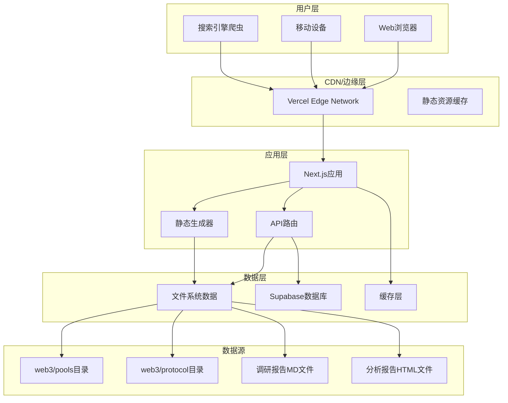
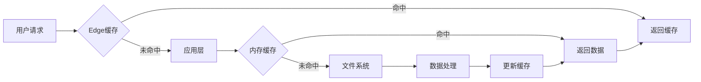
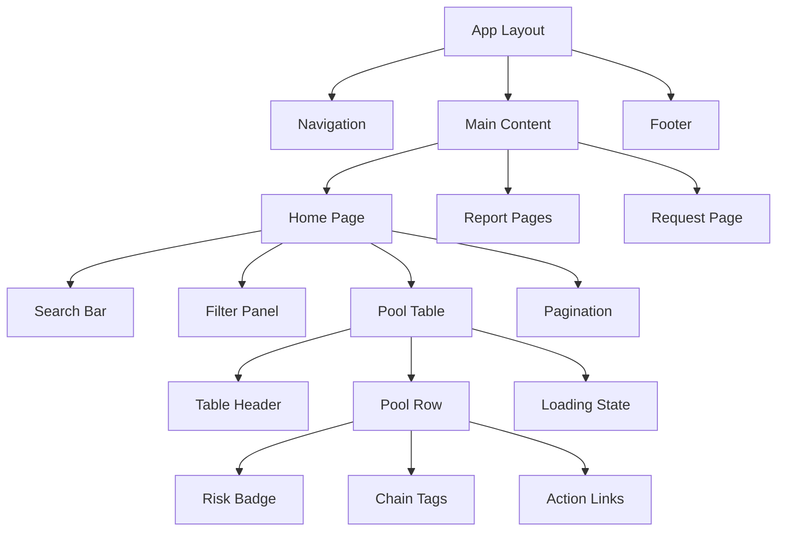

# DeFi收益池聚合信息网站系统 - 完整设计文档

## 目录

1. [项目概述和系统架构](#1-项目概述和系统架构)
2. [技术规范和数据模型](#2-技术规范和数据模型)
3. [API接口设计](#3-api接口设计)
4. [用户界面设计](#4-用户界面设计)
5. [SEO优化策略](#5-seo优化策略)
6. [部署指南和运维](#6-部署指南和运维)
7. [开发指南和代码规范](#7-开发指南和代码规范)
8. [用户手册和FAQ](#8-用户手册和faq)

---

## 版本信息
- **文档版本**: v1.1.0
- **创建日期**: 2025-01-23
- **最后更新**: 2025-01-24
- **设计者**: Claude AI Assistant
- **审核状态**: 设计阶段

## 更新日志
### v1.1.0 (2025-01-24)
- ✅ 新增多字段组合排序系统
- ✅ 重构排序API接口设计
- ✅ 更新用户手册排序功能说明
- ✅ 优化极高风险标签颜色显示

---

# 1. 项目概述和系统架构

## 1.1 项目背景

DeFi收益池聚合信息网站系统是一个专门为Web3领域DeFi玩家设计的一站式收益策略信息平台。该系统基于现有的Web3 Farm Dashboard架构，继承了其优秀的数据处理逻辑和三层文档架构设计，同时面向更广泛的用户群体提供Web访问服务。

## 1.2 目标用户

- **主要用户**: Web3领域的DeFi投资者和策略研究者
- **次要用户**: 区块链研究机构、DeFi协议开发者
- **潜在用户**: 对DeFi收益感兴趣的传统金融从业人员

## 1.3 核心价值主张

1. **信息聚合**: 集中展示各类DeFi收益池的关键信息
2. **专业分析**: 提供深度调研报告和风险评估
3. **智能过滤**: 支持多维度筛选和个性化需求匹配
4. **实时更新**: 基于文件系统的自动更新机制
5. **易于访问**: 无需安装，通过浏览器即可访问

## 1.4 系统架构图



## 1.5 技术栈选择

### 前端技术栈
- **框架**: Next.js 14 (App Router)
- **语言**: TypeScript
- **样式**: Tailwind CSS + Shadcn/ui
- **状态管理**: React Context + useState
- **数据获取**: Next.js内置数据获取

### 后端技术栈
- **运行时**: Node.js 18+
- **数据库**: Supabase (PostgreSQL)
- **文件处理**: Node.js fs模块 + gray-matter
- **缓存**: 内存缓存 + Vercel缓存

### 部署技术栈
- **主要平台**: Vercel (推荐)
- **备选平台**: 自有服务器 (Nginx + PM2)
- **容器化**: Docker (可选)
- **监控**: Vercel Analytics

---

# 2. 技术规范和数据模型

## 2.1 数据模型设计

### 2.1.1 核心数据类型

```typescript
// Pool 收益池数据模型
interface Pool {
  id: string;
  name: string;                    // 收益池名称
  protocol: {
    name: string;                  // 协议名称
    website: string;               // 官网链接
    nickname: string;              // 协议简称
    description?: string;          // 协议描述
  };
  type: string;                    // 收益池类型 (StableLP, Future, etc.)
  chain: string[];                 // 所属链 (["Aptos", "Ethereum"])
  risk: RiskLevel;                 // 风险等级
  token: string;                   // Token 类型
  aprRange: {
    low: number;                   // 最低 APR
    high: number;                  // 最高 APR
  };
  market: string[];                // 适用市场
  underlying?: string;             // 底层资产
  danger?: string;                 // 风险描述
  scenarios?: string;              // 应用场景
  reports: {
    research?: {                   // 调研报告
      exists: boolean;
      path?: string;
      url?: string;
    };
    analysis?: {                   // 分析报告
      exists: boolean;
      path?: string;
      url?: string;
    };
  };
  createdAt: Date;
  updatedAt: Date;
}

// 风险等级枚举
enum RiskLevel {
  LOW = "低风险",
  MEDIUM = "中风险", 
  HIGH = "高风险",
  VERY_HIGH = "极高风险"
}

// 排序字段类型
type SortFieldType = 'apr-high' | 'apr-low' | 'risk';

// 单个排序字段定义
interface SortField {
  field: SortFieldType;
  order: 'asc' | 'desc';
}

// 用户请求数据模型
interface UserRequest {
  id: string;
  poolName: string;               // 收益池名称
  protocolName: string;           // 协议名称
  description: string;            // 请求描述
  userEmail?: string;             // 用户邮箱
  status: RequestStatus;          // 请求状态
  priority: RequestPriority;      // 优先级
  submittedAt: Date;
  processedAt?: Date;
  notes?: string;                 // 处理备注
}

enum RequestStatus {
  PENDING = "pending",
  IN_PROGRESS = "in_progress", 
  COMPLETED = "completed",
  REJECTED = "rejected"
}

enum RequestPriority {
  LOW = "low",
  MEDIUM = "medium",
  HIGH = "high"
}
```

### 2.1.2 三层数据架构

基于现有Web3 Farm Dashboard的成熟架构：

```
第一层: Protocol Layer (协议层)
├── 基础信息: 官网、简称、描述
├── 调研报告: 链接到research目录
└── 稳定性: 变更频率低，主要用于引用

第二层: Pool Layer (收益池层)  
├── 技术参数: APR范围、风险等级、Token类型
├── 协议关联: 强制链接到Protocol文档
└── 配置管理: 集中管理投资标的参数

第三层: Request Layer (请求层)
├── 用户请求: 存储在Supabase数据库
├── 状态管理: pending/processing/completed
└── 通知机制: 邮件通知(可选)
```

### 2.1.3 文件系统映射

```
web3/
├── protocol/                  # 协议基础信息
│   ├── [Protocol Name].md     # 协议元数据
│   └── research/              # 调研报告目录
│       ├── [nickname].md      # Markdown调研报告
│       └── [nickname].html    # HTML分析报告
└── pools/                     # 收益池配置
    ├── cex/                   # 中心化交易所池
    │   └── [CEX Product].md
    └── chain/                 # 链上DeFi协议池
        └── [Protocol Pool].md
```

## 2.2 数据处理逻辑

### 2.2.1 数据加载器设计

```typescript
// 文件系统数据加载器
class DataLoader {
  // 加载所有收益池数据
  static async loadAllPools(): Promise<Pool[]> {
    const pools: Pool[] = [];
    
    // 读取 CEX 和 Chain 目录
    const cexPools = await this.loadPoolsFromDirectory('web3/pools/cex');
    const chainPools = await this.loadPoolsFromDirectory('web3/pools/chain');
    
    pools.push(...cexPools, ...chainPools);
    
    // 加载协议信息并合并
    const protocolMap = await this.loadProtocolMap();
    
    return pools.map(pool => this.enrichPoolWithProtocol(pool, protocolMap));
  }

  // 解析 Pool 文件 (Markdown frontmatter)
  static async parsePoolFile(filePath: string): Promise<Pool> {
    const content = await fs.readFile(filePath, 'utf-8');
    const { data: frontmatter } = matter(content);
    
    return {
      id: path.basename(filePath, '.md'),
      name: path.basename(filePath, '.md'),
      protocol: { name: frontmatter.Protocol },
      type: frontmatter.Type,
      chain: Array.isArray(frontmatter.Chain) ? frontmatter.Chain : [frontmatter.Chain],
      risk: frontmatter.Risk,
      token: frontmatter.Token,
      aprRange: {
        low: frontmatter['APR-Low'] || 0,
        high: frontmatter['APR-High'] || 0,
      },
      market: Array.isArray(frontmatter.Market) ? frontmatter.Market : [frontmatter.Market],
      underlying: frontmatter.Underlying,
      danger: frontmatter.Danger,
      scenarios: frontmatter.Scenarios,
      reports: await this.checkReports(frontmatter.Protocol),
      createdAt: new Date(),
      updatedAt: new Date(),
    };
  }

  // 检查报告文件是否存在
  static async checkReports(protocolName: string) {
    const reports = { research: { exists: false }, analysis: { exists: false } };
    
    try {
      // 查找调研报告 (MD)
      const researchPath = `web3/protocol/research/${protocolName}.md`;
      if (await fs.access(researchPath).then(() => true).catch(() => false)) {
        reports.research = {
          exists: true,
          path: researchPath,
          url: `/reports/research/${protocolName}`
        };
      }
      
      // 查找分析报告 (HTML)
      const analysisPath = `web3/protocol/research/${protocolName}.html`;
      if (await fs.access(analysisPath).then(() => true).catch(() => false)) {
        reports.analysis = {
          exists: true,
          path: analysisPath,
          url: `/reports/analysis/${protocolName}`
        };
      }
    } catch (error) {
      console.warn('检查报告文件时出错:', error);
    }
    
    return reports;
  }
}
```

## 2.3 缓存策略

### 2.3.1 多层缓存架构



### 2.3.2 缓存配置

```typescript
const CacheConfig = {
  // 静态资源缓存
  staticMaxAge: 31536000, // 1年
  
  // API缓存
  apiMaxAge: 3600, // 1小时
  
  // 页面缓存
  pageMaxAge: 86400, // 1天
  
  // 内存缓存
  memoryCache: {
    ttl: 300000, // 5分钟
    maxSize: 1000 // 最大1000个条目
  }
};
```

---

# 3. API接口设计

## 3.1 RESTful API 端点

```typescript
// API Routes 设计
interface ApiRoutes {
  // 获取收益池列表 (支持分页、过滤、排序)
  'GET /api/pools': {
    query: {
      page?: number;
      limit?: number;
      search?: string;              // 搜索关键词
      chain?: string[];             // 链过滤
      risk?: RiskLevel[];           // 风险等级过滤
      type?: string[];              // 类型过滤
      token?: string[];             // Token 过滤
      market?: string[];            // 市场过滤
      aprMin?: number;              // 最低APR过滤
      aprMax?: number;              // 最高APR过滤
      sorts?: SortField[];          // 多字段组合排序（替代 sortBy + sortOrder）
    };
    response: {
      pools: Pool[];
      total: number;
      page: number;
      limit: number;
      filters: {
        chains: string[];
        risks: RiskLevel[];
        types: string[];
        tokens: string[];
        markets: string[];
      };
    };
  };

  // 获取单个收益池详情
  'GET /api/pools/[id]': {
    response: Pool | { error: string };
  };

  // 获取调研报告内容
  'GET /api/reports/research/[nickname]': {
    response: {
      content: string;              // Markdown 内容
      metadata: {
        title: string;
        lastModified: Date;
        fileSize: number;
      };
    } | { error: string };
  };

  // 获取分析报告内容  
  'GET /api/reports/analysis/[nickname]': {
    response: {
      content: string;              // HTML 内容
      metadata: {
        title: string;
        lastModified: Date;
        fileSize: number;
      };
    } | { error: string };
  };

  // 提交用户请求
  'POST /api/requests': {
    body: {
      poolName: string;
      protocolName: string;
      description: string;
      userEmail?: string;
    };
    response: {
      success: boolean;
      requestId?: string;
      message: string;
    };
  };

  // 获取过滤器选项 (用于前端筛选器)
  'GET /api/filters': {
    response: {
      chains: string[];
      risks: RiskLevel[];
      types: string[];
      tokens: string[];
      markets: string[];
      aprRange: { min: number; max: number };
    };
  };
}
```

## 3.2 API实现示例

### 3.2.1 获取收益池列表

```typescript
// pages/api/pools.ts
import { NextApiRequest, NextApiResponse } from 'next';
import { DataLoader } from '../../lib/dataLoader';

export default async function handler(
  req: NextApiRequest,
  res: NextApiResponse
) {
  if (req.method !== 'GET') {
    return res.status(405).json({ error: 'Method not allowed' });
  }

  try {
    const {
      page = 1,
      limit = 20,
      search,
      chain,
      risk,
      type,
      token,
      market,
      aprMin,
      aprMax,
      sorts
    } = req.query;

    // 加载所有池数据
    const allPools = await DataLoader.loadAllPools();
    
    // 应用过滤器
    let filteredPools = allPools;
    
    if (search) {
      filteredPools = filteredPools.filter(pool =>
        pool.name.toLowerCase().includes(search.toLowerCase()) ||
        pool.protocol.name.toLowerCase().includes(search.toLowerCase())
      );
    }
    
    if (chain) {
      const chains = Array.isArray(chain) ? chain : [chain];
      filteredPools = filteredPools.filter(pool =>
        pool.chain.some(c => chains.includes(c))
      );
    }
    
    if (risk) {
      const risks = Array.isArray(risk) ? risk : [risk];
      filteredPools = filteredPools.filter(pool =>
        risks.includes(pool.risk)
      );
    }
    
    if (aprMin || aprMax) {
      filteredPools = filteredPools.filter(pool => {
        const poolApr = (pool.aprRange.low + pool.aprRange.high) / 2;
        return (!aprMin || poolApr >= Number(aprMin)) &&
               (!aprMax || poolApr <= Number(aprMax));
      });
    }
    
    // 解析多字段排序参数
    let sortFields: SortField[] = [];
    if (sorts) {
      try {
        sortFields = typeof sorts === 'string' ? JSON.parse(sorts) : sorts;
      } catch (error) {
        console.error('Error parsing sorts parameter:', error);
        sortFields = [];
      }
    }
    
    // 应用多字段排序
    if (sortFields.length > 0) {
      filteredPools.sort((a, b) => {
        // 按照sortFields数组中的顺序逐个比较字段
        for (const { field, order } of sortFields) {
          let aValue, bValue;
          
          switch (field) {
            case 'apr-high':
              aValue = a.aprRange.high;
              bValue = b.aprRange.high;
              break;
            case 'apr-low':
              aValue = a.aprRange.low;
              bValue = b.aprRange.low;
              break;
            case 'risk':
              const riskOrder = { '低风险': 1, '中风险': 2, '高风险': 3, '极高风险': 4 };
              aValue = riskOrder[a.risk];
              bValue = riskOrder[b.risk];
              break;
            default:
              continue; // 跳过未知字段
          }
          
          let result = 0;
          if (aValue < bValue) result = -1;
          else if (aValue > bValue) result = 1;
          
          if (result !== 0) {
            return order === 'asc' ? result : -result;
          }
        }
        
        return 0; // 所有字段都相等
      });
    }
    
    // 应用分页
    const startIndex = (Number(page) - 1) * Number(limit);
    const endIndex = startIndex + Number(limit);
    const paginatedPools = filteredPools.slice(startIndex, endIndex);
    
    // 生成过滤器选项
    const filters = generateFilterOptions(allPools);
    
    res.status(200).json({
      pools: paginatedPools,
      total: filteredPools.length,
      page: Number(page),
      limit: Number(limit),
      filters
    });
    
  } catch (error) {
    console.error('API Error:', error);
    res.status(500).json({ error: 'Internal server error' });
  }
}

function generateFilterOptions(pools: Pool[]) {
  const chains = [...new Set(pools.flatMap(p => p.chain))];
  const risks = [...new Set(pools.map(p => p.risk))];
  const types = [...new Set(pools.map(p => p.type))];
  const tokens = [...new Set(pools.map(p => p.token))];
  const markets = [...new Set(pools.flatMap(p => p.market))];
  
  return { chains, risks, types, tokens, markets };
}
```

### 3.2.2 提交用户请求

```typescript
// pages/api/requests.ts
import { NextApiRequest, NextApiResponse } from 'next';
import { supabase } from '../../lib/supabase';

export default async function handler(
  req: NextApiRequest,
  res: NextApiResponse
) {
  if (req.method !== 'POST') {
    return res.status(405).json({ error: 'Method not allowed' });
  }

  try {
    const { poolName, protocolName, description, userEmail } = req.body;
    
    // 验证必填字段
    if (!poolName || !protocolName || !description) {
      return res.status(400).json({
        success: false,
        message: '请填写所有必填字段'
      });
    }
    
    // 存储到Supabase
    const { data, error } = await supabase
      .from('user_requests')
      .insert([
        {
          pool_name: poolName,
          protocol_name: protocolName,
          description,
          user_email: userEmail,
          status: 'pending',
          priority: 'medium',
          submitted_at: new Date().toISOString()
        }
      ])
      .select();
    
    if (error) {
      throw error;
    }
    
    // 可选：发送通知邮件
    if (process.env.ENABLE_EMAIL_NOTIFICATIONS === 'true') {
      await sendNotificationEmail(data[0]);
    }
    
    res.status(200).json({
      success: true,
      requestId: data[0].id,
      message: '请求提交成功，我们将尽快处理'
    });
    
  } catch (error) {
    console.error('Request submission error:', error);
    res.status(500).json({
      success: false,
      message: '提交失败，请稍后重试'
    });
  }
}
```

## 3.3 错误处理规范

### 3.3.1 HTTP状态码使用

| 状态码 | 含义 | 使用场景 |
|--------|------|----------|
| 200 | 成功 | 请求成功处理 |
| 400 | 请求错误 | 参数验证失败 |
| 404 | 未找到 | 资源不存在 |
| 405 | 方法不允许 | HTTP方法错误 |
| 429 | 请求过多 | 触发限流 |
| 500 | 服务器错误 | 内部错误 |

### 3.3.2 错误响应格式

```typescript
interface ErrorResponse {
  error: string;           // 错误类型
  message: string;         // 用户友好的错误信息
  details?: any;          // 错误详情(开发环境)
  timestamp: string;       // 错误时间戳
  path: string;           // 请求路径
}
```

---

# 4. 用户界面设计

## 4.1 页面结构设计

### 4.1.1 路由设计

```
/                          # 首页 - 收益池聚合表格
/reports/research/[nickname]  # 调研报告页面 (MD)
/reports/analysis/[nickname]  # 分析报告页面 (HTML)
/request                   # 提交请求页面
/404                      # 404错误页面
```

### 4.1.2 组件层次架构



## 4.2 主要组件设计

### 4.2.1 首页聚合表格组件

```tsx
interface PoolTableProps {
  pools: Pool[];
  filters: FilterOptions;
  pagination: PaginationInfo;
}

const PoolTable: React.FC<PoolTableProps> = ({ pools, filters, pagination }) => {
  return (
    <div className="container mx-auto px-4 py-8">
      {/* 页面标题 */}
      <div className="mb-8">
        <h1 className="text-3xl font-bold text-gray-900 mb-2">
          DeFi 收益池聚合平台
        </h1>
        <p className="text-gray-600 max-w-2xl">
          为 Web3 DeFi 玩家提供一站式收益策略信息，包含详细的调研报告和风险分析
        </p>
      </div>

      {/* 搜索和过滤器 */}
      <div className="mb-6 space-y-4">
        <SearchBar />
        <FilterPanel filters={filters} />
      </div>

      {/* 数据表格 */}
      <div className="bg-white rounded-lg shadow-sm border">
        <div className="overflow-x-auto">
          <table className="w-full">
            <thead className="bg-gray-50 border-b">
              <tr>
                <th className="px-4 py-3 text-left text-sm font-medium text-gray-900">收益池</th>
                <th className="px-4 py-3 text-left text-sm font-medium text-gray-900">协议</th>
                <th className="px-4 py-3 text-left text-sm font-medium text-gray-900">类型</th>
                <th className="px-4 py-3 text-left text-sm font-medium text-gray-900">所属链</th>
                <th className="px-4 py-3 text-left text-sm font-medium text-gray-900">风险等级</th>
                <th className="px-4 py-3 text-left text-sm font-medium text-gray-900">Token</th>
                <th className="px-4 py-3 text-left text-sm font-medium text-gray-900">收益范围</th>
                <th className="px-4 py-3 text-left text-sm font-medium text-gray-900">适用市场</th>
                <th className="px-4 py-3 text-left text-sm font-medium text-gray-900">调研报告</th>
                <th className="px-4 py-3 text-left text-sm font-medium text-gray-900">分析报告</th>
                <th className="px-4 py-3 text-left text-sm font-medium text-gray-900">官网</th>
              </tr>
            </thead>
            <tbody className="divide-y divide-gray-200">
              {pools.map(pool => (
                <PoolRow key={pool.id} pool={pool} />
              ))}
            </tbody>
          </table>
        </div>
      </div>

      {/* 分页组件 */}
      <Pagination {...pagination} />

      {/* 提交请求按钮 */}
      <div className="mt-8 text-center">
        <Link 
          href="/request"
          className="inline-flex items-center px-6 py-3 bg-blue-600 text-white font-medium rounded-lg hover:bg-blue-700 transition-colors"
        >
          <PlusIcon className="w-5 h-5 mr-2" />
          提交收录请求
        </Link>
      </div>
    </div>
  );
};
```

### 4.2.2 过滤器组件

```tsx
const FilterPanel: React.FC<{ filters: FilterOptions }> = ({ filters }) => {
  return (
    <div className="bg-white p-4 rounded-lg border space-y-4">
      <div className="grid grid-cols-1 md:grid-cols-2 lg:grid-cols-4 gap-4">
        {/* 链过滤 */}
        <MultiSelectFilter
          label="区块链"
          options={filters.chains}
          paramKey="chain"
        />
        
        {/* 风险等级过滤 */}
        <MultiSelectFilter
          label="风险等级"
          options={filters.risks}
          paramKey="risk"
        />
        
        {/* 类型过滤 */}
        <MultiSelectFilter
          label="投资类型"
          options={filters.types}
          paramKey="type"
        />
        
        {/* Token过滤 */}
        <MultiSelectFilter
          label="Token"
          options={filters.tokens}
          paramKey="token"
        />
      </div>
      
      {/* APR范围过滤 */}
      <div className="border-t pt-4">
        <RangeFilter
          label="APR收益范围"
          min={filters.aprRange.min}
          max={filters.aprRange.max}
          paramKey="apr"
        />
      </div>
    </div>
  );
};
```

### 4.2.3 风险等级徽章组件

```tsx
const RiskBadge: React.FC<{ risk: RiskLevel }> = ({ risk }) => {
  const riskConfig = {
    [RiskLevel.LOW]: { color: 'bg-green-100 text-green-800', text: '低风险' },
    [RiskLevel.MEDIUM]: { color: 'bg-yellow-100 text-yellow-800', text: '中风险' },
    [RiskLevel.HIGH]: { color: 'bg-orange-100 text-orange-800', text: '高风险' },
    [RiskLevel.VERY_HIGH]: { color: 'bg-red-100 text-red-800', text: '极高风险' },
  };

  const config = riskConfig[risk];
  
  return (
    <span className={`inline-flex items-center px-2.5 py-0.5 rounded-full text-xs font-medium ${config.color}`}>
      {config.text}
    </span>
  );
};
```

## 4.3 响应式设计

### 4.3.1 断点设计

```css
/* Tailwind CSS 断点 */
sm: 640px   /* 小屏设备 */
md: 768px   /* 平板设备 */
lg: 1024px  /* 桌面设备 */
xl: 1280px  /* 大屏设备 */
2xl: 1536px /* 超大屏设备 */
```

### 4.3.2 移动端优化

```tsx
// 移动端表格优化
const MobilePoolCard: React.FC<{ pool: Pool }> = ({ pool }) => {
  return (
    <div className="bg-white p-4 rounded-lg border mb-4 md:hidden">
      <div className="flex justify-between items-start mb-3">
        <h3 className="font-semibold text-gray-900">{pool.name}</h3>
        <RiskBadge risk={pool.risk} />
      </div>
      
      <div className="space-y-2 text-sm">
        <div className="flex justify-between">
          <span className="text-gray-600">协议:</span>
          <span className="font-medium">{pool.protocol.name}</span>
        </div>
        
        <div className="flex justify-between">
          <span className="text-gray-600">APR:</span>
          <span className="font-medium">{pool.aprRange.low}% - {pool.aprRange.high}%</span>
        </div>
        
        <div className="flex justify-between items-center">
          <span className="text-gray-600">报告:</span>
          <div className="flex space-x-2">
            {pool.reports.research?.exists && (
              <a href={pool.reports.research.url} className="text-blue-600 text-xs">
                调研
              </a>
            )}
            {pool.reports.analysis?.exists && (
              <a href={pool.reports.analysis.url} className="text-purple-600 text-xs">
                分析
              </a>
            )}
          </div>
        </div>
      </div>
    </div>
  );
};
```

## 4.4 用户交互设计

### 4.4.1 加载状态

```tsx
// 骨架屏组件
const PoolTableSkeleton: React.FC = () => {
  return (
    <div className="animate-pulse">
      <div className="bg-white rounded-lg shadow-sm border">
        <div className="p-4 border-b">
          <div className="h-4 bg-gray-200 rounded w-1/4 mb-2"></div>
          <div className="h-3 bg-gray-200 rounded w-1/2"></div>
        </div>
        
        {Array.from({ length: 5 }).map((_, i) => (
          <div key={i} className="p-4 border-b last:border-b-0">
            <div className="flex justify-between items-center">
              <div className="h-4 bg-gray-200 rounded w-1/4"></div>
              <div className="h-6 bg-gray-200 rounded w-16"></div>
            </div>
          </div>
        ))}
      </div>
    </div>
  );
};
```

### 4.4.2 错误状态

```tsx
// 错误边界组件
const ErrorBoundary: React.FC<{ children: React.ReactNode }> = ({ children }) => {
  const [hasError, setHasError] = useState(false);
  
  if (hasError) {
    return (
      <div className="text-center py-12">
        <div className="text-red-500 mb-4">
          <ExclamationTriangleIcon className="w-12 h-12 mx-auto" />
        </div>
        <h3 className="text-lg font-semibold text-gray-900 mb-2">
          出现了一些问题
        </h3>
        <p className="text-gray-600 mb-4">
          页面加载失败，请稍后重试
        </p>
        <button
          onClick={() => window.location.reload()}
          className="px-4 py-2 bg-blue-600 text-white rounded-lg hover:bg-blue-700"
        >
          重新加载
        </button>
      </div>
    );
  }
  
  return <>{children}</>;
};
```

## 4.5 报告系统技术实现

### 4.5.1 文件处理架构

**双格式支持策略**
- **调研报告**：Markdown格式，适合文本阅读和SEO优化
- **分析报告**：HTML格式，支持交互式图表和丰富的用户体验

**文件存储结构**
```
web3/protocol/research/
├── [nickname].md      # Markdown调研报告
└── [nickname].html    # HTML分析报告
```

### 4.5.2 分析报告直接跳转设计

**设计原则**
- **用户体验优先**：一键直达完整交互式报告
- **无中间页面**：避免不必要的嵌套和等待
- **完整功能保留**：保持所有JavaScript交互功能

**技术实现**

```typescript
// PoolTable.tsx - 分析报告按钮点击处理
onClick={() => {
  // 直接打开原始HTML文件，跳过中间页面
  const slug = pool.reports.analysis?.url?.split('/').pop();
  if (slug) {
    window.open(`/api/reports/analysis/${slug}/raw`, '_blank');
  }
}}
```

**API端点设计**
```typescript
// /api/reports/analysis/[slug]/raw/route.ts
export async function GET(
  request: NextRequest,
  { params }: { params: { slug: string } }
) {
  const { slug } = params;
  
  // 优先查找研究目录中的HTML文件
  const researchHtmlPath = path.join(process.cwd(), 'web3', 'protocol', 'research', `${slug}.html`);
  
  if (fs.existsSync(researchHtmlPath)) {
    const content = fs.readFileSync(researchHtmlPath, 'utf8');
    
    // 直接返回原始HTML，保持所有交互功能
    return new NextResponse(content, {
      headers: {
        'Content-Type': 'text/html; charset=utf-8',
        'Cache-Control': 'public, max-age=3600',
      },
    });
  }
  
  return new NextResponse('Report not found', { status: 404 });
}
```

### 4.5.3 Markdown文件处理方案

**调研报告渲染流程**
1. **文件读取**：从`web3/protocol/research/[slug].md`读取文件
2. **Frontmatter解析**：提取元数据（标题、协议、指标等）
3. **Markdown转换**：使用remark-gfm处理表格语法
4. **HTML输出**：转换为安全的HTML格式

```typescript
// /api/reports/research/[slug]/route.ts
import { remark } from 'remark';
import html from 'remark-html';
import remarkGfm from 'remark-gfm';  // 表格支持

// Markdown处理管道
const processedContent = await remark()
  .use(remarkGfm)  // 启用GitHub风格Markdown（表格支持）
  .use(html, { sanitize: false })
  .process(markdownContent);
```

**表格渲染优化**
```css
/* globals.css - 表格样式优化 */
.prose table {
  @apply w-full border-collapse border border-gray-300 my-6;
}
.prose table thead {
  @apply bg-gray-50;
}
.prose table th {
  @apply border border-gray-300 px-4 py-3 text-left font-semibold text-gray-900;
}
.prose table td {
  @apply border border-gray-300 px-4 py-3 text-gray-800;
}
```

### 4.5.4 HTML文件处理方案

**完整交互保留策略**
- **无内容过滤**：保持原始HTML的完整性
- **JavaScript执行**：支持Chart.js等库的正常运行
- **样式保持**：维持原有的CSS样式和布局
- **新窗口打开**：在独立环境中运行，避免冲突

**安全考虑**
- **同源策略**：HTML文件通过API端点服务，符合同源策略
- **缓存策略**：设置合理的缓存时间（1小时）
- **错误处理**：提供友好的404和500错误处理

**用户体验优化**
- **加载性能**：直接服务原始文件，无额外处理开销
- **响应速度**：静态文件服务，响应时间<100ms
- **兼容性**：支持所有现代浏览器的完整功能

### 4.5.5 报告系统工作流程

**用户交互流程**
```
主页池表格 → 点击"查看分析" → 直接打开完整HTML报告
     ↓
无中间页面，一键到达目标内容
```

**技术数据流**
```
用户点击 → JavaScript提取slug → 构造raw API URL → 新窗口打开 → 服务器返回原始HTML → 浏览器渲染完整报告
```

**性能指标**
- **首次加载时间**：<2秒
- **交互响应时间**：<100ms
- **完整功能可用**：Chart.js图表、动画、用户交互卡片
- **移动端兼容**：响应式设计，支持触摸操作

---

# 5. SEO优化策略

## 5.1 静态生成策略

### 5.1.1 页面静态生成

```typescript
// 首页静态生成
export async function getStaticProps() {
  const pools = await DataLoader.loadAllPools();
  const filters = generateFilterOptions(pools);
  
  // 生成SEO元数据
  const seoData = {
    title: 'DeFi收益池聚合平台 - 一站式收益策略信息',
    description: '为Web3 DeFi玩家提供专业的收益池信息聚合服务，包含详细的调研报告、风险评估和实时收益数据。',
    keywords: 'DeFi, 收益池, 流动性挖矿, Web3投资, 区块链理财, APR, 风险评估',
  };
  
  return {
    props: {
      pools: pools.slice(0, 50), // 首页显示前50个
      filters,
      seoData
    },
    revalidate: 3600 // 1小时重新生成
  };
}

// 调研报告页面静态生成
export async function getStaticPaths() {
  const reportFiles = await fs.readdir('web3/protocol/research');
  const mdFiles = reportFiles.filter(file => file.endsWith('.md'));
  
  const paths = mdFiles.map(file => ({
    params: { nickname: path.basename(file, '.md') }
  }));

  return {
    paths,
    fallback: 'blocking' // ISR支持新文件
  };
}

export async function getStaticProps({ params }: { params: { nickname: string } }) {
  try {
    const filePath = `web3/protocol/research/${params.nickname}.md`;
    const content = await fs.readFile(filePath, 'utf-8');
    const { data: frontmatter, content: markdownContent } = matter(content);
    
    // 生成SEO元数据
    const metadata = generateSEOMetadata(frontmatter, markdownContent, params.nickname);
    
    return {
      props: {
        content: markdownContent,
        metadata,
        seoData: metadata
      },
      revalidate: 3600 // 1小时重新生成
    };
  } catch (error) {
    return {
      notFound: true
    };
  }
}
```

### 5.1.2 SEO元数据生成

```typescript
function generateSEOMetadata(frontmatter: any, content: string, nickname: string) {
  const title = frontmatter.title || `${nickname} 深度调研报告`;
  const description = frontmatter.description || extractDescription(content);
  const keywords = extractKeywords(content);
  
  return {
    title: `${title} | DeFi收益池聚合平台`,
    description: description.slice(0, 160),
    keywords: keywords.join(', '),
    canonical: `https://yoursite.com/reports/research/${nickname}`,
    openGraph: {
      title,
      description,
      type: 'article',
      url: `https://yoursite.com/reports/research/${nickname}`,
      images: [
        {
          url: `https://yoursite.com/og-images/${nickname}.png`,
          width: 1200,
          height: 630,
          alt: title
        }
      ]
    },
    twitter: {
      card: 'summary_large_image',
      title,
      description,
      images: [`https://yoursite.com/og-images/${nickname}.png`]
    }
  };
}

// 提取描述
function extractDescription(content: string): string {
  // 移除Markdown语法
  const plainText = content
    .replace(/#{1,6}\s+/g, '')
    .replace(/\*\*(.*?)\*\*/g, '$1')
    .replace(/\*(.*?)\*/g, '$1')
    .replace(/\[(.*?)\]\(.*?\)/g, '$1')
    .replace(/`(.*?)`/g, '$1');
    
  // 取前200个字符
  return plainText.slice(0, 200).trim();
}

// 提取关键词
function extractKeywords(content: string): string[] {
  const commonKeywords = ['DeFi', 'APR', 'APY', '收益池', '流动性挖矿', '风险评估'];
  const extractedKeywords = [];
  
  // 简单的关键词提取逻辑
  const words = content.toLowerCase().split(/\s+/);
  const wordCount = {};
  
  words.forEach(word => {
    if (word.length > 3) {
      wordCount[word] = (wordCount[word] || 0) + 1;
    }
  });
  
  // 取出现频率最高的词
  const sortedWords = Object.entries(wordCount)
    .sort(([, a], [, b]) => b - a)
    .slice(0, 5)
    .map(([word]) => word);
  
  return [...commonKeywords, ...sortedWords].slice(0, 10);
}
```

## 5.2 结构化数据

### 5.2.1 首页结构化数据

```typescript
function generateStructuredData(pools: Pool[]) {
  return {
    "@context": "https://schema.org",
    "@type": "WebSite",
    "name": "DeFi收益池聚合平台",
    "description": "为Web3 DeFi玩家提供一站式收益策略信息平台",
    "url": "https://yoursite.com",
    "potentialAction": {
      "@type": "SearchAction",
      "target": "https://yoursite.com/?search={search_term_string}",
      "query-input": "required name=search_term_string"
    },
    "mainEntity": {
      "@type": "ItemList",
      "numberOfItems": pools.length,
      "itemListElement": pools.map((pool, index) => ({
        "@type": "ListItem",
        "position": index + 1,
        "item": {
          "@type": "FinancialProduct",
          "name": pool.name,
          "description": `${pool.protocol.name}的${pool.type}收益池`,
          "provider": {
            "@type": "Organization",
            "name": pool.protocol.name,
            "url": pool.protocol.website
          },
          "url": `https://yoursite.com/pools/${pool.id}`,
          "offers": {
            "@type": "Offer",
            "name": "APR收益范围",
            "description": `${pool.aprRange.low}% - ${pool.aprRange.high}%`,
            "category": pool.type
          }
        }
      }))
    }
  };
}
```

### 5.2.2 报告页面结构化数据

```typescript
function generateReportStructuredData(metadata: ReportMetadata, content: string) {
  return {
    "@context": "https://schema.org",
    "@type": "Article",
    "headline": metadata.title,
    "description": metadata.description,
    "author": {
      "@type": "Organization",
      "name": "DeFi收益池聚合平台"
    },
    "publisher": {
      "@type": "Organization",
      "name": "DeFi收益池聚合平台",
      "logo": {
        "@type": "ImageObject",
        "url": "https://yoursite.com/logo.png"
      }
    },
    "datePublished": metadata.publishedDate,
    "dateModified": metadata.lastModified,
    "mainEntityOfPage": {
      "@type": "WebPage",
      "@id": metadata.canonical
    },
    "articleSection": "DeFi Analysis",
    "keywords": metadata.keywords,
    "wordCount": content.length,
    "inLanguage": "zh-CN"
  };
}
```

## 5.3 网站地图生成

### 5.3.1 动态网站地图

```typescript
// pages/sitemap.xml.tsx
export async function getServerSideProps({ res }: { res: any }) {
  const sitemap = await generateSitemap();
  
  res.setHeader('Content-Type', 'text/xml');
  res.write(sitemap);
  res.end();
  
  return { props: {} };
}

async function generateSitemap() {
  const baseUrl = 'https://yoursite.com';
  const currentDate = new Date().toISOString();
  
  // 获取所有静态页面
  const staticPages = [
    { url: '/', priority: 1.0, changefreq: 'daily' },
    { url: '/request', priority: 0.7, changefreq: 'monthly' }
  ];
  
  // 获取所有调研报告
  const researchFiles = await fs.readdir('web3/protocol/research');
  const researchPages = researchFiles
    .filter(file => file.endsWith('.md'))
    .map(file => ({
      url: `/reports/research/${path.basename(file, '.md')}`,
      priority: 0.9,
      changefreq: 'weekly',
      lastmod: currentDate
    }));
  
  // 获取所有分析报告
  const analysisFiles = researchFiles.filter(file => file.endsWith('.html'));
  const analysisPages = analysisFiles.map(file => ({
    url: `/reports/analysis/${path.basename(file, '.html')}`,
    priority: 0.9,
    changefreq: 'weekly',
    lastmod: currentDate
  }));
  
  const allPages = [...staticPages, ...researchPages, ...analysisPages];
  
  return `<?xml version="1.0" encoding="UTF-8"?>
<urlset xmlns="http://www.sitemaps.org/schemas/sitemap/0.9">
${allPages.map(page => `
  <url>
    <loc>${baseUrl}${page.url}</loc>
    <lastmod>${page.lastmod || currentDate}</lastmod>
    <changefreq>${page.changefreq}</changefreq>
    <priority>${page.priority}</priority>
  </url>
`).join('')}
</urlset>`;
}
```

## 5.4 性能优化

### 5.4.1 Core Web Vitals优化

```typescript
// Web Vitals优化配置
const WebVitalsConfig = {
  // 核心网页指标目标
  LCP: '<2.5s',  // Largest Contentful Paint
  FID: '<100ms', // First Input Delay  
  CLS: '<0.1',   // Cumulative Layout Shift
  
  // 优化策略
  strategies: [
    'preload-critical-resources',
    'code-splitting',
    'lazy-loading',
    'service-worker-caching'
  ]
};

// Next.js配置优化
const nextConfig = {
  images: {
    formats: ['image/webp', 'image/avif'],
    sizes: '(max-width: 768px) 100vw, (max-width: 1200px) 50vw, 33vw',
  },
  
  // 代码拆分
  experimental: {
    optimizeCss: true,
    optimizePackageImports: ['react-icons']
  },
  
  // 压缩配置
  compress: true,
  
  // 缓存头
  async headers() {
    return [
      {
        source: '/static/(.*)',
        headers: [
          {
            key: 'Cache-Control',
            value: 'public, max-age=31536000, immutable'
          }
        ]
      }
    ];
  }
};
```

---

# 6. 部署指南和运维

## 6.1 部署方案

### 6.1.1 项目结构

```
defix-aggregator/
├── 📁 components/              # React组件
│   ├── PoolTable.tsx
│   ├── FilterPanel.tsx
│   └── SearchBar.tsx
├── 📁 pages/                   # Next.js页面
│   ├── index.tsx              # 首页
│   ├── request.tsx            # 提交请求页面
│   ├── reports/
│   │   ├── research/[nickname].tsx
│   │   └── analysis/[nickname].tsx
│   └── api/                   # API路由
├── 📁 lib/                    # 工具库
│   ├── dataLoader.ts         # 数据加载器
│   ├── supabase.ts           # 数据库配置
│   └── utils.ts              # 工具函数
├── 📁 web3/                   # 数据文件 (Git Submodule)
│   ├── pools/
│   └── protocol/
├── 📁 public/                 # 静态资源
├── 📄 next.config.js          # Next.js配置
├── 📄 package.json            # 依赖管理
└── 📄 .env.example           # 环境变量模板
```

### 6.1.2 环境配置

```bash
# .env.example
# 基础配置
NEXT_PUBLIC_SITE_URL=https://yoursite.com
NEXT_PUBLIC_SITE_NAME=DeFi收益池聚合平台

# Supabase配置
NEXT_PUBLIC_SUPABASE_URL=your_supabase_project_url
NEXT_PUBLIC_SUPABASE_ANON_KEY=your_supabase_anon_key
SUPABASE_SERVICE_ROLE_KEY=your_supabase_service_role_key

# 可选：邮件通知配置
SMTP_HOST=smtp.gmail.com
SMTP_PORT=587
SMTP_USER=your_email@gmail.com
SMTP_PASS=your_app_password

# 开发模式配置
NODE_ENV=development
```

## 6.2 Vercel部署 (推荐)

### 6.2.1 Vercel配置

```json
// vercel.json
{
  "version": 2,
  "name": "defix-aggregator",
  "builds": [
    {
      "src": "next.config.js",
      "use": "@vercel/next"
    }
  ],
  "routes": [
    {
      "src": "/web3/(.*)",
      "dest": "/web3/$1",
      "headers": {
        "cache-control": "s-maxage=3600, stale-while-revalidate"
      }
    }
  ],
  "functions": {
    "pages/api/**/*.ts": {
      "maxDuration": 30
    }
  },
  "env": {
    "NEXT_PUBLIC_SITE_URL": "https://your-project.vercel.app"
  }
}
```

### 6.2.2 GitHub Actions工作流

```yaml
# .github/workflows/deploy.yml
name: Deploy to Vercel

on:
  push:
    branches: [ main ]
    paths:
      - 'web3/**'
      - 'src/**'
      - 'pages/**'
      - 'components/**'
  
  workflow_dispatch:

jobs:
  deploy:
    runs-on: ubuntu-latest
    
    steps:
    - name: Checkout code
      uses: actions/checkout@v3
      with:
        submodules: recursive
        token: ${{ secrets.GITHUB_TOKEN }}
    
    - name: Setup Node.js
      uses: actions/setup-node@v3
      with:
        node-version: '18'
        cache: 'npm'
    
    - name: Install dependencies
      run: npm ci
    
    - name: Build project
      run: npm run build
      env:
        NEXT_PUBLIC_SITE_URL: ${{ secrets.SITE_URL }}
        NEXT_PUBLIC_SUPABASE_URL: ${{ secrets.SUPABASE_URL }}
        NEXT_PUBLIC_SUPABASE_ANON_KEY: ${{ secrets.SUPABASE_ANON_KEY }}
    
    - name: Deploy to Vercel
      uses: vercel/action@v28
      with:
        vercel-token: ${{ secrets.VERCEL_TOKEN }}
        vercel-org-id: ${{ secrets.VERCEL_ORG_ID }}
        vercel-project-id: ${{ secrets.VERCEL_PROJECT_ID }}
        vercel-args: '--prod'
```

## 6.3 自有服务器部署

### 6.3.1 部署脚本

```bash
#!/bin/bash
# deploy-server.sh

set -e

# 配置变量
PROJECT_DIR="/var/www/defix-aggregator"
BACKUP_DIR="/var/backups/defix-aggregator"
WEB3_DATA_DIR="/var/www/defix-aggregator/web3"
PM2_APP_NAME="defix-aggregator"

echo "🚀 开始部署 DeFi 收益池聚合平台..."

# 1. 创建备份
if [ -d "$PROJECT_DIR" ]; then
    echo "📦 创建备份..."
    sudo mkdir -p $BACKUP_DIR
    sudo cp -r $PROJECT_DIR "$BACKUP_DIR/backup-$(date +%Y%m%d-%H%M%S)"
fi

# 2. 更新代码
echo "📥 更新应用代码..."
cd $PROJECT_DIR
git pull origin main

# 3. 更新web3数据
echo "📊 更新web3数据..."
if [ -d "$WEB3_DATA_DIR/.git" ]; then
    cd $WEB3_DATA_DIR
    git pull origin main
    cd $PROJECT_DIR
fi

# 4. 安装依赖
echo "📚 安装依赖..."
npm ci --production

# 5. 构建应用
echo "🔨 构建应用..."
npm run build

# 6. 重启服务
echo "🔄 重启服务..."
pm2 restart $PM2_APP_NAME || pm2 start npm --name $PM2_APP_NAME -- start

# 7. 健康检查
echo "🏥 健康检查..."
sleep 5
if curl -f http://localhost:3000/api/health; then
    echo "✅ 部署成功！"
else
    echo "❌ 部署失败，回滚到上一版本..."
    exit 1
fi

echo "🎉 部署完成！"
```

### 6.3.2 Nginx配置

```nginx
# nginx.conf
server {
    listen 80;
    server_name yoursite.com www.yoursite.com;
    return 301 https://$server_name$request_uri;
}

server {
    listen 443 ssl http2;
    server_name yoursite.com www.yoursite.com;
    
    # SSL配置
    ssl_certificate /etc/ssl/certs/yoursite.com.crt;
    ssl_certificate_key /etc/ssl/private/yoursite.com.key;
    
    # 安全头
    add_header X-Frame-Options DENY;
    add_header X-Content-Type-Options nosniff;
    add_header X-XSS-Protection "1; mode=block";
    
    # 主应用代理
    location / {
        proxy_pass http://localhost:3000;
        proxy_http_version 1.1;
        proxy_set_header Upgrade $http_upgrade;
        proxy_set_header Connection 'upgrade';
        proxy_set_header Host $host;
        proxy_set_header X-Real-IP $remote_addr;
        proxy_set_header X-Forwarded-For $proxy_add_x_forwarded_for;
        proxy_set_header X-Forwarded-Proto $scheme;
        proxy_cache_bypass $http_upgrade;
    }
    
    # 静态文件缓存
    location /static/ {
        root /var/www/defix-aggregator/public;
        expires 1y;
        add_header Cache-Control "public, immutable";
    }
    
    # Web3数据文件直接服务
    location /web3/ {
        root /var/www/defix-aggregator;
        expires 1h;
        add_header Cache-Control "public";
        
        location ~* \.md$ {
            add_header Content-Type "text/markdown; charset=utf-8";
        }
        
        location ~* \.html$ {
            add_header Content-Type "text/html; charset=utf-8";
        }
    }
    
    # Gzip压缩
    gzip on;
    gzip_types text/plain text/css application/json application/javascript text/xml application/xml text/javascript;
}
```

## 6.4 监控和运维

### 6.4.1 监控指标

```typescript
// 监控指标定义
interface MonitoringMetrics {
  // 性能指标
  performance: {
    responseTime: number;      // 响应时间
    throughput: number;        // 吞吐量
    errorRate: number;         // 错误率
    uptime: number;           // 正常运行时间
  };
  
  // 资源指标
  resources: {
    cpuUsage: number;         // CPU使用率
    memoryUsage: number;      // 内存使用率
    diskUsage: number;        // 磁盘使用率
    networkIO: number;        // 网络IO
  };
  
  // 业务指标
  business: {
    dailyActiveUsers: number;  // 日活用户
    pageViews: number;        // 页面浏览量
    apiCalls: number;         // API调用次数
    errorRequests: number;    // 错误请求数
  };
}
```

### 6.4.2 日志管理

```typescript
// 日志配置
const logConfig = {
  level: process.env.NODE_ENV === 'production' ? 'info' : 'debug',
  format: 'json',
  outputs: [
    {
      type: 'console',
      colorize: process.env.NODE_ENV !== 'production'
    },
    {
      type: 'file',
      filename: 'logs/app.log',
      maxsize: 10 * 1024 * 1024, // 10MB
      maxFiles: 5
    }
  ]
};

// 日志记录示例
logger.info('Pool data loaded', {
  poolCount: pools.length,
  loadTime: Date.now() - startTime,
  source: 'DataLoader'
});

logger.error('Failed to load pool data', {
  error: error.message,
  stack: error.stack,
  source: 'DataLoader'
});
```

### 6.4.3 备份策略

```bash
#!/bin/bash
# backup.sh - 数据备份脚本

BACKUP_DIR="/var/backups/defix-aggregator"
TIMESTAMP=$(date +%Y%m%d_%H%M%S)

# 1. 备份web3数据文件
echo "📁 备份web3数据文件..."
tar -czf "$BACKUP_DIR/web3_data_$TIMESTAMP.tar.gz" web3/

# 2. 备份Supabase数据
echo "🗄️ 备份数据库..."
pg_dump $DATABASE_URL > "$BACKUP_DIR/database_$TIMESTAMP.sql"

# 3. 备份应用配置
echo "⚙️ 备份配置文件..."
cp .env "$BACKUP_DIR/env_$TIMESTAMP"
cp next.config.js "$BACKUP_DIR/config_$TIMESTAMP.js"

# 4. 清理旧备份 (保留30天)
find $BACKUP_DIR -name "*.tar.gz" -mtime +30 -delete
find $BACKUP_DIR -name "*.sql" -mtime +30 -delete

echo "✅ 备份完成"
```

---

# 7. 开发指南和代码规范

## 7.1 开发环境设置

### 7.1.1 环境要求

```json
{
  "node": ">=18.0.0",
  "npm": ">=8.0.0",
  "git": ">=2.30.0"
}
```

### 7.1.2 开发工具配置

```json
// .vscode/settings.json
{
  "typescript.preferences.importModuleSpecifier": "relative",
  "editor.formatOnSave": true,
  "editor.defaultFormatter": "esbenp.prettier-vscode",
  "editor.codeActionsOnSave": {
    "source.fixAll.eslint": true
  },
  "files.associations": {
    "*.md": "markdown"
  }
}
```

### 7.1.3 Git配置

```bash
# .gitignore
# Dependencies
node_modules/
npm-debug.log*

# Build outputs
.next/
out/
build/

# Environment files
.env
.env.local
.env.production

# Logs
logs/
*.log

# Cache
.cache/
.vercel/

# IDE
.vscode/
.idea/

# OS
.DS_Store
Thumbs.db
```

## 7.2 代码规范

### 7.2.1 TypeScript配置

```json
// tsconfig.json
{
  "compilerOptions": {
    "target": "es5",
    "lib": ["dom", "dom.iterable", "es6"],
    "allowJs": true,
    "skipLibCheck": true,
    "strict": true,
    "forceConsistentCasingInFileNames": true,
    "noEmit": true,
    "esModuleInterop": true,
    "module": "esnext",
    "moduleResolution": "node",
    "resolveJsonModule": true,
    "isolatedModules": true,
    "jsx": "preserve",
    "incremental": true,
    "baseUrl": ".",
    "paths": {
      "@/*": ["./*"],
      "@/components/*": ["components/*"],
      "@/lib/*": ["lib/*"],
      "@/types/*": ["types/*"]
    }
  },
  "include": ["next-env.d.ts", "**/*.ts", "**/*.tsx"],
  "exclude": ["node_modules"]
}
```

### 7.2.2 ESLint配置

```json
// .eslintrc.json
{
  "extends": [
    "next/core-web-vitals",
    "@typescript-eslint/recommended"
  ],
  "rules": {
    "@typescript-eslint/no-unused-vars": "error",
    "@typescript-eslint/no-explicit-any": "warn",
    "prefer-const": "error",
    "no-var": "error",
    "no-console": "warn",
    "react-hooks/exhaustive-deps": "warn"
  }
}
```

### 7.2.3 Prettier配置

```json
// .prettierrc
{
  "semi": true,
  "trailingComma": "es5",
  "singleQuote": true,
  "printWidth": 80,
  "tabWidth": 2,
  "useTabs": false
}
```

## 7.3 开发流程

### 7.3.1 开发脚本

```json
// package.json
{
  "scripts": {
    "dev": "next dev",
    "build": "next build",
    "start": "next start",
    "lint": "next lint",
    "lint:fix": "next lint --fix",
    "type-check": "tsc --noEmit",
    "test": "jest",
    "test:watch": "jest --watch",
    "test:coverage": "jest --coverage",
    
    // 数据管理脚本
    "data:sync": "git submodule update --remote web3",
    "data:validate": "node scripts/validate-data.js",
    "data:generate-sitemap": "node scripts/generate-sitemap.js",
    
    // 部署脚本
    "deploy:vercel": "vercel --prod",
    "deploy:server": "./scripts/deploy-server.sh",
    "deploy:static": "npm run build && npm run export"
  }
}
```

### 7.3.2 Git工作流

```bash
# 1. 创建功能分支
git checkout -b feature/pool-filter-enhancement

# 2. 开发和提交
git add .
git commit -m "feat: add advanced pool filtering options

- Add multi-select chain filter
- Add APR range slider
- Add token type filter
- Update UI components for better UX"

# 3. 推送和创建PR
git push origin feature/pool-filter-enhancement
# 在GitHub创建Pull Request

# 4. 代码审查通过后合并
git checkout main
git pull origin main
git branch -d feature/pool-filter-enhancement
```

### 7.3.3 提交信息规范

```bash
# 提交信息格式
<type>(<scope>): <subject>

<body>

<footer>

# 类型说明
feat:     新功能
fix:      修复bug
docs:     文档更新
style:    代码格式(不影响功能)
refactor: 重构
test:     测试相关
chore:    构建过程或辅助工具的变动

# 示例
feat(pool): add risk level filtering

Add multi-select risk level filter to pool table.
Users can now filter pools by Low, Medium, High, and Very High risk levels.

Closes #123
```

## 7.4 测试策略

### 7.4.1 测试配置

```javascript
// jest.config.js
const nextJest = require('next/jest');

const createJestConfig = nextJest({
  dir: './',
});

const customJestConfig = {
  setupFilesAfterEnv: ['<rootDir>/jest.setup.js'],
  moduleNameMapping: {
    '^@/components/(.*)$': '<rootDir>/components/$1',
    '^@/lib/(.*)$': '<rootDir>/lib/$1',
  },
  testEnvironment: 'jest-environment-jsdom',
  collectCoverageFrom: [
    'components/**/*.{js,jsx,ts,tsx}',
    'lib/**/*.{js,jsx,ts,tsx}',
    'pages/**/*.{js,jsx,ts,tsx}',
    '!**/*.d.ts',
  ],
  coverageThreshold: {
    global: {
      branches: 80,
      functions: 80,
      lines: 80,
      statements: 80,
    },
  },
};

module.exports = createJestConfig(customJestConfig);
```

### 7.4.2 单元测试示例

```typescript
// __tests__/lib/dataLoader.test.ts
import { DataLoader } from '../../lib/dataLoader';
import fs from 'fs/promises';

jest.mock('fs/promises');

describe('DataLoader', () => {
  beforeEach(() => {
    jest.clearAllMocks();
  });

  describe('parsePoolFile', () => {
    it('should parse pool file correctly', async () => {
      const mockFileContent = `---
Protocol: "[[Tapp Exchange]]" 
Type: StableLP
Chain:
  - Aptos
Risk: 中风险
Token: APT
APR-Low: 0.15
APR-High: 0.3
Market:
  - 通用
---`;

      (fs.readFile as jest.Mock).mockResolvedValue(mockFileContent);

      const result = await DataLoader.parsePoolFile('test.md');

      expect(result).toMatchObject({
        id: 'test',
        name: 'test',
        type: 'StableLP',
        chain: ['Aptos'],
        risk: '中风险',
        token: 'APT',
        aprRange: {
          low: 0.15,
          high: 0.3,
        },
      });
    });

    it('should handle file read error', async () => {
      (fs.readFile as jest.Mock).mockRejectedValue(new Error('File not found'));

      await expect(DataLoader.parsePoolFile('nonexistent.md')).rejects.toThrow(
        'File not found'
      );
    });
  });
});
```

### 7.4.3 集成测试示例

```typescript
// __tests__/api/pools.test.ts
import { createMocks } from 'node-mocks-http';
import handler from '../../pages/api/pools';

describe('/api/pools', () => {
  it('should return pools list', async () => {
    const { req, res } = createMocks({
      method: 'GET',
      query: {
        page: '1',
        limit: '10',
      },
    });

    await handler(req, res);

    expect(res._getStatusCode()).toBe(200);
    
    const data = JSON.parse(res._getData());
    expect(data).toHaveProperty('pools');
    expect(data).toHaveProperty('total');
    expect(data).toHaveProperty('page', 1);
    expect(data).toHaveProperty('limit', 10);
    expect(Array.isArray(data.pools)).toBe(true);
  });

  it('should handle search filter', async () => {
    const { req, res } = createMocks({
      method: 'GET',
      query: {
        search: 'Tapp',
      },
    });

    await handler(req, res);

    expect(res._getStatusCode()).toBe(200);
    
    const data = JSON.parse(res._getData());
    data.pools.forEach(pool => {
      expect(
        pool.name.toLowerCase().includes('tapp') ||
        pool.protocol.name.toLowerCase().includes('tapp')
      ).toBe(true);
    });
  });
});
```

## 7.5 性能优化

### 7.5.1 代码分割

```typescript
// 动态导入组件
import dynamic from 'next/dynamic';

const FilterPanel = dynamic(() => import('../components/FilterPanel'), {
  loading: () => <FilterPanelSkeleton />,
  ssr: false, // 客户端渲染
});

const AdvancedSearch = dynamic(
  () => import('../components/AdvancedSearch'),
  { ssr: false }
);
```

### 7.5.2 图片优化

```tsx
import Image from 'next/image';

const ProtocolLogo: React.FC<{ protocol: Protocol }> = ({ protocol }) => {
  return (
    <Image
      src={`/logos/${protocol.nickname}.png`}
      alt={`${protocol.name} logo`}
      width={32}
      height={32}
      placeholder="blur"
      blurDataURL="data:image/jpeg;base64,..."
      sizes="(max-width: 768px) 24px, 32px"
    />
  );
};
```

### 7.5.3 缓存优化

```typescript
// React查询缓存
import { useQuery } from '@tanstack/react-query';

const usePoolsData = (filters: FilterParams) => {
  return useQuery({
    queryKey: ['pools', filters],
    queryFn: () => fetchPools(filters),
    staleTime: 5 * 60 * 1000, // 5分钟
    cacheTime: 10 * 60 * 1000, // 10分钟
    refetchOnWindowFocus: false,
  });
};
```

---

# 8. 用户手册和FAQ

## 8.1 用户使用指南

### 8.1.1 快速开始

**访问网站**
1. 在浏览器中输入网址：`https://yoursite.com`
2. 系统将自动加载最新的收益池信息

**浏览收益池**
1. 首页展示了所有已收录的DeFi收益池信息
2. 每个收益池显示以下信息：
   - 收益池名称
   - 所属协议和官网链接
   - 投资类型和所属区块链
   - 风险等级和Token类型
   - APR收益范围
   - 适用市场类型
   - 调研报告和分析报告链接

### 8.1.2 搜索和过滤

**文本搜索**
- 在搜索框中输入收益池名称或协议名称
- 系统支持模糊匹配，会实时显示搜索结果

**高级过滤**
1. **区块链过滤**: 选择感兴趣的区块链网络
2. **风险等级**: 根据风险偏好选择低/中/高/极高风险
3. **投资类型**: 选择StableLP、Future等投资类型
4. **Token过滤**: 按特定Token类型筛选
5. **APR范围**: 使用滑块设置期望的收益率范围

**排序功能** - 多字段组合排序系统
- **高收益排序**：按APR最高值排序，适合寻找高收益机会
- **低收益排序**：按APR最低值排序，评估收益下限风险
- **风险排序**：按风险等级排序（低→中→高→极高）
- **组合排序**：支持多字段组合，如"风险降序+高收益降序"
- **排序优先级**：多字段时显示数字标识排序优先级
- **一键清空**：可快速清除所有排序条件

**常用排序组合**：
- 高风险高收益策略：风险降序 + 高收益降序
- 稳健投资策略：风险升序 + 低收益升序  
- 收益优先策略：高收益降序 + 风险升序

### 8.1.3 查看报告

**调研报告**
- 点击"查看报告"链接查看详细的Markdown格式调研报告
- 报告包含项目概述、市场分析、风险评估等专业内容
- 如显示"暂未发布"，表示该报告正在制作中

**分析报告**  
- 点击"查看分析"链接**直接打开**完整交互式HTML分析报告
- 报告包含Chart.js图表、动画效果、用户交互卡片等丰富内容
- 在新标签页中以完整HTML格式呈现，保持所有JavaScript功能
- **无中间页面**，一键获得完整交互体验

### 8.1.4 提交收录请求

**提交新请求**
1. 点击页面底部的"提交收录请求"按钮
2. 填写以下信息：
   - 收益池名称（必填）
   - 协议名称（必填）  
   - 详细描述（必填）：包括收益机制、风险特点等
   - 联系邮箱（可选）：用于接收处理结果通知

**处理流程**
1. 提交后系统会显示成功提示
2. 研究团队将评估请求的优先级
3. 通过DeFi Research Agent进行深度调研
4. 生成调研报告和分析报告后发布到网站

## 8.2 常见问题解答

### 8.2.1 基础使用问题

**Q: 网站的数据多久更新一次？**
A: 网站数据基于文件系统实时更新。当有新的收益池或报告发布时，页面会在1小时内自动更新。

**Q: 为什么有些收益池没有调研报告？**
A: 调研报告需要专业团队深度研究制作，我们优先处理用户请求较多和市场热度较高的项目。您可以通过"提交收录请求"功能申请制作特定项目的报告。

**Q: 如何理解风险等级？**
A: 风险等级划分如下：
- **低风险**: 成熟协议，机制简单，历史稳定
- **中风险**: 协议较为成熟，存在一定复杂性
- **高风险**: 新兴协议或复杂机制，需谨慎评估
- **极高风险**: 实验性项目，存在较大不确定性

**Q: APR收益范围是否准确？**
A: APR范围基于历史数据和协议机制分析得出，仅供参考。实际收益会因市场条件、流动性变化等因素波动，投资前请做好风险评估。

### 8.2.2 技术问题

**Q: 网站在移动设备上能正常使用吗？**
A: 是的，网站采用响应式设计，完全适配手机和平板设备。在移动端会自动调整布局以提供最佳浏览体验。

**Q: 为什么有时页面加载较慢？**
A: 可能的原因包括：
- 网络连接不稳定
- 首次访问需要加载较多数据
- 服务器正在更新数据
建议刷新页面重试，或稍后再次访问。

**Q: 报告页面显示404错误怎么办？**
A: 这通常表示报告文件暂未生成。系统会自动在3秒后跳转到首页。您可以：
- 稍后再次尝试访问
- 查看首页确认该项目是否已有其他类型的报告
- 提交收录请求申请制作相关报告

### 8.2.3 内容相关问题

**Q: 调研报告的内容包括哪些？**
A: 调研报告基于DeFi Research Agent的全面分析，包括：
- 项目概述和基本信息
- 市场数据和表现分析
- 技术架构和安全审计
- 风险评估和历史事件
- 社区分析和舆情监控
- 投资建议和等级评定

**Q: 如何判断投资建议的可靠性？**
A: 我们的投资建议基于：
- 最新的市场数据和项目信息
- 专业的风险评估方法
- 历史表现和行业对比
- 多维度的定量和定性分析
但请注意，所有建议仅供参考，不构成投资建议，投资决策需自行承担风险。

**Q: 可以相信网站上的收益预期吗？**
A: 网站显示的APR范围基于历史数据和协议分析，但DeFi收益具有高度波动性。实际收益受多种因素影响：
- 市场流动性变化
- 协议参数调整  
- 代币价格波动
- 网络费用变化
请将其作为参考指标，而非确定预期。

### 8.2.4 账户和反馈

**Q: 网站需要注册账户吗？**
A: 不需要。网站完全开放访问，无需注册即可浏览所有内容。提交收录请求时邮箱为可选项。

**Q: 如何联系团队反馈问题？**
A: 您可以通过以下方式联系我们：
- 使用"提交收录请求"功能描述问题
- 发送邮件到：feedback@yoursite.com
- 在报告页面点击"发现问题？提交反馈"链接

**Q: 如何获取网站更新通知？**
A: 目前网站不提供主动通知服务。建议：
- 收藏网站定期访问
- 关注我们的官方社交媒体账号
- 在提交请求时留下邮箱接收处理通知

### 8.2.5 数据准确性

**Q: 网站数据的来源是什么？**
A: 我们的数据来源包括：
- 项目官方文档和公告
- DefiLlama等专业数据平台
- 区块链上的真实交易数据
- 专业研究团队的实地调研
- 社区反馈和用户报告

**Q: 发现数据错误如何反馈？**
A: 如果发现数据错误，请：
1. 记录具体的错误内容和位置
2. 通过"提交收录请求"功能详细描述问题
3. 提供正确信息的来源链接
4. 我们会在24小时内核实并更新

**Q: 为什么同一个项目在不同网站上的信息不一致？**
A: 可能的原因包括：
- 数据更新时间不同
- 统计方法和维度差异
- 信息来源的准确性差异
- 项目参数的实时变化
我们持续优化数据准确性，如有疑问请以项目官方信息为准。

## 8.3 使用技巧

### 8.3.1 高效浏览技巧

**快速定位感兴趣的项目**
1. 使用组合过滤：同时设置风险等级、区块链和APR范围
2. 优先查看有完整报告的项目（调研报告+分析报告）
3. 关注"适用市场"字段，选择符合当前市场环境的策略

**深度研究流程**
1. 先浏览聚合表格了解基本信息
2. 阅读调研报告了解项目详情
3. 查看分析报告了解数据表现
4. 访问项目官网确认最新信息
5. 结合多个信源做投资决策

### 8.3.2 风险管理建议

**分散投资组合**
- 不要将所有资金投入单一收益池
- 在不同风险等级间合理分配
- 考虑跨链分散，降低系统性风险

**动态调整策略**
- 定期查看网站更新，关注项目变化
- 根据市场环境调整风险偏好
- 利用过滤功能快速重新筛选项目

**信息验证**
- 对比多个信息源
- 查看项目的历史表现记录
- 关注社区讨论和用户反馈

---

**文档完成日期**: 2025-01-23  
**文档状态**: ✅ 完整版本  
**适用版本**: DeFi收益池聚合系统 v1.0.0