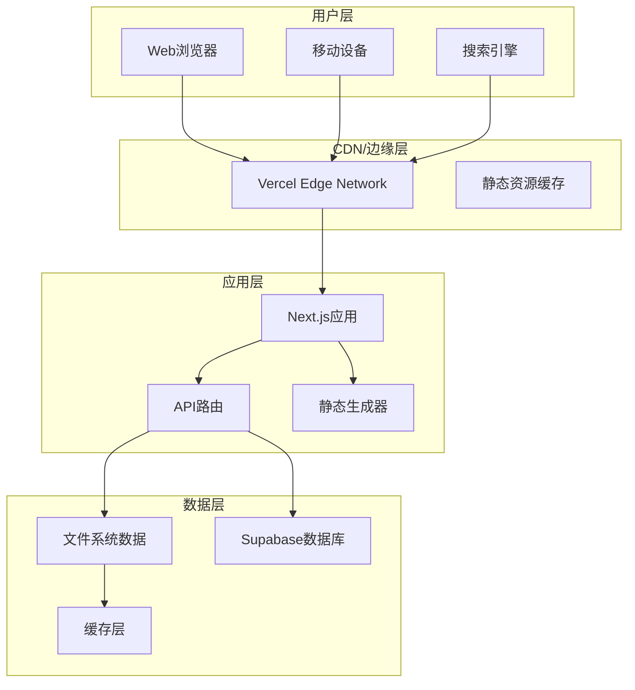

# DeFi 收益池聚合系统文档

## 📖 文档概述

这是 DeFi 收益池聚合信息网站系统的完整技术文档，为 Web3 领域的 DeFi 玩家提供一站式收益策略信息平台。

## 🗂️ 文档结构

### 核心文档
- **[系统设计指南](./SYSTEM_DESIGN.md)** - 完整的系统架构和技术设计
- **[功能实现指南](./FEATURE_IMPLEMENTATION.md)** - 核心功能的实现细节
- **[部署运维指南](./DEPLOYMENT_GUIDE.md)** - 部署配置和运维说明

### 专项文档  
- **[API 接口文档](./API_REFERENCE.md)** - 接口规范和使用说明
- **[组件开发指南](./COMPONENT_GUIDE.md)** - 前端组件开发规范

## 🚀 快速开始

### 项目概述
**目标用户**: Web3 领域的 DeFi 玩家  
**核心目的**: 提供一站式的 DeFi 收益池聚合信息平台

### 核心功能
1. **收益池信息展示** - 聚合表格显示，支持筛选、排序
2. **收益池详情弹窗** - 点击查看详细信息和风险提示
3. **调研报告展示** - MD 文件完整渲染
4. **分析报告展示** - HTML 文件完整渲染  
5. **提交请求功能** - 用户收录请求，Supabase 存储
6. **SEO 优化** - 符合搜索引擎收录规则

### 技术栈
- **前端**: Next.js 14 (App Router) + TypeScript + Tailwind CSS
- **组件库**: Radix UI + Lucide Icons
- **数据存储**: Supabase (PostgreSQL) + 本地文件系统
- **部署**: Vercel + Edge CDN

## 📊 数据来源
- **收益池数据**: `web3/pools/` 目录下的 Markdown 文件
- **协议信息**: `web3/protocol/` 目录下的协议基础信息
- **调研报告**: `web3/protocol/research/` 目录下的 MD 和 HTML 文件

## 🏗️ 系统架构

## 📋 开发状态

### ✅ 已完成功能
- [x] 收益池数据解析和展示
- [x] 筛选、排序、分页系统
- [x] 收益池详情弹窗功能
- [x] 调研报告和分析报告系统
- [x] 用户请求提交功能
- [x] SEO 优化和站点地图
- [x] Supabase 数据库集成
- [x] 响应式UI设计

### 🔄 优化项目
- [ ] 性能优化和缓存策略
- [ ] 多语言支持
- [ ] 用户个性化功能
- [ ] 实时数据更新

## 🤝 贡献指南

1. 阅读相关文档了解系统设计
2. 查看 [功能实现指南](./FEATURE_IMPLEMENTATION.md) 了解开发规范
3. 参考 [组件开发指南](./COMPONENT_GUIDE.md) 进行前端开发
4. 遵循现有的代码风格和架构模式

## 📝 版本信息
- **文档版本**: v2.0.0
- **最后更新**: 2025-01-25
- **维护者**: Claude Code Assistant

---

**注意**: 本文档系统已重构整合，旧版本文档请参考 `archive/` 目录。