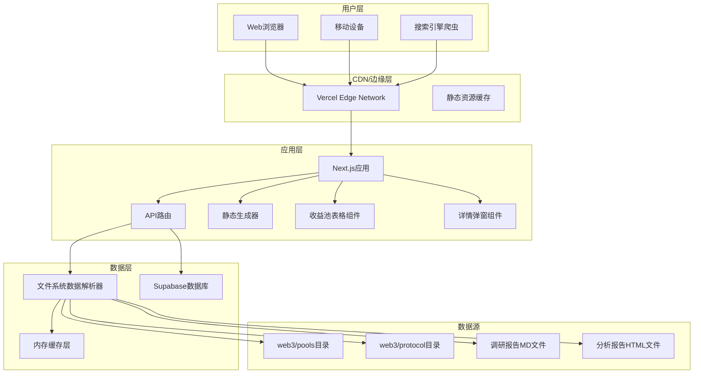

# 系统设计指南

## 📋 项目概述

### 目标与定位
DeFi 收益池聚合系统是为 Web3 领域 DeFi 玩家设计的一站式收益策略信息平台，基于现有 Web3 Farm Dashboard 架构，提供专业的收益池信息聚合和分析服务。

### 核心价值主张
1. **信息聚合** - 集中展示各类 DeFi 收益池关键信息
2. **专业分析** - 提供深度调研报告和风险评估
3. **智能过滤** - 支持多维度筛选和个性化匹配
4. **实时更新** - 基于文件系统的自动更新机制
5. **易于访问** - 无需安装，浏览器直接访问

## 🏗️ 系统架构设计

### 技术栈选择

**前端框架**: Next.js 14 (App Router)
- **SSR/SSG**: SEO 优化的服务端渲染和静态生成
- **API 路由**: 内置 API 支持，无需独立后端
- **文件路由**: 自动路由生成，简化开发

**数据存储策略**:
- **文件系统**: 收益池和协议数据 (web3/ 目录)
- **数据库**: 用户请求数据 (Supabase PostgreSQL)
- **缓存层**: 内存缓存提升性能

**部署架构**:
```
GitHub 仓库 (defix) 
├── web3/ (数据源)
│   ├── protocol/ (协议信息)
│   ├── pools/ (收益池数据) 
│   └── research/ (调研报告)
├── app/ (Next.js 应用)
│   ├── api/ (API 路由)
│   ├── components/ (React 组件)
│   └── lib/ (工具函数)
└── docs/ (技术文档)
```

### 系统架构图



### 数据流设计

**读取流程**:
```
文件系统 → 数据解析器 → 缓存层 → API 路由 → 前端组件 → 用户界面
```

**写入流程**:
```
用户提交 → 表单验证 → API 路由 → Supabase 数据库 → 确认反馈
```

## 📊 数据模型设计

### 核心数据结构

```typescript
// 收益池数据模型
export interface Pool {
  id: string;
  name: string;
  protocol: {
    name: string;
    website: string;
    nickname: string;
    description?: string;
  };
  type: string;                // 投资类型: StableLP, Leverage 等
  chain: string[];             // 区块链网络
  risk: RiskLevel;             // 风险等级
  token: string;               // 代币类型
  aprRange: {
    low: number;               // 最低 APR
    high: number;              // 最高 APR
  };
  market: string[];            // 适用市场
  underlying?: string;         // 底层收益描述
  danger?: string;             // 风险提示
  scenarios?: string;          // 适用场景
  reports: {
    research?: ReportInfo;     // 调研报告
    analysis?: ReportInfo;     // 分析报告
  };
  createdAt: Date;
  updatedAt: Date;
}

// 协议数据模型
export interface Protocol {
  id: string;
  name: string;
  website: string;
  nickname: string;
  description?: string;
  reportPath?: string;
}

// 风险等级枚举
export enum RiskLevel {
  LOW = "低风险",
  MEDIUM = "中风险", 
  HIGH = "高风险",
  VERY_HIGH = "极高风险"
}
```

### 文件数据映射

**收益池文件结构** (web3/pools/\*/\*.md):
```yaml
---
Protocol: '协议名称'
Type: 'StableLP'
Chain:
  - 'Ethereum'
  - 'Arbitrum'
Risk: '中风险'
Token: 'USDT'
APR-Low: 0.1
APR-High: 0.25
Market:
  - '通用'
Underlying: '底层收益描述'
Danger: '风险提示信息'
Scenarios: '适用场景说明'
---
文件正文内容（可选）
```

**协议文件结构** (web3/protocol/\*.md):
```yaml
---
Website: 'https://protocol.com'
Nickname: 'protocol'
Report: 'protocol'
Description: '协议描述'
---
```

## 🔌 API 接口设计

### 核心 API 端点

**收益池数据 API**:
```
GET /api/pools
Query Parameters:
- page: 页码 (默认 1)
- limit: 每页数量 (默认 20)
- search: 搜索关键词
- chain[]: 链过滤
- risk[]: 风险过滤
- type[]: 类型过滤
- sorts[]: 排序字段

Response:
{
  "success": true,
  "data": {
    "pools": Pool[],
    "total": number,
    "page": number,
    "limit": number,
    "filters": FilterOptions
  }
}
```

**收益池详情内容 API**:
```
GET /api/pool-content
Query Parameters:
- fileName: 收益池文件名

Response: 文件正文内容 (text/plain)
```

**过滤器选项 API**:
```
GET /api/filters

Response:
{
  "chains": string[],
  "risks": RiskLevel[],
  "types": string[],
  "tokens": string[],
  "markets": string[],
  "aprRange": { min: number, max: number }
}
```

**用户请求提交 API**:
```
POST /api/requests
Body: {
  "type": "pool_inclusion",
  "poolName": string,
  "protocolName": string,
  "officialWebsite": string,
  "chain": string[],
  "description": string,
  "userEmail": string
}

Response:
{
  "success": boolean,
  "message": string,
  "requestId"?: string
}
```

### 报告系统 API

**调研报告 API**:
```
GET /reports/research/[slug]
Dynamic Route: 渲染 Markdown 报告
```

**分析报告 API**:
```
GET /reports/analysis/[slug]
Static Route: 直接服务 HTML 文件
```

**原始文件 API**:
```
GET /api/reports/analysis/[slug]/raw
Response: HTML 文件原始内容
```

## 🎨 前端架构设计

### 组件层级结构

```
app/
├── layout.tsx (根布局)
├── page.tsx (主页)
├── loading.tsx (加载状态)
├── error.tsx (错误处理)
├── not-found.tsx (404页面)
├── reports/
│   ├── layout.tsx (报告布局)
│   ├── research/[slug]/page.tsx (调研报告)
│   └── analysis/[slug]/route.ts (分析报告)
├── request/
│   ├── layout.tsx (请求布局)
│   └── page.tsx (提交请求)
└── api/
    ├── pools/route.ts
    ├── filters/route.ts
    ├── requests/route.ts
    └── pool-content/route.ts
```

### 主要组件设计

**收益池表格组件** (components/PoolTable.tsx):
```typescript
interface PoolTableProps {
  pools: Pool[];
  isLoading?: boolean;
}

功能:
- 表格数据展示
- 排序和筛选
- 分页控制
- 详情弹窗触发
- 响应式布局
```

**详情弹窗组件** (components/PoolDetailDialog.tsx):
```typescript
interface PoolDetailDialogProps {
  pool: Pool | null;
  isOpen: boolean;
  onClose: () => void;
  poolContent?: string;
}

功能:
- 收益池详细信息展示
- 底层收益、风险提示、适用场景
- 文件正文内容显示
- 无障碍支持
```

**筛选器组件** (components/FilterPanel.tsx):
```typescript
interface FilterPanelProps {
  filters: FilterOptions;
  activeFilters: PoolsQuery;
  onFilterChange: (filters: PoolsQuery) => void;
}

功能:
- 多维度筛选
- 搜索功能
- 过滤器重置
- 响应式折叠
```

### 状态管理策略

**URL 状态管理**:
- 使用 Next.js searchParams 管理筛选和分页状态
- 支持浏览器前进后退
- SEO 友好的 URL 结构

**组件状态管理**:
- React useState 管理局部状态
- 表单状态使用受控组件
- 弹窗状态独立管理

## 🔍 SEO 优化策略

### 元数据优化

**全局元数据** (app/layout.tsx):
```typescript
export const metadata: Metadata = {
  title: 'DeFi收益池聚合平台',
  description: '专业的DeFi收益池信息聚合平台',
  keywords: ['DeFi', '收益池', '加密货币', 'Web3'],
  openGraph: {
    title: 'DeFi收益池聚合平台',
    description: '一站式DeFi收益策略信息服务',
    type: 'website',
  },
  twitter: {
    card: 'summary_large_image',
    title: 'DeFi收益池聚合平台',
    description: '专业的DeFi收益池信息聚合服务',
  }
}
```

**动态元数据**:
- 报告页面根据内容生成标题和描述
- 自动提取协议名称和报告类型

### 站点地图生成

**实现** (app/sitemap.ts):
```typescript
export default function sitemap(): MetadataRoute.Sitemap {
  return [
    {
      url: baseUrl,
      lastModified: new Date(),
      changeFrequency: 'daily',
      priority: 1,
    },
    // 动态生成报告页面链接
    ...reportSitemaps,
  ]
}
```

### 搜索引擎指令

**Robots.txt** (app/robots.ts):
```typescript
export default function robots(): MetadataRoute.Robots {
  return {
    rules: {
      userAgent: '*',
      allow: '/',
      disallow: ['/api/', '/admin/'],
    },
    sitemap: `${baseUrl}/sitemap.xml`,
  }
}
```

## 🛡️ 安全性设计

### 数据验证
- API 输入参数验证
- 表单数据校验
- SQL 注入防护

### 访问控制
- 公开只读访问
- 管理员功能预留
- API 频率限制

### 数据保护
- 敏感信息加密
- 环境变量隔离
- HTTPS 强制使用

## ⚡ 性能优化策略

### 缓存策略
```typescript
// 内存缓存实现
class DataCache {
  private cache = new Map<string, any>();
  private timeout = 5 * 60 * 1000; // 5分钟

  set(key: string, value: any) {
    this.cache.set(key, value);
    setTimeout(() => this.cache.delete(key), this.timeout);
  }

  get(key: string) {
    return this.cache.get(key);
  }
}
```

### 静态生成
- 主页使用 SSG 预生成
- 报告页面增量静态生成
- 构建时优化

### 代码分割
- 动态导入组件
- 路由级代码分割
- 第三方库优化

## 🔧 环境配置

### 开发环境
```env
# Supabase 配置
NEXT_PUBLIC_SUPABASE_URL=https://project.supabase.co
NEXT_PUBLIC_SUPABASE_ANON_KEY=anon_key_here

# 站点配置
NEXT_PUBLIC_SITE_URL=http://localhost:3000
```

### 生产环境
```env
# Supabase 生产配置
NEXT_PUBLIC_SUPABASE_URL=https://prod.supabase.co
NEXT_PUBLIC_SUPABASE_ANON_KEY=prod_anon_key

# 生产站点配置
NEXT_PUBLIC_SITE_URL=https://defix.example.com
```

## 📈 扩展性考虑

### 功能扩展
- 用户认证系统
- 个性化推荐
- 实时数据集成
- 多语言支持

### 技术扩展
- 微服务架构迁移
- GraphQL API 集成
- 移动端应用开发
- 区块链数据集成

---

**文档版本**: v2.0.0  
**最后更新**: 2025-01-25  
**维护者**: Claude Code Assistant