# 系统设计指南

## 📋 项目概述

### 目标与定位
DeFi 收益池聚合系统是为 Web3 领域 DeFi 玩家设计的一站式收益策略信息平台，基于现有 Web3 Farm Dashboard 架构，提供专业的收益池信息聚合和分析服务。

### 核心价值主张
1. **信息聚合** - 集中展示各类 DeFi 收益池关键信息
2. **专业分析** - 提供深度调研报告和风险评估
3. **智能过滤** - 支持多维度筛选和个性化匹配
4. **实时更新** - 基于文件系统的自动更新机制
5. **易于访问** - 无需安装，浏览器直接访问

## 🏗️ 系统架构设计

### 技术栈选择

**前端框架**: Next.js 14 (App Router)
- **SSR/SSG**: SEO 优化的服务端渲染和静态生成
- **API 路由**: 内置 API 支持，无需独立后端
- **文件路由**: 自动路由生成，简化开发

**前端渲染技术栈**:
- **Tailwind CSS**: 原子化CSS框架，响应式设计
- **@tailwindcss/typography**: Typography插件，支持prose样式
- **HTML渲染**: dangerouslySetInnerHTML结合prose类实现Markdown内容显示
- **TypeScript**: 类型安全，组件接口定义

**数据存储策略**:
- **文件系统**: 收益池和协议数据 (web3/ 目录)
- **数据库**: 用户请求数据 (Supabase PostgreSQL)
- **缓存层**: 内存缓存提升性能

**部署架构**:
```
GitHub 仓库 (defix) 
├── web3/ (数据源)
│   ├── protocol/ (协议信息)
│   ├── pools/ (收益池数据) 
│   └── research/ (调研报告)
├── app/ (Next.js 应用)
│   ├── api/ (API 路由)
│   ├── components/ (React 组件)
│   └── lib/ (工具函数)
└── docs/ (技术文档)
```

### 系统架构图

```mermaid
graph TB
    subgraph "用户层"
        A[Web浏览器]
        B[移动设备]
        C[搜索引擎爬虫]
    end
    
    subgraph "CDN/边缘层"
        D[Vercel Edge Network]
        E[静态资源缓存]
    end
    
    subgraph "应用层"
        F[Next.js应用]
        G[API路由]
        H[静态生成器]
        I[收益池表格组件]
        J[详情弹窗组件]
    end
    
    subgraph "数据层"
        K[AST-based Markdown解析器]
        L[Supabase数据库]
        M[内存缓存层]
        N1[remark解析引擎]
        N2[HTML渲染器]
    end
    
    subgraph "数据源"
        O1[web3/pools目录]
        O2[web3/protocol目录]
        O3[调研报告MD文件]
        O4[分析报告HTML文件]
    end
    
    A --> D
    B --> D
    C --> D
    D --> F
    F --> G
    F --> H
    F --> I
    F --> J
    G --> K
    G --> L
    K --> M
    K --> N1
    K --> N2
    K --> O1
    K --> O2
    K --> O3
    K --> O4
```



### 数据流设计

**Markdown解析流程**:
```
MD文件 → remark AST解析 → 字段内容提取 → Markdown→HTML转换 → 结构化数据 → 缓存层
```

**读取流程**:
```
文件系统 → AST-based解析器 → HTML渲染 → 缓存层 → API 路由 → 前端组件 → 用户界面
```

**写入流程**:
```
用户提交 → 表单验证 → API 路由 → Supabase 数据库 → 确认反馈
```

**内容过滤流程** (附加说明字段):
```
MD文件 → 结构化字段识别 → 内容过滤 → 非结构化内容提取 → API返回
```

## 🔧 文件数据解析器架构

### AST-based Markdown 解析系统

系统采用现代化的 AST（抽象语法树）解析方案，取代传统的正则表达式方法，确保更高的解析准确性和可靠性。

#### 核心技术栈
- **remark**: 标准Markdown解析库，用于生成AST
- **remark-html**: Markdown到HTML转换器，支持完整的HTML渲染
- **gray-matter**: YAML frontmatter解析器

#### 解析流程设计

```typescript
// 1. 文件读取和结构分离
const { data, content } = matter(fileContent);

// 2. AST 解析
const tree = remark().parse(content);

// 3. 字段内容提取
function extractFieldContent(tree: any, fieldName: string): string {
  // 遍历AST节点，查找 **字段名** 标记
  // 收集字段内容直到下一个字段或分隔符
  // 返回原始Markdown格式内容
}

// 4. Markdown到HTML转换
const htmlContent = await remark()
  .use(remarkHtml, { sanitize: false })
  .process(markdownContent);

// 5. 结构化数据生成
const pool: Pool = {
  underlying: htmlContent, // 渲染后的HTML
  // ... 其他字段
}
```

#### 关键特性

**完整内容提取**:
- 支持多行内容，包括列表、段落、链接等复杂结构
- 正确处理嵌套的Markdown语法（粗体、斜体、代码块等）
- 保持原始格式和语义

**智能字段识别**:
- 基于AST节点类型判断，避免正则表达式的局限性
- 支持字段间的精确边界识别
- 自动处理空行和格式变化

**HTML渲染支持**:
- 自动将Markdown语法转换为HTML标签
- 保留所有格式信息（列表、粗体、链接等）
- 前端可直接使用`dangerouslySetInnerHTML`或类似机制显示

**前端集成方案**:
```tsx
// PoolDetailDialog组件中的HTML渲染实现
<div 
  className="prose prose-sm max-w-none text-gray-700 text-sm" 
  dangerouslySetInnerHTML={{ __html: pool.underlying }}
/>
```

**Typography样式集成**:
- 使用`@tailwindcss/typography`插件提供prose样式
- `prose-sm`控制文字大小，`max-w-none`避免宽度限制
- 自动处理列表、标题、段落、链接的样式

**错误处理机制**:
- 提供正则表达式降级方案作为备份
- 详细的错误日志和统计信息
- 优雅处理格式异常的文档

#### 内容过滤系统

针对"附加说明"字段的智能过滤机制：

```typescript
function filterNonStructuredContent(content: string): string {
  // 状态机模式识别结构化字段
  let inStructuredField = false;
  
  // 逐行处理，过滤掉 **Underlying** 到 **Remark** 之间的内容
  // 保留分隔符、标题和其他非结构化内容
}
```

**过滤规则**:
- 识别并移除所有结构化字段内容（**Underlying**, **Danger**, **Scenarios**, **Remark**）
- 保留文档分隔符（`---`）和标题（`##`, `#`）
- 保留结构化字段后的所有附加说明内容

#### 性能优化策略

**缓存机制**:
```typescript
// 协议信息缓存
let protocolsCache: Map<string, Protocol> | null = null;

// 解析结果缓存（内存）
const parseCache = new Map<string, Pool>();
```

**批量处理**:
- 并行解析多个文档
- 异步I/O操作优化
- 内存使用控制

## 📊 数据模型设计

### 核心数据结构

```typescript
// 收益池数据模型
export interface Pool {
  id: string;
  name: string;
  protocol: {
    name: string;
    website: string;
    nickname: string;
    description?: string;
  };
  type: string;                // 投资类型: StableLP, Leverage 等
  chain: string[];             // 区块链网络
  risk: RiskLevel;             // 风险等级
  token: string;               // 代币类型
  aprRange: {
    low: number;               // 最低 APR
    high: number;              // 最高 APR
  };
  market: string[];            // 适用市场
  underlying?: string;         // 底层收益描述
  danger?: string;             // 风险提示
  scenarios?: string;          // 适用场景
  reports: {
    research?: ReportInfo;     // 调研报告
    analysis?: ReportInfo;     // 分析报告
  };
  createdAt: Date;
  updatedAt: Date;
}

// 协议数据模型
export interface Protocol {
  id: string;
  name: string;
  website: string;
  nickname: string;
  description?: string;
  reportPath?: string;
}

// 风险等级枚举
export enum RiskLevel {
  LOW = "低风险",
  MEDIUM = "中风险", 
  HIGH = "高风险",
  VERY_HIGH = "极高风险"
}
```

### 文件数据映射

**收益池文件结构** (web3/pools/\*/\*.md):
```yaml
---
Protocol: '协议名称'
Type: 'StableLP'
Chain:
  - 'Ethereum'
  - 'Arbitrum'
Risk: '中风险'
Token: 'USDT'
APR-Low: 0.1
APR-High: 0.25
Market:
  - '通用'
---

**Underlying**

底层收益机制的详细说明，支持完整的 Markdown 格式：
- **列表项**: 支持无序和有序列表
- **强调文本**: 支持粗体和斜体
- **链接**: 支持内联和引用链接

**Danger**

风险分析和注意事项，支持多种 Markdown 格式。

**Scenarios**

- **场景一**: 详细的使用场景描述
- **场景二**: 另一个使用场景

**Remark**

备注和补充说明信息。

---

## 其他附加说明

这里可以添加更多非结构化的详细说明内容。
```

**协议文件结构** (web3/protocol/\*.md):
```yaml
---
Website: 'https://protocol.com'
Nickname: 'protocol'
Report: 'protocol'
Description: '协议描述'
---
```

## 🔌 API 接口设计

### 核心 API 端点

**收益池数据 API**:
```
GET /api/pools
Query Parameters:
- page: 页码 (默认 1)
- limit: 每页数量 (默认 20)
- search: 搜索关键词
- chain[]: 链过滤
- risk[]: 风险过滤
- type[]: 类型过滤
- sorts[]: 排序字段

Response:
{
  "success": true,
  "data": {
    "pools": Pool[],
    "total": number,
    "page": number,
    "limit": number,
    "filters": FilterOptions
  }
}
```

**收益池详情内容 API**:
```
GET /api/pool-content
Query Parameters:
- fileName: 收益池文件名

Response: 过滤后的非结构化内容 (text/plain)
注: 自动过滤掉 **Underlying**, **Danger**, **Scenarios**, **Remark** 等结构化字段
```

**过滤器选项 API**:
```
GET /api/filters

Response:
{
  "chains": string[],
  "risks": RiskLevel[],
  "types": string[],
  "tokens": string[],
  "markets": string[],
  "aprRange": { min: number, max: number }
}
```

**用户请求提交 API**:
```
POST /api/requests
Body: {
  "type": "protocol_inclusion" | "data_correction" | "other_feedback",
  "protocolName"?: string,        // 协议收录时必填
  "officialWebsite"?: string,     // 协议收录时必填  
  "contactEmail": string,         // 必填
  "description"?: string          // 数据纠错和其他反馈时必填
}

Response:
{
  "success": boolean,
  "message": string,
  "requestId"?: string,
  "type"?: string
}
```

**管理后台 API**:
```
GET /api/requests
用途: 获取所有用户请求列表
Response: {
  "success": true,
  "data": SubmissionRequest[]
}

PATCH /api/requests  
Body: {
  "id": string,
  "status": "pending" | "in_review" | "approved" | "rejected"
}
用途: 更新请求状态
Response: {
  "success": boolean,
  "message": string,
  "data": SubmissionRequest
}
```

### 报告系统 API

**调研报告 API**:
```
GET /reports/research/[slug]
Dynamic Route: 渲染 Markdown 报告
```

**分析报告 API**:
```
GET /reports/analysis/[slug]
Static Route: 直接服务 HTML 文件
```

**原始文件 API**:
```
GET /api/reports/analysis/[slug]/raw
Response: HTML 文件原始内容
```

## 🎨 前端架构设计

### 组件层级结构

```
app/
├── layout.tsx (根布局)
├── page.tsx (主页)
├── loading.tsx (加载状态)
├── error.tsx (错误处理)
├── not-found.tsx (404页面)
├── reports/
│   ├── layout.tsx (报告布局)
│   ├── research/[slug]/page.tsx (调研报告)
│   └── analysis/[slug]/route.ts (分析报告)
├── request/
│   ├── layout.tsx (请求布局)
│   └── page.tsx (提交请求)
├── admin/
│   ├── layout.tsx (管理员布局+认证)
│   ├── page.tsx (管理后台主页)
│   └── requests/
│       └── page.tsx (请求管理页面)
└── api/
    ├── pools/route.ts
    ├── filters/route.ts
    ├── requests/route.ts (GET、POST、PATCH)
    └── pool-content/route.ts
```

### 主要组件设计

**收益池表格组件** (components/PoolTable.tsx):
```typescript
interface PoolTableProps {
  pools: Pool[];
  isLoading?: boolean;
}

功能:
- 表格数据展示
- 排序和筛选
- 分页控制
- 详情弹窗触发
- 响应式布局
```

**详情弹窗组件** (components/PoolDetailDialog.tsx):
```typescript
interface PoolDetailDialogProps {
  pool: Pool | null;
  isOpen: boolean;
  onClose: () => void;
  poolContent?: string;
}

功能:
- 收益池详细信息展示
- HTML格式的底层收益、风险提示、适用场景、备注说明
- 非结构化的文件正文内容显示
- Typography样式支持和无障碍支持

HTML渲染实现:
// 支持Markdown转换后的HTML内容正确显示
<div 
  className="prose prose-sm max-w-none" 
  dangerouslySetInnerHTML={{ __html: pool.underlying }}
/>

字段显示:
- underlying: 底层收益机制 (蓝色背景)
- danger: 风险提示信息 (黄色背景)  
- scenarios: 适用场景说明 (绿色背景)
- remark: 备注补充说明 (灰色背景)
- poolContent: 附加说明内容 (紫色背景)
```

**筛选器组件** (components/FilterPanel.tsx):
```typescript
interface FilterPanelProps {
  filters: FilterOptions;
  activeFilters: PoolsQuery;
  onFilterChange: (filters: PoolsQuery) => void;
}

功能:
- 多维度筛选
- 搜索功能
- 过滤器重置
- 响应式折叠
```

## 🛠️ 管理后台架构设计

### 管理后台功能模块

**管理员认证模块** (app/admin/layout.tsx):
```typescript
interface AdminAuthProps {
  children: React.ReactNode;
}

功能:
- 简单密码验证 (默认: defix2024)
- 本地存储会话状态
- 登录/退出功能
- 未认证时显示登录界面
```

**管理后台主页** (app/admin/page.tsx):
```typescript
interface AdminStats {
  totalRequests: number;
  pendingRequests: number;
  protocolInclusions: number;
  dataCorrections: number;
  otherFeedback: number;
}

功能:
- 请求统计概览
- 系统状态监控
- 快速操作入口
- 仪表板界面
```

**请求管理页面** (app/admin/requests/page.tsx):
```typescript
interface Request {
  id: string;
  type: 'protocol_inclusion' | 'data_correction' | 'other_feedback';
  protocol_name?: string;
  official_website?: string;
  contact_email: string;
  description?: string;
  status: 'pending' | 'in_review' | 'approved' | 'rejected';
  created_at: string;
  updated_at: string;
}

功能:
- 请求列表展示和分页
- 状态筛选 (全部/待处理/审核中/已通过/已拒绝)
- 关键词搜索 (协议名称、邮箱、描述)
- 状态管理 (pending → in_review → approved/rejected)
- 请求详情查看弹窗
- CSV 数据导出
- 批量操作按钮
```

### 数据库设计

**请求表结构** (Supabase PostgreSQL):
```sql
CREATE TABLE pool_requests (
  id UUID DEFAULT gen_random_uuid() PRIMARY KEY,
  type VARCHAR(50) NOT NULL CHECK (type IN ('protocol_inclusion', 'data_correction', 'other_feedback')),
  protocol_name VARCHAR(255),
  official_website TEXT,
  contact_email VARCHAR(255) NOT NULL,
  description TEXT,
  status VARCHAR(20) DEFAULT 'pending' CHECK (status IN ('pending', 'in_review', 'approved', 'rejected')),
  created_at TIMESTAMP WITH TIME ZONE DEFAULT NOW(),
  updated_at TIMESTAMP WITH TIME ZONE DEFAULT NOW()
);

-- 索引优化
CREATE INDEX idx_pool_requests_type ON pool_requests(type);
CREATE INDEX idx_pool_requests_status ON pool_requests(status);
CREATE INDEX idx_pool_requests_created_at ON pool_requests(created_at);
```

### 管理工作流程

**请求处理流程**:
```
用户提交 → pending (待处理)
          ↓
管理员审核 → in_review (审核中) 
          ↓
最终决定 → approved (已通过) / rejected (已拒绝)
```

**管理操作**:
- 查看请求详情
- 更新请求状态
- 添加处理备注 (预留功能)
- 邮件通知用户 (预留功能)
- 数据导出和分析

### 状态管理策略

**URL 状态管理**:
- 使用 Next.js searchParams 管理筛选和分页状态
- 支持浏览器前进后退
- SEO 友好的 URL 结构

**组件状态管理**:
- React useState 管理局部状态
- 表单状态使用受控组件
- 弹窗状态独立管理

## 🔍 SEO 优化策略

### 元数据优化

**全局元数据** (app/layout.tsx):
```typescript
export const metadata: Metadata = {
  title: 'DeFi收益池聚合平台',
  description: '专业的DeFi收益池信息聚合平台',
  keywords: ['DeFi', '收益池', '加密货币', 'Web3'],
  openGraph: {
    title: 'DeFi收益池聚合平台',
    description: '一站式DeFi收益策略信息服务',
    type: 'website',
  },
  twitter: {
    card: 'summary_large_image',
    title: 'DeFi收益池聚合平台',
    description: '专业的DeFi收益池信息聚合服务',
  }
}
```

**动态元数据**:
- 报告页面根据内容生成标题和描述
- 自动提取协议名称和报告类型

### 站点地图生成

**实现** (app/sitemap.ts):
```typescript
export default function sitemap(): MetadataRoute.Sitemap {
  return [
    {
      url: baseUrl,
      lastModified: new Date(),
      changeFrequency: 'daily',
      priority: 1,
    },
    // 动态生成报告页面链接
    ...reportSitemaps,
  ]
}
```

### 搜索引擎指令

**Robots.txt** (app/robots.ts):
```typescript
export default function robots(): MetadataRoute.Robots {
  return {
    rules: {
      userAgent: '*',
      allow: '/',
      disallow: ['/api/', '/admin/'],
    },
    sitemap: `${baseUrl}/sitemap.xml`,
  }
}
```

## 🛡️ 安全性设计

### 数据验证
- API 输入参数验证
- 表单数据校验
- SQL 注入防护

### 访问控制
- 公开只读访问 (收益池数据)
- 管理员功能密码保护 (/admin 路径)
- API 频率限制
- 简单会话管理 (localStorage)

### 数据保护
- 敏感信息加密
- 环境变量隔离
- HTTPS 强制使用

## ⚡ 性能优化策略

### 缓存策略
```typescript
// 内存缓存实现
class DataCache {
  private cache = new Map<string, any>();
  private timeout = 5 * 60 * 1000; // 5分钟

  set(key: string, value: any) {
    this.cache.set(key, value);
    setTimeout(() => this.cache.delete(key), this.timeout);
  }

  get(key: string) {
    return this.cache.get(key);
  }
}
```

### 静态生成
- 主页使用 SSG 预生成
- 报告页面增量静态生成
- 构建时优化

### 代码分割
- 动态导入组件
- 路由级代码分割
- 第三方库优化

## 🔧 环境配置

### 开发环境
```env
# Supabase 配置
NEXT_PUBLIC_SUPABASE_URL=https://project.supabase.co
NEXT_PUBLIC_SUPABASE_ANON_KEY=anon_key_here

# 站点配置
NEXT_PUBLIC_SITE_URL=http://localhost:3000
```

### 生产环境
```env
# Supabase 生产配置
NEXT_PUBLIC_SUPABASE_URL=https://prod.supabase.co
NEXT_PUBLIC_SUPABASE_ANON_KEY=prod_anon_key

# 生产站点配置
NEXT_PUBLIC_SITE_URL=https://defix.example.com
```

## 📈 扩展性考虑

### 功能扩展
- 用户认证系统
- 个性化推荐
- 实时数据集成
- 多语言支持

### 技术扩展
- 微服务架构迁移
- GraphQL API 集成
- 移动端应用开发
- 区块链数据集成

---

**文档版本**: v2.1.0  
**最后更新**: 2025-07-26  
**维护者**: Claude Code Assistant

## 📝 更新日志

**v2.2.0** (2025-07-26)
- ✨ 新增：管理后台架构设计
- ✨ 新增：用户请求管理系统
- ✨ 新增：简单身份认证模块
- ✨ 新增：请求状态管理工作流程
- ✨ 新增：Supabase数据库表结构设计
- 🔧 优化：API接口扩展 (PATCH /api/requests)
- 🔧 优化：安全策略更新，包含管理员访问控制
- 📚 文档：完善管理后台组件设计和数据库架构

**v2.1.0** (2025-07-26)
- ✨ 新增：AST-based Markdown解析器架构设计
- ✨ 新增：标准Markdown库技术栈说明
- ✨ 新增：智能内容过滤系统设计
- ✨ 新增：HTML渲染和前端集成方案
- ✨ 新增：PoolDetailDialog组件HTML渲染实现说明
- ✨ 新增：Typography插件集成和最佳实践
- 🔧 优化：数据流程图更新，包含新的解析组件
- 🔧 优化：前端组件设计说明，包含具体实现代码
- 📚 文档：完善解析器性能优化和错误处理策略

**v2.0.0** (2025-01-25)
- 🎉 首次发布完整系统设计文档