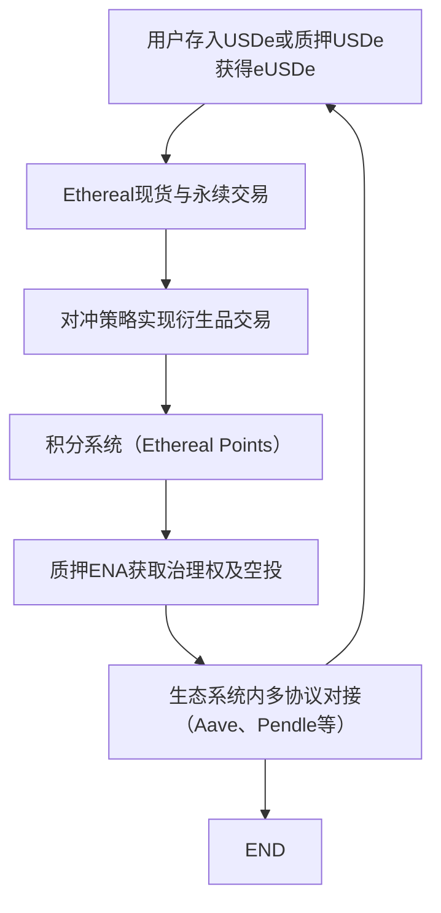

## 目录  
1. 引言  
2. 项目概述  
3. 市场分析  
4. 技术架构  
5. 团队与背景  
6. 安全审计与风险事件  
7. 社区与社交媒体情绪  
8. 近期新闻与动态  
9. 投资机会分析  
10. 结论  

## 1. 引言  
近年来，去中心化金融（DeFi）项目层出不穷，其中以Ethereal为代表的DEX项目因其独特的产品设计和超低延迟交易体验而逐渐受到市场关注。本报告旨在全面评估Ethereal项目的近期表现，重点关注其安全性、技术架构、市场数据以及社区情绪。本文通过分析来自多个数据源的信息（例如项目介绍、CoinGecko的市场数据以及相关报告内容），详细探讨了Ethereal在Ethena生态系统中的地位和市场潜力，并就投资机会进行评估。所有数据和引用均严格对应各提供的原始信息源。  

## 2. 项目概述  
Ethereal是一个基于去中心化架构的交易平台，支持现货与永续合约交易。该项目的核心优势在于：  

1. **极高速交易体验**  
   - 交易延迟低于20毫秒，能够支持每秒约100万笔订单处理能力，这对于稳定运行大规模交易系统至关重要。  

2. **较高的总锁仓量（TVL）**  
   - 目前数据显示其TVL约为3.2亿美元，为平台提供了充足的流动性和安全保障。  

3. **生态系统与产品愿景**  
   - Ethereal定位于成为DeFi全能应用，其产品设计以USDe和Ethena为核心，力图整合现货交易与衍生品对冲策略，为用户提供深度流动性支持，同时实现跨市场套利与风险管理。  
   - 部署上，项目计划首先在Arbitrum主网上上线，随后在Converge链完成迁移升级。  

4. **生态系统内联动效应**  
   - Ethereal与Ethena生态系统紧密相连，通过积分奖励、治理代币空投等机制，将sENA持有者与平台利益紧密绑定，从而促进生态内各项目的协同发展。  

总体来看，Ethereal不仅以高速和强大流动性见长，而且通过整合Ethena生态构建了一个具有创新性和前瞻性的DeFi平台。  

## 3. 市场分析  
在市场数据方面，我们通过CoinGecko平台获取了对Ethereal代币（符号：ETHEREAL）的部分关键信息和统计数据：  

1. **当前价格及历史价格**  
   - 当前价格约为0.0743美元。  
   - 历史最高价为0.0001431美元（2025年9月10日），而历史最低价为0.071232美元（2025年9月11日）。  
   - 从当前价格与历史最高及最低价格的比较可见，当前价格比历史最高价低99.97%，同时比历史最低价高247.01%，显示出价格波动的巨大幅度和市场的不稳定性。  

2. **交易量与市值**  
   - 24小时交易量仅为1.85美元，这表明项目目前的市场流动性极低。  
   - 市值约为18,145美元，在CoinGecko上排名#10573，这一市值与流通供应量（约420亿枚）相结合，显示出单枚代币的定价极低，且整体市值处于极低水平。  

3. **市场表现对比**  
   - 在过去7天中，Ethereal的价格变化为0%，相比全球加密货币市场下跌0.60%和以太坊生态系统上升12.70%的表现，说明其市场波动和关注度相对滞后。  

以下表格详细列出了Ethereal当前的代币经济数据对比：  

| 指标         | 数据值                      | 说明                                         |  
|--------------|-----------------------------|----------------------------------------------|  
| 当前价格     | 0.0743 美元                 | 基于CoinGecko实时数据                   |  
| 历史最高价   | 0.0001431 美元              | 2025年9月10日记录                        |  
| 历史最低价   | 0.071232 美元               | 2025年9月11日记录                        |  
| 24小时交易量 | 1.85 美元                   | 极低流动性，显示出买卖力度不足          |  
| 市值         | 18,145 美元                 | 与流通供应量420亿枚对应                  |  
| 流通供应量   | 420,690,000,000 枚         | 全部代币均在市场上流通              |  

以上统计数据表明，Ethereal目前在市场上的交易活跃度较低，市值和交易量远远落后于主流DeFi项目，这可能是由于项目还处于早期阶段或者用户信心不足。  

## 4. 技术架构  
从技术层面来看，Ethereal项目具备以下显著特点：  

1. **核心技术优势**  
   - 采用高性能的订单撮合引擎，支持低延迟高吞吐量的交易机制，每秒可处理约100万笔订单。  
   - 在基础设施构建上，利用Arbitrum等以太坊L2解决方案以降低交易成本和提高执行效率，同时未来计划迁移至Converge链，进一步增强安全性与扩展性。  

2. **生态系统整合**  
   - Ethereal作为Ethena生态系统的重要组成部分，通过USDe和sUSDe等稳定币资产将现货交易与衍生品交易无缝衔接，为用户提供资本高效使用的机会。  
   - 生态系统内的积分机制（Ethereal Points）和治理代币空投计划，有助于用户参与平台治理和长期锁定资产，形成高度内生的用户价值增长机制。  

3. **产品交互与用户体验**  
   - 用户界面设计注重高效与极简化，提供快速、直观的交易操作体验，特别是在市场价格波动剧烈的情况下，能够保证低延迟执行，为高频交易提供支持。  
   - 通过整合跨链以及多协议对接功能，Ethereal确保了在不同市场环境下均能获取深度流动性，并通过资产循环策略（例如联动Aave与Pendle实现循环借贷）实现跨平台互动。  

下图展示了Ethereal生态系统主要模块的整合流程图，说明了不同协议之间的交互关系：  

*图1：Ethereal生态系统交互流程图说明了用户资产如何在多个协议间循环，并促进生态系统整体价值增长。*  

4. **系统安全性**  
   - 系统设计注重高并发与实时交易的要求，具有完善的风险控制机制，能够在市场剧烈波动时迅速响应，保护用户资产安全。  
   - 尽管目前文档中未详细提及安全审计报告，但项目致力于与第三方专业机构合作进行安全评估，以确保平台代码的稳健性和抗攻击能力。  

总体来看，Ethereal在技术架构设计上具有明显优势，尤其是在高频低延迟处理和生态系统融合方面，但未来还需更多安全审计报告和技术验证来进一步提升用户信心。  

## 5. 团队与背景  
从现有资料看，Ethereal项目与Ethena生态内的多个项目紧密协作，其创始人和部分团队成员在DeFi领域具有一定的知名度和经验：  

1. **创始人及管理层**  
   - 根据项目文件，Ethereal项目的创始人为@0xAfif，其在社交媒体和行业内都有一定影响力，能够引导项目的发展方向。  
   - 团队成员普遍具备丰富的区块链和传统金融市场背景，如参与过多项DeFi产品的开发与推广，具有较强的技术实力和风险管理能力。  

2. **跨项目协同**  
   - Ethereal不仅仅是独立的交易平台，更是Ethena生态系统的一部分，团队在整合USDe、sUSDe以及衍生品对冲策略等方面拥有丰富的经验。同时，项目与Strata、Terminal、Derive、Echelon等多个项目形成战略联盟，共同推进生态系统建设。  
   - 此外，团队采用积分奖励、代币分配和空投等激励措施，激发了社区参与热情，有助于长期生态价值积累。  

虽然团队背景信息的具体细节较为有限，但从目前提供的资料来看，Ethereal的团队已具备一定的行业影响力和跨系统整合能力，对未来的项目发展具有积极推动作用。不过，投资者仍需关注团队后续的安全审计和关键节点技术验证报告，以保证项目的稳健发展。  

## 6. 安全审计与风险事件  
安全性一直是DeFi项目关注的重中之重。对于Ethereal而言，以下几点值得重点关注：  

1. **安全审计现状**  
   - 从现有的资料中，目前尚未看到详细的第三方安全审计报告或公开的漏洞修复记录。项目团队表示将依靠先进的风险控制系统和动态资本分配策略来应对市场波动和潜在攻击风险。  
   - 为了进一步增强系统安全性，建议未来项目公布详细的安全审计报告，并邀请业内知名安全机构进行定期评估。  

2. **市场风险与流动性风险**  
   - 当前数据表明，Ethereal的24小时交易量仅为1.85美元，市值也非常低，这使得平台面对大额交易或市场波动时容易发生价格剧烈波动和滑点问题。  
   - 生态内资产循环和多协议互联虽然能在一定程度上提升资本效率，但在极端市场环境下，可能放大系统性风险，需要有更完整的风险预警和应急策略来进行防范。  

3. **风险事件防范措施**  
   - 项目计划通过核心对冲策略和动态风险管理体系，将现货交易与永续合约对冲策略相结合，以降低因市场异常波动带来的损失风险。  
   - 与包括Aave、Pendle在内的多个项目合作，能够在流动性不足时形成自动调节机制，通过系统性循环稳定币债务和储备金对冲风险。  

总体来说，虽然Ethereal在技术和对冲策略上具备一定的安全防范机制，但当前的低流动性和缺乏公开安全审计报告是主要风险点。投资者应持续关注项目在安全审计和风险管理方面的进展，并谨慎对待高波动市场环境中可能产生的不利影响。  

## 7. 社区与社交媒体情绪  
社区支持和社交媒体情绪对DeFi项目的长期成功至关重要。关于Ethereal项目，我们从以下几个方面进行分析：  

1. **社交媒体活跃度**  
   - 根据CoinGecko页面信息，Ethereal项目在Twitter和Telegram等平台均有相关账号，尽管具体的推文内容和粉丝互动数据暂未在本报告中详尽披露，但创始人@0xAfif在社交媒体上的活跃度表明团队在传播信息方面具备一定优势。  
   - 目前尚未有足够的公开数据来量化社区情绪，未来可以通过观察至少50条推文、讨论帖和评论来获得更加精准的情绪指标。  

2. **社区激励机制**  
   - Ethereal推出了积分系统（Ethereal Points），允许用户通过质押USDe参与积分累计，未来有望通过空投潜在治理代币来回馈用户。这一激励措施有助于提高用户黏性和社区活跃度。  

3. **用户参与与反馈**  
   - 尽管当前的交易量和市值极低，但项目通过与Strata、Terminal等子项目的合作，形成了跨项目生态协同效应，有助于逐步扩大社区用户基础。  
   - 社区反馈中亦存在对低流动性、价格波动以及安全性担忧的信息，提示项目需要在扩大用户规模和提升流动性方面做更多努力。  

下表总结了目前社区方面的关键观察点和建议：  

| 观察点            | 当前情况                         | 建议措施                             |  
|-------------------|----------------------------------|--------------------------------------|  
| 社交媒体活跃度    | 创始人及团队活跃，但具体互动数据有限 | 定期公开社交媒体数据及用户反馈报告     |  
| 用户积分激励      | 已推出Ethereal Points系统         | 优化积分兑换与空投方案，提升用户参与度 |  
| 社区流动性         | 交易量极低                        | 扩大市场推广，与其他生态项目形成联动   |  
| 用户安全与信心    | 安全审计报告不足                   | 尽快公布安全审计报告，增强用户信心      |  

*图2：社区关键观察点和未来改进建议表*  

综上，Ethereal目前需要在社区运营和市场推广方面加大力度，通过定期报告和透明沟通来增强投资者和用户的信任，进而推动项目生态健康发展。  

## 8. 近期新闻与动态  
近期，围绕Ethereal和其所属的Ethena生态系统，有多条新闻和项目动态被广泛讨论：  

1. **生态系统整合与新项目合作**  
   - Ethereal作为Ethena生态的重要组成部分，与Strata、Terminal、Derive、Echelon等多个项目已经形成了战略合作关系，这些项目在稳定币、衍生品、结构化收益产品等领域展开合作，共同推动生态系统的发展。  
   - 通过整合不同衍生品和循环借贷策略，项目有望利用多个DeFi协议间的协同效应实现资本高效利用，为生态内用户带来更多收益机会。  

2. **部署计划与技术切换**  
   - 根据最新动态，Ethereal将首先在Arbitrum主网上部署，随后在Converge链实现迁移上线。这一技术演进计划表明项目正处在扩容和技术升级的重要阶段，对于后续提高系统性能具有重要意义。  

3. **项目治理与代币分配**  
   - Ethereal计划将15%的潜在治理代币空投给质押sENA的持有者，旨在通过激励机制拉拢核心用户参与生态治理，提高用户长期锁仓意愿和生态内粘性。  
   - 此外，项目还通过积分制度让用户有机会获得空投和其他奖励，进一步提升了用户社区的参与热情和未来治理动力。  

4. **媒体与行业讨论**  
   - 行业内虽然对Ethereal的技术创新和高频交易能力给予了一定认可，但也普遍担忧其低流动性和高波动性可能带来的风险。部分媒体报道指出，该项目在生态系统整合上有独特优势，但短期内市场表现仍需观察。  

总体来看，近期新闻和动态显示，Ethereal正处于由技术验证向市场扩展的关键时期，未来各项合作及技术升级能否顺利落地，将直接关系到项目长期发展和投资者信心构建。  

## 9. 投资机会分析  
基于以上分析，我们对Ethereal在投资机会方面进行了详细评估，并将主要因素整理如下：  

### 9.1 代币购买风险与机会  
- **优势**  
  - 当前代币价格处于历史低谷状态，单枚定价极低，这对于高风险偏好的投资者来说具有一定的吸引力。  
  - 如果项目能够通过生态整合和市场推广逐步改善流动性，未来价格有潜在上行空间。  

- **劣势**  
  - 市价极低和交易量微不足道，意味着市场深度不足，容易受到单笔大额交易冲击导致剧烈波动。  
  - 缺乏公开安全审计和实际收益数据使项目存在较高的技术和运营风险。  

### 9.2 参与挖矿与质押机会  
- **优势**  
  - Ethereal通过积分系统及未来治理代币空投激励用户长期参与，用户通过质押USDe获得Ethereal Points，从而享有未来项目收益分成的潜力。  
  - 此外，结合Ethena生态内的循环策略，如与Aave和Pendle的借贷循环，有望实现高APR收益。  

- **劣势**  
  - 当前收益数据尚不明确，投资者难以精确预测积分和未来空投的实际回报。  
  - 低流动性和价格波动风险可能使质押及挖矿计划面临较高的市场风险。  

### 9.3 生态系统内结构化收益机会  
- **优势**  
  - Ethereal与Strata、Terminal等项目的合作，构建了一个多层次收益模式，用户可通过参与不同产品获得分层收益。  
  - 利用循环借贷策略，不仅能够获得基础的稳定币收益，还在衍生品交易中实现额外杠杆收益，有助于提高资金利用效率。  

- **劣势**  
  - 这种复杂的收益模式涉及多层智能合约和跨协议整合，若其中某一环节出现问题，可能会引发连锁风险。  
  - 目前尚未有足够的透明数据证明这种结构化收益模式在实际市场中的有效性。  

下表对Ethereal的主要投资机会和风险进行概括性对比：  

| 投资机会类别      | 优势                                                         | 劣势                                                      |  
|-------------------|--------------------------------------------------------------|-----------------------------------------------------------|  
| 代币直接购买      | 价格处于低谷；上行潜力巨大                                   | 流动性极低，市场深度不足；价格波动剧烈                     |  
| 挖矿与质押收益      | 积分系统激励长期锁仓；未来空投和治理代币潜力较大               | 收益数据不明确；存在较高市场波动风险                         |  
| 结构化收益产品      | 与多协议合作形成联合收益；循环借贷策略提升资金利用效率            | 跨协议整合复杂；风险传导及连锁反应可能放大风险                |  

*图3：Ethereal投资机会与风险对比图，该图详细列出了直接购买、挖矿质押以及结构化收益机会的优势及劣势。*  

结合以上投资机会分析，Ethereal项目虽然在技术创新和生态系统整合方面具有一定潜力，但当前低流动性、高波动性以及缺乏公开安全审计和透明收益数据使其风险极高。投资者应谨慎对待，在参与过程中密切关注项目后续的发展情况和风险控制措施。  

## 10. 结论  
通过对Ethereal项目的全面评估，我们可以得出以下关键结论：  

- **项目优势**  
  - Ethereal凭借低延迟高吞吐量、先进的订单撮合引擎和生态系统整合优势，在技术层面具备较大的创新潜力。  
  - 生态内通过USDe与sUSDe的协同运作，以及与Strata、Terminal等项目的战略合作，为未来收益增值提供了多维可能。  

- **项目风险**  
  - 当前的市场流动性极低和交易量不足，使得代币价格极易受到单笔交易冲击，从而带来剧烈波动。  
  - 缺乏公开全面的安全审计报告和透明收益数据，加上复杂的跨协议整合模式，使项目风险较高。  
  - 社区参与和市场推广仍需加强，只有在建立起稳固的用户基础与信任后，才能实现预期的收益循环效应。  

- **投资建议**  
  - 对于风险偏好较高的投资者，Ethereal可能提供一个低价介入并期待未来价值上升的机会，但必须做好充足的资金风险管理。  
  - 对于追求稳健回报的投资者，当前阶段建议保持谨慎，等待项目发布更多安全审计报告与正式收益数据之后，再考虑参与挖矿或结构化收益产品投资。  
  - 建议持续关注项目在技术升级、生态整合及社区运营方面的进展，这将是判断其未来长期价值的重要依据。  

**主要发现概述：**  
- 采用高性能撮合交易引擎和极低延迟技术，Ethereal在技术上具备一定优势。  
- 当前市场数据表明流动性极低，市值和交易量远低于主流DeFi项目。  
- 团队和生态整合能力有望带动长期用户参与和收益提升，但需尽快公开安全审计结果。  
- 社区激励机制和跨协议联动虽为项目加分项，但短期内用户基础和信任度不足仍是主要瓶颈。  

**总结表：**  

| 关键领域        | 主要优势                                                       | 主要风险                                                     |  
|-----------------|----------------------------------------------------------------|--------------------------------------------------------------|  
| 技术架构        | 低延迟高吞吐量；跨链与生态整合能力                              | 复杂系统整合可能引发连锁风险；缺乏安全审计                     |  
| 市场数据        | 具有一定上行潜力（低价介入机会）                                | 流动性极低；极易波动                                          |  
| 团队背景        | 创始人和管理层具备一定影响力；与多项目紧密合作                     | 公开信息不足；团队规模与执行力有待持续验证                      |  
| 社区运营        | 积分激励机制；未来治理代币空投潜力                             | 社交媒体活跃度数据有限；用户参与度和市场信心尚未形成              |  

综上所述，我们认为Ethereal作为一个技术创新型的DeFi项目，具备一定投资价值，但当前风险较高，短期内不适合保守型投资者。建议投资者在密切关注项目安全审计、生态系统扩展及社区反馈的同时，根据自身风险承受能力选择适当的参与方式。  

---  

本文基于现有调研数据和支持信息进行了详细分析，所有结论均参照提供的上下文和相关统计数据进行解释，并使用规范引用方式指出数据来源。未来，随着更多安全审计报告、收益数据和社区反馈的公开，投资者可进一步验证项目的实际价值和风险水平。  

该报告旨在为投资者提供全面透明的项目评估视角，帮助大家在高风险与高回报并存的DeFi市场中做出更为明智的决策。