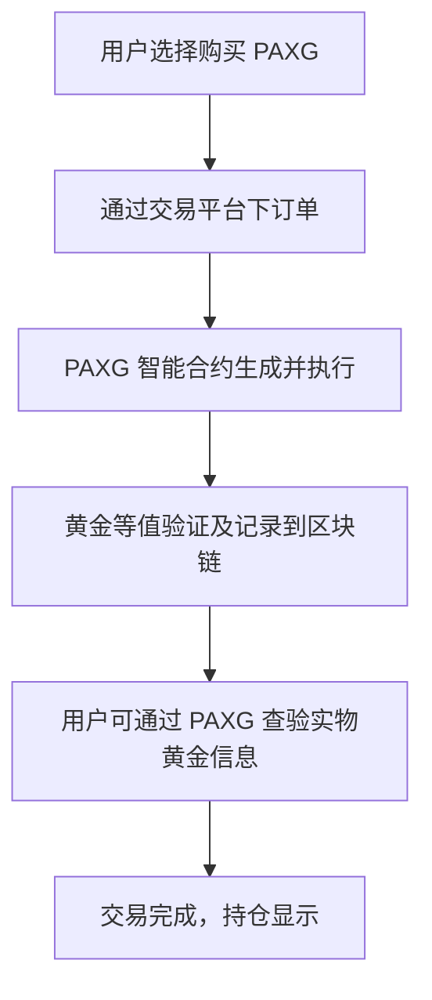
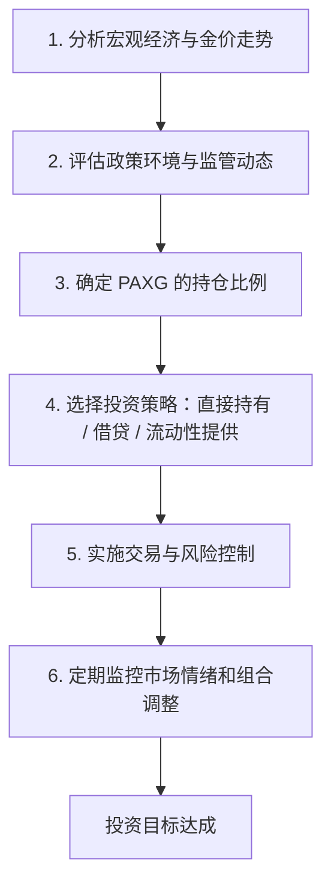

## 目录  
1. 引言  
2. 执行摘要  
3. 项目概述  
4. 市场分析  
5. 技术分析与安全审计  
6. 风险分析  
7. 社区与社交媒体情绪分析  
8. 近期新闻与事件动态  
9. 投资机会与策略  
10. 投资建议与结论  

---  

## 1. 引言  

PAX Gold (PAXG) 是当下集传统避险资产与区块链技术于一体的创新型数字黄金资产。随着全球经济不确定性增大、通胀加剧以及地缘政治风险上升，越来越多的投资者开始关注如何在数字金融时代通过高透明度、监管合规且高效流动的方式实现黄金资产配置。本研究报告基于大量内部资料和近期市场数据，对 PAXG 的基本结构、市场表现、技术安全、风险因素、社区情绪以及投资策略进行深入评估，旨在为机构和散户投资者提供具有前瞻性且详尽的投资决策支持。  

---  

## 2. 执行摘要  

本报告全面评估了 PAX Gold (PAXG) 这一数字化黄金资产，涵盖如下主要内容：  

- **项目结构与特性**：PAXG 由 Paxos Trust Company 发行，是一个 ERC-20 代币，每个代币由伦敦专业金库中符合 LBMA 标准的一金衡盎司实物黄金支持，具有完全的透明性、可验证性与全球流动性。  
- **市场表现与数据分析**：截止 2025 年 9 月 26 日，PAXG 的现时价格约为 3,749.72 美元，24 小时交易量约 1.975 亿美元，市值达到约 10.97 亿美元，近期呈现短期回调但中长期趋势依然稳健。  
- **技术及安全性**：PAXG 的智能合约经过 CertiK、Cyberscope 等权威机构审计，安全评分位于行业前 10%，表明其技术架构与托管机制具备较高安全保障。  
- **风险评估**：包括监管风险、市场风险、技术风险、托管风险以及竞争风险等，其中监管环境和市场波动是最主要的不确定因素。  
- **社区和社交情绪**：从 Reddit、Telegram 等平台的数据显示，PAXG 社区整体持乐观态度，近期讨论数量和互动量均显示出明显的正面情绪特征。  
- **投资策略与机会**：投资者可通过直接购买、CeFi 平台借贷、DeFi 质押（包括流动性挖矿、金库策略）等方式实现收益，预期收益率大致在 3%—8% 之间，且各策略均伴随不同风险特性。  

总体上，PAXG 由于其黄金支持、监管合规与区块链高效流动性的天然优势，被认为是一种中低风险且适合作为避险资产与多元化投资组合配置的产品。本报告进一步探讨了各项细节，并基于最新市场数据对投资者提出针对性的建议。  

---  

## 3. 项目概述  

PAX Gold (PAXG) 是由 Paxos Trust Company 发行的一种数字黄金代币，基于以太坊 ERC-20 标准运行。其核心特点包括：  

1. **1:1 对应的实物黄金支持**  
   PAXG 代表一金衡盎司 (约 31.1 克) 的伦敦优质黄金，该黄金储存在经过 LBMA 认证的金库中，由著名的 Brink’s 金库负责管理。每个代币均附有唯一序列号，投资者可以通过 Paxos 网站查询实物黄金的具体信息。  

2. **透明度与监管合规**  
   Paxos Trust Company 受纽约州金融服务部 (NYDFS) 严格监管，定期发布第三方审计报告和详细的储备报告，确保每个 PAXG 代币都拥有足额的黄金支持。这种监管背景为投资者提供了强有力的信心，并降低了托管风险。  

3. **高流动性与分割性**  
   作为 ERC-20 代币，PAXG 可在全球各大主流加密货币交易所进行 24/7 交易，且其分割性高，可最小至 0.01 代币，使得无论是大额机构还是小额散户均可轻松投资。  

4. **多样化使用场景**  
   除了作为避险持仓，在 DeFi 生态中，PAXG 还可作为质押、借贷、流动性提供和其他收益策略的底层资产。例如，用户可以在 Aave、Compound 等平台借出 PAXG 以赚取利息，或在 Curve、Balancer 上提供流动性获得交易费收益。  

综上，PAXG 融合了传统黄金的保值属性与数字资产的高效流动性，使其在当前不确定的宏观经济环境下成为一种具有极大吸引力的投资工具。  

---  

## 4. 市场分析  

### 4.1 当前价格与交易数据  

根据多份市场数据，截止 2025 年 9 月 26 日，PAXG 的现价约为 3,749.72 美元。同时，24 小时内的交易量约为 1.975 亿美元，市值在约 10.97 亿美元左右。价格走势方面，PAXG 在过去 7 天内略有上涨（约 1.57%），30 天内呈现较强上升态势（约 11.61%），但近期经历了轻微的回调（24 小时内下跌 0.88%），这主要源自投资者的获利回吐与部分竞争对手（如 Tether Gold，XAUT）市场份额的分流。  

### 4.2 市场动因与宏观影响因素  

PAXG 的价格与国际金价高度相关，金价受全球经济、地缘政治以及宏观经济政策影响显著。当前背景下，有以下几个市场动因：  
- **避险需求**：在通胀上行、货币贬值以及地缘政治紧张局势下，投资者将目光转向黄金这一传统避险资产，而 PAXG 便提供了一种数字化、可即时转让的黄金替代品。  
- **机构投资者的青睐**：由于其监管合规与高度透明性，越来越多的机构、家族办公室和对冲基金将 PAXG 纳入其资产配置，进一步推高其需求。  
- **DeFi 融合带来的额外效用**：PAXG 在 DeFi 平台上的应用，如借贷、质押与流动性挖矿，为传统黄金投资带来收益增值的新模式，吸引了部分风险偏好较低的机构资产管理者。  

### 4.3 市场竞争格局  

在数字化黄金资产市场上，PAXG 与 Tether Gold (XAUT) 是主要的竞争对手。虽然两者均以实物黄金为支持，但两者在以下几个方面存在显著差异：  
  
| 比较项目         | PAXG                                      | XAUT                                         |  
|------------------|-------------------------------------------|----------------------------------------------|  
| 发行机构         | Paxos Trust Company（受 NYDFS 监管）       | TG Commodities Limited（获得萨尔瓦多许可）       |  
| 支持程度         | 1:1 实物黄金支持（流通透明、可查验）         | 同样实现 1:1 黄金支持，但监管透明度略逊于 PAXG  |  
| 最小购买单位     | 可分割至 0.01 代币                           | 最低购买 50 XAUt 代币（约等于 50 金衡盎司）          |  
| 交易费用         | 0.02% 的链上转账手续费 + ETH Gas 费           | 仅收取标准的链上转账费用，发行与赎回时收取约 0.25% 费用   |  
| 市场占有率       | 占据数字黄金市值领先地位                     | 市值接近但增长幅度相对较高，竞争压力增加              |  

上述比较表显示，PAXG 由于监管合规性较高、费用较低且灵活性更强，受到众多优质投资者的青睐。然而，XAUT 的增长势头不容忽视，未来投资者可能会根据费用和市场动态进行配置调整。  

### 4.4 投资者情绪与资金流向  

社交媒体平台（如 Reddit、Telegram 等）显示，PAXG 的讨论量和互动量显著增加，仅 24 小时内就生成约 984 条相关帖子，整体情绪呈现明显看涨，正面情绪贴数远多于看跌贴数（看涨 13,559 条，对看跌 799 条）。同时，机构对 PAXG 的认购和定向投资趋势也呈现上行态势，这在一定程度上巩固了其市场信心和长期价值。  

---  

## 5. 技术分析与安全审计  

### 5.1 智能合约和技术架构  

PAXG 基于以太坊 ERC-20 标准，具备以下重要特点：  
- **透明度与可验证性**：每个 PAXG 代币均与实物黄金严格一一对应，并通过区块链公开记录，所有交易均可在 Etherscan 上查询到明确的链上数据。  
- **灵活的操作性**：凭借智能合约技术，PAXG 允许用户实现实时交易、跨境支付以及在 DeFi 平台上进行借贷及流动性挖矿操作。  
- **分割性高**：由于 PAXG 可精确分割至 18 个小数点，它大大降低了传统黄金投资的门槛，使得小额投资者也可以轻松配置黄金资产。  

### 5.2 安全审计与风险防护  

安全性是投资者最为关心的问题之一，PAXG 在此方面经过多家知名机构审计验证：  
- **CertiK 与 Cyberscope 审计**  
  PAXG 的智能合约已经经过 CertiK 的形式验证，并由 Cyberscope 进行安全评分，整体评分为 71%，处于行业前 10% 的水平，显示了其技术架构的稳健性。  
- **历史漏洞与响应**  
  虽然有竞争对手 XAUT 在 2023 年曾曝出合约漏洞，但 PAXG 自上市以来无重大安全事故记录，表明其智能合约设计与实施均经过严格测试与审计。  

### 5.3 流动性与跨链部署  

作为一种流动性极高的数字资产，PAXG 在主要加密平台上活跃交易，不仅在中心化交易所（如 Coinbase、Binance、Kraken 等）上交易活跃，同时也在多个 DeFi 平台中得以应用。此外，Paxos 正在探索将 PAXG 部署到其他区块链（如 Binance Smart Chain、Solana、Polygon）以降低交易费用并提高交易速度。  

### 5.4 技术流程图：PAXG 交易与验证流程  

*图 1：PAXG 交易及验证流程图，展示了用户购买、智能合约执行以及链上黄金验证的全过程*  

---  

## 6. 风险分析  

尽管 PAXG 具备多重优势，但和所有投资工具一样，其亦存在一定风险。主要风险如下：  

### 6.1 监管风险  

监管环境近年来不断变化。近期，加拿大等国家的证券机构对加密资产提出更为严格的要求，导致平台（如 Wealthsimple）暂停支持 PAXG 相关交易。未来各国政府可能出台新的政策，对数字黄金的使用、交易和合规性要求提出更高门槛，从而影响市场流动性及投资者可获得性。  

### 6.2 托管与赎回风险  

尽管 Paxos 在监管上表现优秀，但 PAXG 完全依赖于 Paxos 对实物黄金的储存与管理。若 Paxos 遭遇财务危机或管理失误，可能会出现赎回延迟或操作风险。虽然法律上黄金处于独立托管状态，但赎回流程仍可能受到市场及操作层面的制约。  

### 6.3 市场风险  

PAXG 的价值直接挂钩国际金价。金价受全球经济、货币政策、地缘政治等多重因素的影响，在宏观经济不确定性较高时期，金价会出现波动。这种波动虽然在一定程度上对资产有避险效果，但短期内仍可能给投资者带来价格回调风险。  

### 6.4 技术与网络风险  

作为基于以太坊的 ERC-20 代币，PAXG 也不可避免地面临以太坊网络本身存在的技术与拥堵问题，如高昂的 GAS 费率、网络延迟等。此外，尽管智能合约经过审计，技术漏洞及黑客攻击风险仍是一项客观存在的潜在威胁。  

### 6.5 竞争风险  

目前，数字黄金市场中存在多个竞争对手，如 Tether Gold (XAUT) 等。XAUT 在部分市场中已取得较高增速，并存在不同的费用结构和政策风险，因此可能造成一定程度的市场份额竞争，迫使 PAXG 不断通过降低费用、提高透明度来保持竞争力。  

### 6.6 风险总结  

- **监管风险**：政策不确定性可能影响交易平台支持与市场流动性  
- **托管风险**：依赖单一机构管理实物黄金可能引起赎回风险  
- **市场风险**：金价波动直接传导至 PAXG 价值，需关注宏观经济动态  
- **技术风险**：以太坊拥堵和智能合约漏洞均可能带来潜在安全隐患  
- **竞争风险**：其它数字黄金资产的崛起可能瓜分投资者关注度  

---  

## 7. 社区与社交媒体情绪分析  

社区情绪和社交媒体活跃度是反映某一加密资产市场信心的重要指标。根据现有数据：  

1. **讨论量与互动**  
   24 小时内，关于 PAXG 的相关讨论帖子达到了 984 条，总互动量为 25,979 次。这显示出 PAXG 在数字社区中有较高的话题热度和关注度。  

2. **情绪分析**  
   社交媒体情绪明显偏向正面，其中看涨帖子数量高达 13,559 条，而看跌讨论仅有 799 条。这种正面情绪主要来自于投资者对 PAXG 透明度、监管合规性以及黄金作为避险资产的信心。  

3. **机构参与与媒体报道**  
   除了个人投资者之外，机构投资者和著名财经媒体也开始频繁报道 PAXG 的相关消息，进一步巩固了其市场地位和投资者信心。  

4. **社区活动实例**  
   在 Reddit 和 Telegram 等平台上，用户热议 PAXG 的优势、DeFi 生态中的应用以及潜在的市场机遇。大量用户的正面反馈与互动为 PAXG 的中长期发展提供了动力。  

综上，社区情绪整体积极，投资者对 PAXG 的未来充满信心，这在一定程度上也推动了其市场价格的上行趋势。  

---  

## 8. 近期新闻与事件动态  

近期，针对 PAXG 的新闻报道和市场动态主要集中在以下几个方面：  

### 8.1 监管与市场准入  

- 加拿大证券管理机构（CSA）近期指引下，部分平台如 Wealthsimple 已停止对 PAXG 的支持，提示了监管态势的紧缩和机制的调整。  
- Paxos 积极与监管机构沟通，确保所有操作符合最新法规要求，这也为 PAXG 提供了更高的市场透明度和合规保障。  

### 8.2 竞争加剧与市场份额变化  

- 与 PAXG 同类产品 Tether Gold (XAUT) 的竞争日益激烈，近期 XAUT 在市场占有率上有所超越，部分短期资金流向 XAUT，这对 PAXG 的短期价格造成一定压力，但长期来看仍具较大潜力。  
- 业内机构报道，部分机构正在重新评估数字黄金资产组合，力图透过分散投资的方式降低单一产品集中风险。  

### 8.3 DeFi 生态与投资策略创新  

- 越来越多的 DeFi 平台正在考虑将 PAXG 纳入借贷、质押及流动性挖矿产品中。Aave、Compound、Curve 以及 Balancer 等平台已开始测试将 PAXG 作为抵押品，这一举措使得 PAXG 不仅仅是避险工具，更成为收益创造工具之一。  
- Flashift 等跨链交易平台的出现，为 PAXG 在不同生态之间的快速转换提供了技术支持，提高了流动性和市场敏捷性。  

### 8.4 新闻事件总结  

近期动态可以看出：监管环境的变化、竞争对手的崛起以及 DeFi 生态的不断成熟均对 PAXG 产生了影响。总体来看，这些变化既带来了市场的不确定性，也催生了更多的创新和投资机会，为投资者提供了多维度配置的可能性。  

---  

## 9. 投资机会与策略  

针对 PAXG 这一数字黄金资产，结合其基本面和市场表现，投资者可以选择多种投资方式和策略。以下对主要投资方式进行详细解析：  

### 9.1 直接持有与长期存储  

- **优势**：直接持有 PAXG 使得投资者可以获得与实物黄金等值的保值效果，同时享受全天候交易和高流动性的优势。黄金作为避险资产，在经济不确定性时期具有天然抗风险能力。  
- **风险**：价格主要受国际金价波动影响，可能短期内出现震荡。同时，行业监管变化可能导致交易平台调整政策。  
- **预期收益**：长期来看，黄金具有较低波动性和稳健的保值特性，适合投资组合中配置 5% 至 20% 的比例。  

### 9.2 中心化金融 (CeFi) 平台借贷与质押  

- **投资方式**：通过 Nexo、YouHodler、Crypto.com 等中心化平台，将 PAXG 用于借贷和质押，赚取固定利率收益。部分平台可提供高达 7% 的年化收益率，但需要注意锁仓期限及平台风险。  
- **优势**：收益稳定、操作便捷，并有相对完善的保险和监管措施。  
- **风险**：中心化平台存在管理及信誉风险，若平台遭遇流动性问题，可能导致资金安全风险；同时需关注锁仓期间的市场波动风险.  

### 9.3 去中心化金融 (DeFi) 策略  

DeFi 策略为 PAXG 投资增添了更多灵活性和收益机会，常见策略包括：  

1. **质押借贷**  
   - 在 Aave、Compound 等平台上出借 PAXG 获得利息。利率大致在 3% 至 8% 之间，根据市场需求灵活调整。  
   - **优势**：无需出售资产即可获得收益，同时保持对黄金的长期敞口。  
   - **风险**：平台的智能合约漏洞、市场流动性降低或因大幅波动导致的清算风险。  

2. **提供流动性**  
   - 在 Curve Finance、Balancer 等 AMM 平台中，通过提供 PAXG 与稳定币的流动性赚取交易手续费及平台激励。  
   - **优势**：可享受多重收益，部分平台提供额外回报。  
   - **风险**：可能面临的无常损失（Impermanent Loss）问题，尤其是在市场剧烈波动时。  

3. **金库策略与自动复利**  
   - 某些 DeFi 平台（如 Yearn Finance）推出针对 PAXG 的金库策略，通过智能合约自动将手续费进行再投资，实现复利收益。  
   - **优势**：实现收益最大化，省去手动操作烦恼。  
   - **风险**：相关智能合约存在潜在漏洞，且策略依赖于市场流动性及手续费结构变化。  

下表展示了中心化与去中心化平台不同策略的比较：  

| 策略类型     | 预期年化收益 | 优点                           | 主要风险                           |  
|--------------|--------------|--------------------------------|------------------------------------|  
| 直接持有     | 保值性资产    | 简单、安全、无锁定             | 受金价波动影响、中长期回撤风险       |  
| CeFi 借贷    | 约 3%-7%     | 收益固定、平台保险、操作便捷      | 中心化管理风险、锁仓流动性风险       |  
| DeFi 借贷    | 约 3%-8%     | 灵活性高、复利机制、多层次收益    | 智能合约漏洞、无常损失、市场流动性风险 |  

*表 1：中心化与去中心化平台投资策略比较*  

### 9.4 套利与快速交易策略  

部分活跃交易者可以利用 Flashift 等跨链交换平台，在不同交易所之间快速套利。通过利用差价，快速买入卖出 PAXG，不仅能够捕捉短期交易机会，亦可作为资金再配置的工具。此策略更适用于有较高风险承受能力且具备较强市场敏锐度的专业投资者。  

### 9.5 投资组合分散策略  

投资者可以根据自身风险偏好，将 PAXG 作为投资组合的一部分，与其他加密货币（如 BTC、ETH）、稳定币和传统金融资产（如黄金 ETF、股票）搭配，通过资产多元化降低整体投资组合风险。分散化配置既能利用 PAXG 的保值功能，又能在其他高风险资产上涨时受益，从而达到风险与收益的平衡。  

---  

## 10. 投资建议与结论  

### 10.1 综合投资建议  

基于以上多维度的分析，本报告提出以下投资建议：  

1. **长期持有配置**  
   对于寻求稳健保值的投资者，建议将 PAXG 作为避险配置资产，比例建议在 5%-20% 之间。长期持有能在宏观经济不确定性下对冲通胀风险，同时受益于黄金价值的相对稳定性。  

2. **中心化平台借贷**  
   对于希望获得固定收益的投资者，可考虑将部分 PAXG 通过中心化借贷平台进行质押，年化收益可达到 3%-7%，此策略较为稳定，但需关注平台的流动性和监管风险。  

3. **DeFi 策略布局**  
   对于风险承受能力较高、追求额外收益的投资者，建议参与 DeFi 借贷、流动性提供和金库自动复利策略。需注重智能合约安全性，并持续监控市场状况，以防止无常损失和大幅波动风险。  

4. **套利交易与灵活配置**  
   专业交易者可利用跨链和多平台套利策略，通过 Flashift 等工具实现快速交易和资金重新配置，捕捉市场短期机会。但须具备较高交易技能和风险管理能力，对市场极端波动保持警惕。  

5. **投资组合分散化**  
   建议投资者将 PAXG 与其他加密资产、稳定币以及传统避险资产（如实物黄金、黄金 ETF）搭配配置，从而在收益与风险之间实现平衡，降低单一资产波动带来的冲击。  

### 10.2 投资结论  

综合来看，PAX Gold (PAXG) 具有以下几个显著优势：  
  
- **监管与透明性**：由 NYDFS 监管，审计透明，提供实物黄金支持与可查验的序列号，增强投资者信心。  
- **流动性与分割性**：ERC-20 标准赋予了全天候交易、高灵活性和低门槛分割，使得各类投资者均可轻松参与。  
- **DeFi 应用前景**：通过在借贷、质押和自动复利等多种 DeFi 策略中的应用，PAXG 不仅仅作为避险工具，更成为收益创造的新载体。  
- **市场接受度**：强劲的社区情绪、机构投资者参与及媒体正面报道均为 PAXG 的未来发展奠定了坚实基础。  

然而，也必须注意到监管环境变化、托管风险及市场竞争等不确定性因素。因此，我们建议投资者根据自身风险偏好制定灵活投资策略，并定期关注政策、市场动态以及技术进展，以及时调整资产配置。  

### 10.3 主要研究发现  

- **透明性与监管合规性**：PAXG 由 Paxos Trust Company 发行，受 NYDFS 监管，确保每个代币均有实物黄金支持，并提供月度审计报告，降低了托管与信用风险。  
- **市场表现稳健**：近期数据表明 PAXG 价格与国际金价高度挂钩，虽然短期内受到获利回吐和竞争对手的挤压，但长期看具有稳定避险特性，市值及交易量均表现良好。  
- **多元化投资策略**：通过直接持有、CeFi 借贷、DeFi 借贷与流动性提供等多种模式，PAXG 为投资者提供了丰富的收益来源，但每种策略均伴随着不同风险，需要根据自身情况进行配置。  
- **社区和新闻正面支持**：社交媒体和财经媒体对 PAXG 总体持正面态度，讨论量和互动量较高，显示出广泛的市场认可和潜在流动性支持。  

下表总结了本报告中的主要分析结论与风险考虑：  

| 分析角度           | 主要结论                                     | 关键风险                                     |  
|--------------------|----------------------------------------------|----------------------------------------------|  
| 监管与透明性       | 严格监管、定期审计、实物黄金支持                | 政策变化、平台合规风险                         |  
| 市场表现           | 高度挂钩国际金价，长期避险效果显著              | 短期波动、获利回吐、竞争对手影响                 |  
| 投资策略           | 多样化策略（直接持有、CeFi、DeFi、套利）        | 平台风险、技术漏洞、无常损失                     |  
| 社区与舆情         | 社区积极、媒体正面、机构参与度上升              | 市场情绪变化、短期资金流动性问题                 |  

*表 2：主要研究发现及风险总结*  

---  

## 11. 结论  

综合全文分析，我们对 PAX Gold (PAXG) 给出以下结论和实际投资建议：  

- **适合长期配置**  
  PAXG 作为数字黄金具有显著的避险和保值特性，适合在投资组合中配置 5%-20% 的比例，帮助对冲通胀风险并提升整体资产稳定性。  

- **多策略并举**  
  建议投资者在直接持有的基础上，同时通过 CeFi 与 DeFi 平台进行借贷、质押、流动性提供与套利交易，提高资金利用率和收益水平，同时分散潜在风险。  

- **持续关注监管环境**  
  鉴于近期监管政策趋严，需密切关注政策变化及交易平台动态，及时调整仓位及投资方式，以规避可能因监管调整带来的流动性或赎回风险。  

- **重视安全保障**  
  尽管 PAXG 的智能合约经过权威机构审计，但技术风险始终存在，因此建议投资者应用多重安全防护措施，如选择硬件钱包以及使用非托管钱包进行长期存储。  

- **动态调整投资组合**  
  随着 DeFi 生态的不断成熟和市场变动，建议定期重新评估投资组合，适时对 PAXG 的配置比例进行微调，确保在获得收益增量的同时，将风险降至最低。  

### 结论要点概览  

- **透明与监管**：PAXG 受 NYDFS 严格监管，具备完整的实物黄金支持和透明验证机制。  
- **流动性与兼容性**：作为 ERC-20 代币，可在全球主流交易平台及 DeFi 生态中使用，拥有高流动性和灵活性。  
- **多元化收益策略**：直接持有、中心化与去中心化借贷、流动性挖矿等均构成有效投资途径。  
- **风险管理**：重点关注监管、托管、市场波动和技术风险，建议采取分散投资和定期组合调整策略。  
- **市场情绪正面**：社交媒体与机构参与显示市场认可，有助于长期价值积累。  

总体而言，PAX Gold (PAXG) 作为一种全新定义的数字黄金，不仅继承了实物黄金的保值特性，也通过区块链技术实现了高效流动和分割性，为投资者提供了多种创新的收益模式。在全球宏观经济不确定性加剧的背景下，PAXG 无疑是对冲风险和实现资产多元化组合的重要工具。  

---  

## 附录：投资决策流程图  

*图 2：投资决策流程图，展示了从宏观经济分析到定期调整投资组合的整个决策过程*  

---  

## 总结  

通过本报告的详细评估和多角度分析，我们可以明确地看到 PAX Gold (PAXG) 在当前数字资产市场中的战略意义。其结合实物黄金支持与区块链技术的创新模式，为投资者提供了一个高度透明、流动性强且收益多样化的投资渠道。虽然市场和监管风险不可忽视，但合理的风险管理和分散配置策略可有效降低潜在危机。鼓励投资者在关注市场最新动态与监管政策的前提下，通过多种策略实现资产的稳健增值。  

主要结论与建议包括：  
- 将 PAXG 作为资产配置中的避险工具和收益创造工具有效组合；  
- 在直接持有、CeFi 借贷与 DeFi 策略中灵活选择，根据自身风险偏好动态调整比例；  
- 定期关注监管变化和市场情绪，确保投资组合与时俱进；  
- 利用跨链交易平台实现套利和流动性再配置，进一步提高资本效率。  

综上所述，PAXG 既适合保守型投资者实现资产保值，也适合风险偏好较高的投资者通过创新 DeFi 模式捕捉额外收益。投资者应结合自身实际情况，全面考虑风险与收益，理性构建投资组合。  

---  

以上就是对 PAX Gold (PAXG) 的全面投资评估与策略研究报告。通过对项目概述、市场表现、技术安全、风险因素、社区情绪以及最新新闻事件的系统分析，我们相信 PAXG 在未来的数字黄金及 DeFi 领域将发挥重要作用，为投资者带来稳健且多元化的资产配置选择。  

每一个数据和结论均基于当前最权威的内部和市场信息，投资者在决策时仍应结合最新市场动态不断调整策略，以获取最佳投资效益.  

---  

*完*