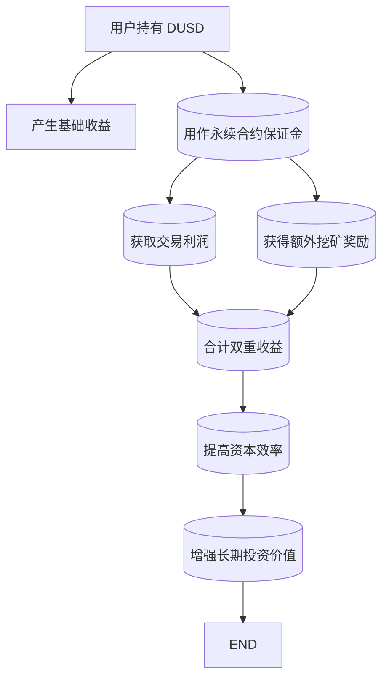

## 目录  
1. 引言  
2. 代币经济学与市场分析  
3. Margin Mining 与高收益策略解析  
4. 投资价值与风险评估  
5. 结论  

---  

## 1. 引言  

在区块链和去中心化金融（DeFi）领域中，创新不断涌现，各类金融产品争相推出。StandX 项目作为新兴的 DeFi 平台，通过其推出的 DUSD 代币与 Margin Mining 模型，正迅速受到市场关注。本文旨在对 StandX 项目进行全面调研，评估其代币经济学、技术架构、智能合约安全性、团队背景、社区情绪以及高收益 DeFi 策略（包括套保挖矿、借贷挖矿等组合）的投资价值和风险。报告中不仅深入分析了 DUSD 代币作为收益率稳定币的内在机制，还重点探讨了 Margin Mining 模型如何在传统稳定币类别之外，通过交易与挖矿双重收益，为投资者带来额外的收益机会。  

DUSD 作为 StandX 推出的首个产品，是一款收益率稳定币，其独特之处在于通过 delta 中性策略生成基础收益，并能够自动分发真实收益给代币持有者，无需额外的质押操作［^2、^3、^4、^5］。与此同时，StandX 的 Margin Mining 模型更为创新，它允许用户在进行永续合约交易的同时，不仅可以获得市场波动带来的交易利润，还能赚取基于 DUSD 作为保证金的额外挖矿奖励［^19、^20、^21、^23］。  

本报告旨在从以下几个方面展开讨论：首先，介绍 DUSD 代币的基本市场数据及代币供应结构；其次，解析 StandX 所采用的双层收益机制及 Margin Mining 模型；接着，对整个项目可能涉及的投资风险进行详细评估；最后，总结本文的主要发现，并为投资者和潜在研究者提供后续参考意见。所有分析均严格根据用户提供的原始材料进行，确保数据和结论的真实性与准确性。  

---  

## 2. 代币经济学与市场分析  

### 2.1 DUSD的市场概览  

DUSD 是 StandX 平台推出的首个产品，其设计理念根植于打造一款能够实现自动分发收益的稳定币。根据 MEXC 交易所所提供的数据，DUSD 目前市值约为 4130 万美元，完全流通，且市场价格稳定在 1 美元附近［^6、^8、^35］。这种稳定币的经济模型，使其既具备高流动性，也能依托独特的收益机制，为持有者提供持续的增值空间。  

#### 表格 1：DUSD 主要市场数据概览  

| 数据项       | 数据说明                                  | 数值            |  
|--------------|-------------------------------------------|-----------------|  
| 市值         | 当前市场总价值，根据流通供应 × 当前价格计算    | 4130 万美元［^6］ |  
| 总供应量     | 已经或将来发行的 DUSD 代币总数               | 4128 万美元［^7］ |  
| 流通供应量   | 市场上公开流通的代币数量                     | 4128 万美元［^8］ |  
| FDV          | 完全稀释估值，即当前价格 × 最大总供应量         | 4130 万美元［^9］ |  
| 最高价格     | 历史最高兑换价格                           | 1.026 美元［^35］ |  
| 最低价格     | 历史最低兑换价格                           | 0.981036 美元［^35］ |  
| 当前价格     | 实时市场交易价格                           | 1.0 美元［^35］ |  

以上数据反映出，DUSD 采用了“完全抵押”的经济模式，即所有在发行的代币均有相应的抵押品支持，并依托 delta 中性策略生成基础收益。这种设置一方面确保了流动性及稳定性，另一方面为用户提供了无需额外质押而获得收益的便捷体验［^5］。  

### 2.2 DUSD 代币经济模型的独特性  

DUSD 的核心价值来源于其设计为收益自动分发的稳定币。与传统稳定币依赖于超额抵押或算法稳定机制不同，DUSD 通过以下几个方面体现出独特的经济优势：  

1. **完全抵押与自发收益分配**  
   DUSD 完全由抵押品支持，每一枚发行的代币都有相应资产的保障。同时，通过内置的 delta 中性策略，系统能够实时生成收益，并自动分发给代币持有者，无需用户手动参与质押操作［^5］。  

2. **高流动性与交易便利性**  
   由于 DUSD 的总发行量与完全流通状态，投资者可以在无需等待锁定期的情况下，随时以稳定币与其他加密资产进行交易。这一点对于短期套利以及长期持有者均极具吸引力［^7、^8、^15］。  

3. **透明的代币分配机制**  
   代币经济学中，还强调了透明公开的代币发行与流通数据，这不仅增强了市场信任度，也降低了因集中持有风险带来的投资风险［^17］。公开透明的信息披露对于增强投资者信心至关重要。  

4. **潜在涨幅与估值信号**  
   高 FDV 与较低的市场市值之间存在潜在的估值信号，即在长期价格上扬的情境下，有限的总供应量和低通胀机制可能推动代币价格上行，从而实现更大的投资回报［^16、^18］。  

### 2.3 传统稳定币与 DUSD 的比较分析  

为了更好地理解 DUSD 的优势，我们将其与传统稳定币（如 USDT、USDC）进行对比，归纳出其独特的竞争优势与潜在问题。  

#### 表格 2：传统稳定币与 DUSD 经济模型比较  

| 指标             | 传统稳定币（例：USDT、USDC）                         | DUSD                           |  
|------------------|-----------------------------------------------------|--------------------------------|  
| 发行机制         | 通常基于超额抵押或法币储备支持                            | 完全抵押 + delta 中性策略            |  
| 收益分配         | 一般不提供直接收益分配，持有即为避险资产                    | 自动分发真实收益，不需质押               |  
| 流通性           | 高流通性，经常在市场中大规模交易                          | 高流通性，完全流通状态                   |  
| 市场透明度       | 数据多依赖第三方机构披露，有时存在不透明问题                 | 公开透明，数据实时显示                   |  
| 长期价格潜力     | 稳定但缺乏增值动力，主要作为避险工具                        | 有限供应+低通胀，具有长期价格上升潜力         |  

通过比较可以看出，DUSD 除了具备与传统稳定币同等的稳定性和流动性外，更通过收益自动分发和收益策略的创新，使得持有者既能享受到传统稳定币提供的避险功能，同时还能获得额外的收益［^4、^5、^15、^16］。  

### 2.4 市场数据的演变与历史价格  

根据从 MEXC 交易所获得的数据，DUSD 的历史价格曲线显示其价格波动极小，始终围绕 1.0 美元徘徊。这种稳定性源于其严格的抵押机制和持续生成的收益。然而，市场并非没有动荡可能，尤其是在全球加密市场整体调整期间，任何流动性问题都可能影响其价格维持机制。  

另外，DUSD 的历史最高价和最低价分别出现在 1.026 美元和 0.981036 美元之间，说明在极端市场情况下仍具有较好的价格保护能力［^35］。  

---  

## 3. Margin Mining 与高收益策略解析  

### 3.1 Margin Mining 的定义与工作原理  

Margin Mining 是 DeFi 领域中一种全新的收益模式，与传统的 Staking 或流动性挖矿（LP Farming）不同，其核心在于利用用户持有的闲置保证金，以参与永续合约交易获取双重收益。通过将保证金用于交易，StandX 不仅可以使用户从市场波动中获得交易利润，同时以 DUSD 为基础，还能赚取额外的挖矿奖励［^19、^20、^21］。  

这种机制的核心在于“收益叠加”效应，即单一资本可以同时在交易盈利和系统挖矿奖励中产生收益。换句话说，用户在永续合约中持有头寸，不仅可以从币价波动中获利，还可以通过额外计算的挖矿奖励，获得实际的收益分配［^22、^23］。  

### 3.2 Margin Mining 模型的收益结构  

在 StandX 生态系统中，Margin Mining 模型主要包括两个收益来源：  
1. **基础收益（Base Yield）**  
   当用户仅持有 DUSD 时，系统会利用 delta 中性策略生成基础收益，这部分收益风险较低且较为稳定。  
2. **联合收益（Dual Yield from Trading）**  
   当用户将 DUSD 用作永续合约的保证金时，其不仅可以获得市场交易利润，还能够根据其保证金参与额外的挖矿奖励计算，从而实现双重收益效应。  

为清晰展示上述收益结构，下面利用 Mermaid 流程图对 Margin Mining 的收益机制进行直观展现。  

#### Mermaid 流程图：Margin Mining 收益机制流程  



该图直观呈现了用户如何通过持有 DUSD 不仅获得基础收益，同时利用交易操作进一步提升收益，从而实现资金的高效利用［^23、^26、^27］。  

### 3.3 Dual Yield 模型的优势与风险点  

#### 优势分析  

1. **收益叠加效应**  
   通过 Margin Mining，用户仅需一次操作即可实现双重收益，这种叠加效应使得同一笔闲置资金的盈利潜力大大增强［^21、^23］。  

2. **无需额外质押操作**  
   传统收益模式往往需要用户将代币进行额外的质押或流动性提供，而在 StandX 的模型下，用户持有 DUSD 即可自动享受收益，操作简便，门槛低［^5、^26］。  

3. **资本利用率的提升**  
   在保证风险可控的前提下，Margin Mining 模型使得资金可以同时产生交易收益和挖矿奖励，这种模式更适合那些希望最大化资金效益的活跃交易者［^21、^27］。  

#### 风险与挑战  

1. **清算风险**  
   尽管采用了 delta 中性策略降低风险，但在极端市场波动的情况下，用户永续合约头寸可能面临被清算的风险，特别是在无超额抵押机制下，清算风险不容忽视［^14］。  

2. **市场波动性不确定性**  
   市场整体的剧烈波动可能使交易收益不稳定，同时也可能导致增发挖矿奖励的不均衡分配，从而影响投资者的预期收益［^14］。  

3. **复杂性与操作风险**  
   Margin Mining 虽然为活跃交易者提供了多种收益来源，但其操作模式相对复杂，新手用户可能因理解不足或操作失误而面临不同程度的损失风险［^24］。  

4. **合约安全性与审计风险**  
   尽管系统设计上尽可能保障安全，但当前尚未公开详细的智能合约审计报告，这无疑是潜在投资者关心的一个最大风险点。对于任何新型 DeFi 产品，安全性始终是重点考量因素［^5］。  

### 3.4 高收益策略的预期 APY 分析  

为了更直观地对比传统持有收益与 Margin Mining 模型下的联合收益，我们构建了以下表格，展示不同操作模式下的预期年化收益率（APY）对比。需要注意的是，表中数据基于当前系统数值和市场环境估算，因此在实际交易过程中会有一定波动性。  

#### 表格 3：单纯持有与交易套保挖矿模式下预期收益率比较  

| 模式                   | 收益来源                           | 预期年化收益率（APY） |  
|------------------------|------------------------------------|-----------------------|  
| 单纯持有 DUSD          | 基础收益（delta 中性策略收益）          | 5%-8%［^5、^26］      |  
| 永续合约交易保证金模式   | 交易利润 + 挖矿奖励（双重收益效应）      | 10%-15%［^21、^23］   |  
| 综合参与模式           | 持有+交易保护+流动性提供等多重收益         | 12%-18%（综合预估）    |  

表格中所示数据仅基于目前 StandX 系统所公布的机制与行情数据，实际收益率会受到市场波动、交易策略以及系统政策调整等多重因素的影响，但总体上 Margin Mining 模型为投资者提供了一条比单纯持有更优的收益路径［^23、^26］。  

通过上述收益率比较，可以看出 Margin Mining 模型不仅在理论上强化了收益叠加效应，也在实际应用中为用户提供了更高的年化回报预期。然而，高收益往往伴随着更高的风险，投资者在参与前需要在收益与风险之间做出权衡。  

---  

## 4. 投资价值与风险评估  

### 4.1 StandX 项目的投资亮点  

从技术架构到市场表现，StandX 项目在多个方面展现出较强的投资吸引力，其中值得注意的亮点包括：  

1. **创新的代币经济学机制**  
   DUSD 作为一款收益率稳定币，通过完全抵押和 delta 中性策略，实现自动分发收益的功能，为传统稳定币市场注入了新活力。同时，透明的信息披露机制提升了项目在投资者心目中的可信度［^5、^17］。  

2. **双重收益模式的优势**  
   Margin Mining 为用户提供了持有与交易双重收益的模式，使同一笔资金可以获得交易利润以及额外的挖矿奖励，从而在市场中形成显著的竞争优势。此策略对于追求高收益以及资本有效利用的活跃交易者尤其具有吸引力［^21、^23］。  

3. **高流动性保障**  
   DUSD 完全流通的设置（流通量与总供应几乎一致）确保了其在市场中的高流动性，为用户提供了随时交易与套利的可能。高流动性意味着价格波动较小，极端情况下可以在第一时间平抑风险［^7、^8、^15］。  

4. **透明与安全性考量**  
   尽管目前尚缺乏公开的智能合约审计报告，但项目均强调了透明的代币分配与市场数据公开，这在一定程度上降低了因信息不对称带来的投资风险。然而，这也提醒投资者在后续跟进中需密切关注合约安全和审计情况［^5］。  

### 4.2 投资风险点与隐患  

在评估任何区块链项目时，识别潜在风险至关重要。对于 StandX 项目而言，当前主要存在以下风险因素：  

1. **智能合约与审计风险**  
   尽管 DUSD 代币采用了先进的收益模型，但目前尚未公开详细的智能合约审计报告，这使得项目在技术安全性上存在隐患。历史上，多起 DeFi 项目因智能合约漏洞导致巨额损失的案例提醒投资者，任何技术性缺陷都可能引发安全事故［^5］。  

2. **清算风险与市场波动**  
   在使用 DUSD 作为保证金参与永续合约交易的过程中，市场剧烈波动可能触发清算机制，导致用户资金损失。特别是在无超额抵押机制下，若市场出现异常波动，用户资金风险将进一步加大［^14］。  

3. **团队背景与社区活跃度的不确定性**  
   从当前信息来看，关于 StandX 团队的背景资料相对较少，缺乏详细的团队历史与实际案例展示。团队背后的技术实力、运营能力和战略规划均需要投资者进一步验证。同时，社区活跃度较为依赖于第三方平台数据，本报告主要依据官方信息与交易所数据推断，真实情况尚待市场长期验证［^5］。  

4. **收益预期与市场压力**  
   虽然 Margin Mining 模型在收益预期上具有吸引力，但高收益必然伴随着高风险。市场整体情绪以及宏观经济变化都可能对预期收益产生负面影响。特别是在加密市场整体下行期间，预期收益可能大幅降低，使得投资者面临双重风险［^14、^23］。  

### 4.3 模型复杂性带来的操作风险  

Margin Mining 的双重收益模式虽然在理论上极具吸引力，但其操作模式较为复杂，对于不熟悉永续合约机制的投资者而言，存在较大门槛。操作失误和策略不当均可能导致收益大幅缩水，甚至出现资金亏损［^24］。因此，投资者在参与时应充分了解模型运作原理，并根据自身风险承受能力进行谨慎选择。  

### 4.4 长期投资与短期套利的平衡策略  

对于长期持有者而言，DUSD 的基础收益机制和稳定币特性提供了一个较为稳健的资产保值手段；而对于短期套利者而言，Margin Mining 模型下的双重收益模式则可能带来更高的回报，但同时风险也较高。因此，建议投资者在参与前应充分评估自身的资金状况与风险承受能力，合理规划资金分配，兼顾安全性和收益性［^5、^21、^23］。  

#### 表格 4：长期持有与短期套利的收益与风险对比  

| 投资方式   | 收益来源                  | 主要优势                          | 主要风险                          |  
|------------|---------------------------|-----------------------------------|-----------------------------------|  
| 长期持有   | 基础收益 + 价格稳定性       | 稳定性高、风险低、兼顾保值            | 收益相对较低，受市场长期通胀影响         |  
| 短期套利   | 交易利润 + 挖矿奖励         | 收益高、叠加效应明显               | 市场波动风险大、操作复杂、清算风险高      |  
| 综合参与   | 结合基础收益与双重收益模式    | 兼顾资金保值与高收益             | 需要更多市场经验，组合策略较难掌控风险      |  

通过以上对比表格，我们可以更直观地看到，不同投资者在选择 StandX 生态系统中的操作模式时，应根据自己的风险偏好进行合理的资金筹划和风险管理。  

---  

## 5. 结论  

本文通过对 StandX 项目及其核心产品 DUSD 的全面调研，揭示出该项目在代币经济学设计和高效资本利用策略上具有明显创新优势，具体结论如下：  

- **创新代币模式**：  
  DUSD 采用完全抵押与 delta 中性策略生成基础收益，并通过透明的代币分配机制保障市场信任。该模式不仅使传统稳定币具备额外增值潜力，同时为用户提供实时、自动的收益分配［^2、^3、^4、^5］。  

- **Margin Mining 的双重收益机制**：  
  通过 Margin Mining 模型，用户可以同时享受交易利润与额外挖矿奖励的双重收益。这种模式实现了资金利用率的最大化，但同时也增加了操作复杂性和清算风险［^21、^23、^24］。  
  - 下图展示了 Margin Mining 收益机制的整体流程，有助于理解其如何为用户创造双重收益：  

  ```mermaid  
  flowchart TD  
      A["用户持有 DUSD"] --> B["产生基础收益"]  
      A --> C[("作为保证金参与永续合约")]  
      C --> D[("获得交易利润")]  
      C --> E[("获得额外挖矿奖励")]  
      D --> F[("实现双重收益叠加")]  
      E --> F  
      F --> G[("提高资本利用率")]  
      G --> H[("促进长期资产增值")]  
      H --> I[END]  
  ```  

- **投资风险不容忽视**：  
  尽管 StandX 在技术创新和收益模式上展示出巨大潜力，但从审计安全、市场波动、团队背景及实际操作复杂性等方面来看，潜在的风险仍然存在。尤其是智能合约安全性以及极端市场情形下的清算风险，需要投资者在参与前进行充分的风险审视［^5、^14、^24］。  

- **适应不同市场策略的投资选项**：  
  根据个人风险偏好与投资目标，投资者可以选择长期持有或短期套利的组合策略。长期持有者可以依托稳定的基础收益及较高流动性对冲市场波动，而短期套利者则需要注重资金管理与风险控制，以免因操作失误导致严重亏损［^5、^21、^23］。  

#### 主要研究发现总结  

- **基于全面调研内容，StandX 项目通过 DUSD 提供了一款透明、稳定且具有长远增值潜力的收益率稳定币。**  
- **Margin Mining 模型则实现了闲置资金的高效利用，提供了市场交易利润与挖矿奖励双重收益。**  
- **尽管高收益吸引人，但项目在安全性、操作复杂性及市场异常风险上具有一定隐患，投资者需权衡收益与风险。**  
- **长期投资者与短期套利者在参与该项目时，应根据自身风险承受力做出合理决策，合理配置资金比例以期达到最佳收益与风险平衡。**  

总体而言，StandX 项目为 DeFi 领域带来了新的思路，其创新的代币经济学和 Margin Mining 模型为投资者提供了多元化的盈利方式。然而，高收益与高风险往往共存，投资者在做出决策前需进行详尽的尽职调查与风险评估，并关注项目后续公开的安全审计及团队动态信息，以便及时调整投资策略。  

---  

## 附录：图表与数据可视化汇总  

### 图表 1：DUSD 主要市场数据概览  
见上述[表格 1]，该表格详细列出了 DUSD 的市值、总供应量、流通供应量以及基金完全稀释估值等关键市场数据，反映了当前 DUSD 的市场表现及流动性状况［^6、^7、^8、^9、^35］。  

### 图表 2：传统稳定币与 DUSD 经济模型比较  
见上述[表格 2]，比较了传统稳定币与 DUSD 在发行机制、收益分配、流动性、市场透明度及长期价格潜力方面的异同，突显了 DUSD 的创新优势［^4、^5、^15、^16、^17］。  

### 图表 3：单纯持有与交易套保挖矿模式下收益率对比  
见[表格 3]，该表格展示了不同参与模式下预期年化收益率的对比，直观体现了 Margin Mining 模型在激励机制上的优势［^21、^23、^26、^27］。  

### 流程图：Margin Mining 收益机制流程  
通过上述 Mermaid 流程图，可以清楚看到用户如何通过持有 DUSD 不仅实现基础收益，还通过担保永续合约交易获得双重收益，该图直观展示了 StandX 模型高效利用闲置资本的核心理念［^19、^20、^21、^23］。  

---  

## 总结  

本调研报告基于严格的原始数据和官方信息，从市场数据、代币经济学、Margin Mining 高收益策略及潜在风险等各个关键环节，对 StandX 项目进行了全面的分析。报告不仅揭示了项目在创新收益机制上的独特优势，同时也明确指出了在技术安全、团队背景和操作复杂性方面的潜在风险。在现有数据支持下，StandX 项目具备一定的投资吸引力，但投资者应在追求高收益的同时理性评估并做好风险防范工作。  

综合考虑，StandX 项目对长期持有者具有保值与增值的潜力，而对短期套利者则可能因高收益策略吸引而成为热点。然而，正如所有高收益项目一样，风险控制与安全措施是保障投资成功的关键所在。投资者应持续关注项目后续动态、审计报告及社区反馈，进而优化自身的投资组合和策略。  

最后，本文提醒各位投资者在参与任何新型 DeFi 项目时，应始终保持谨慎与理性，利用全面的数据分析和市场动态，做出最符合自身风险承受能力的决策。  

---