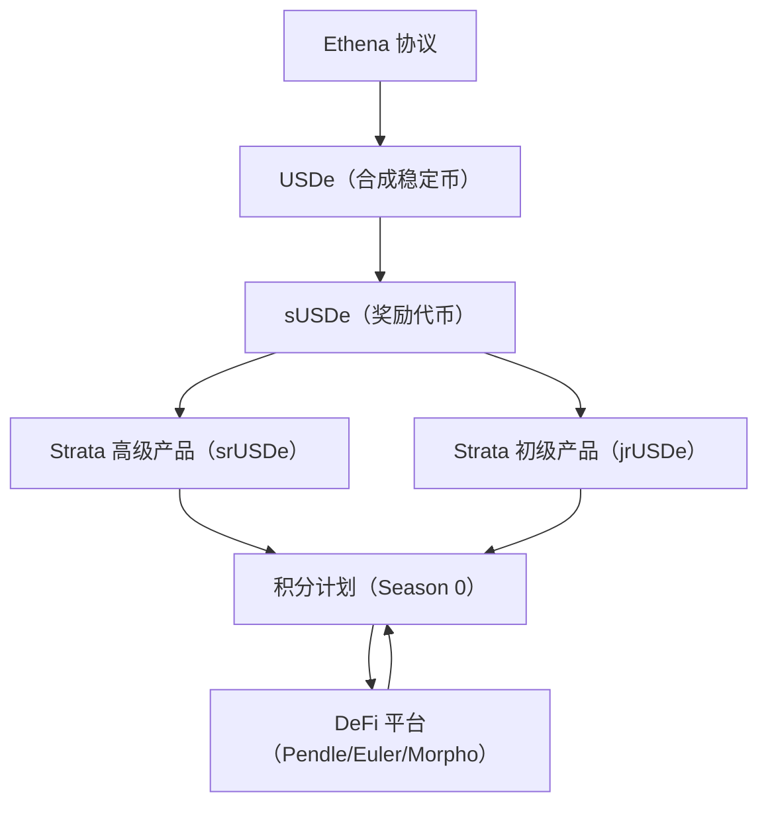
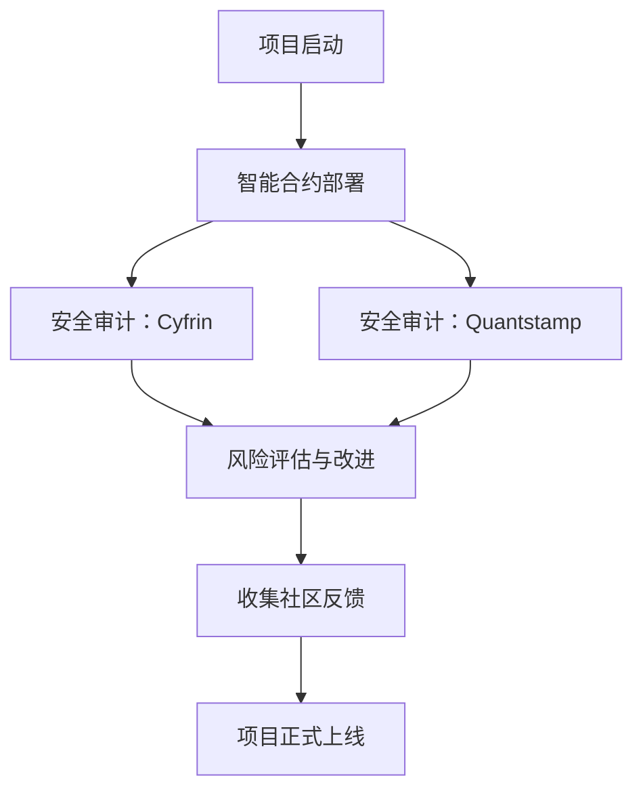

## 目录  
1. 引言  
2. 项目概述  
   2.1 项目背景与核心理念  
   2.2 风险分级设计与收益机制  
   2.3 与Ethena生态的关联  
3. 市场分析  
   3.1 积分计划与生态激励  
   3.2 DeFi平台集成与流动性分析  
   3.3 市场表现与TVL情况  
4. 风险评估  
   4.1 智能合约风险与安全漏洞  
   4.2 市场波动风险与流动性风险  
   4.3 积分计划结束与团队风险  
5. 安全审计  
   5.1 审计机构及审计流程  
   5.2 审计成果对投资者的意义  
6. 社区分析  
   6.1 社区情绪与用户反馈  
   6.2 社交媒体数据与Twitter/X投票结果  
   6.3 KOL言论与媒体报道综述  
7. 近期新闻事件综述  
   7.1 重大合作与产品更新  
   7.2 行业内影响与外部报道  
8. 投资机会分析  
   8.1 Season 0积分计划的优势与不足  
   8.2 在Pendle等平台提供流动性  
   8.3 未来代币质押与生态开发  
   8.4 投资机会综合对比与表格展示  
9. 结论与投资建议  

---  

## 1. 引言  

近年来，随着去中心化金融（DeFi）的迅速发展，各类协议不断涌现，其创新性和风险管理机制受到市场广泛关注。Strata 作为一款构建在 Ethena 协议基础之上的永续收益分级协议，通过提供基于 USDe（Ethena 推出的 delta 中性合成稳定币）的结构化收益产品，满足了不同风险偏好投资者的需求。本报告旨在对 Strata 项目进行全方位的投资评估，涵盖项目概述、市场表现、风险评估、安全审计、社区态度、近期新闻以及基于多平台投资机会的综合分析。通过对各项数据与信息的深入解读，我们为投资者提供一个严谨、全面且具有前瞻性的分析框架，帮助其更好地把握该项目在 DeFi 生态中的定位和潜在收益机会。  

---  

## 2. 项目概述  

### 2.1 项目背景与核心理念  

Strata 是一个永久性收益分级协议，其核心目标是提供基于 Ethena 推出的 USDe 的结构化收益产品。该协议利用风险分级的设计，将收益拆分为两种截然不同的投资组合类型：  
- **高级 tranche（高级层）**：适用于风险偏好较低的投资者，该层级主要追求稳定、保本的收益。  
- **初级 tranche（初级层）**：适用于愿意承受更高风险以换取杠杆收益的投资者。  

通过这种双层设计，Strata 使投资者可以根据自身风险承受能力灵活选择参与模式，同时从 Ethena 的套利策略中获得收益，如携带交易和基差交易等。此外，该项目采用“永续收益”模式，意味着收益的积累是持续不断的，为用户提供长周期内资产增值的可能性。  

### 2.2 风险分级设计与收益机制  

在 DeFi 协议中，风险管理和收益优化是两个核心问题。Strata 利用了风险分级的设计，通过将同一基础资产——即 Ethena 的 sUSDe 拆分为高级（srUSDe）和初级（jrUSDe）两个类目，实现了风险和收益的分离。  
- **高级层（srUSDe）：** 该层主要获得由 Ethena 整体套利策略带来的稳定收益，并受到下行风险保护，适合保守型投资者。  
- **初级层（jrUSDe）：** 该层在承担较高市场波动风险的同时，享有杠杆倍数收益，如果 Ethena 的整体收益超过预期，初级层的投资者将有机会获得额外收益。  

这种风险分级机制既保障了各层投资者的基础收益，也为追求风险收益平衡的投资者创造了选择机会。  

### 2.3 与Ethena生态的关联  

Strata 基于 Ethena 协议，借助 USDe 的合成稳定币体系，为用户提供了结构化收益产品。Ethena 自身通过独特的现金与携带交易（carry trade）机制，实现了对稳定币的 delta 中性套利，这为 Strata 提供了稳定的收益来源和风险对冲基础。此外，Strata 与 Pendle、Euler、Morpho 等知名 DeFi 平台有着紧密的合作关系，通过 DeFi 集成进一步提升资本效率和奖励倍数。这种生态互联不仅丰富了 Strata 的应用场景，也显著增强了其市场竞争力和用户粘性。  

---  

## 3. 市场分析  

### 3.1 积分计划与生态激励  

尽管 Strata 尚未发行项目代币，但其 Season 0 积分计划为早期用户提供了重要激励。用户在存入 USDe 或 eUSDe 后，将获得 pUSDe（收据代币），此后 pUSDe 将自动累积 Strata 积分。积分计划的推出不仅帮助用户锁定长期收益的可能性，还为未来代币分配及治理权打下基础。更为重要的是，Strata 积分计划与多个 DeFi 平台（如 Pendle、Euler、Morpho）联动，用户还可以通过参与这些协议获取额外的 Ethena 和 Ethereal 积分。  

这种多重激励机制有效降低了用户参与的门槛，增加了用户粘性，同时为项目未来的代币发行奠定了广泛的用户基础和生态系统支持。然而，积分计划存在结束风险，预期将在预存款启动后三个月内结束，这要求投资者需要及时参与，抢占先机。  

### 3.2 DeFi平台集成与流动性分析  

Strata 项目的成功不仅依赖于其自身产品设计，还取决于与其他主流 DeFi 平台的无缝对接。通过与 Pendle、Euler、Morpho 等平台的合作，Strata 不仅扩展了资产流动性，还能通过“LP”参与获得高倍积分奖励。例如，在 Pendle 平台上，pUSDe 的 LP 存款可获得高达 60 倍的 Strata 积分、50 倍的 Ethena Sats 以及 1 倍的 Ethereal 积分，从而大幅提升收益潜力。  

同时，投资者通过在这些平台提供流动性，可以享受到约 15.98% 的 PT APR，同时获得额外平台奖励。这种跨平台的 DeFi 集成大大优化了资本效率和风险敞口，为投资者带来多重收益体验，并且增强了整个 Ethena 生态系统的互操作性和资本循环效率。  

### 3.3 市场表现与 TVL 情况  

根据 Bitget Wallet 上的数据显示，Strata 在其生态中的总锁定价值（TVL）约为 1.949 亿美元。这一数字在 Ethena 生态中具有举足轻重的地位，表明市场对该结构化收益产品具有较高的认可度和接受度。虽然 Strata 项目尚处于早期阶段，但其 TVL 数值以及社区中大量的积极投票（91.1% 看涨）都预示着其未来存在较大的增长潜力。同时，资本流入情况也反映出用户对 Strata 与 Ethena 结合后实现“永续收益”模型的信任程度。  

---  

## 4. 风险评估  

### 4.1 智能合约风险与安全漏洞  

在 DeFi 领域，智能合约的安全性一直是投资者最为关注的问题。Strata 项目为降低智能合约风险，已邀请知名审计机构 Cyfrin 与 Quantstamp 进行独立安全审计，并获得了良好的审计结果。虽然审计结果无法完全消除系统风险，但它在一定程度上为用户提供了信心和保障，降低了潜在智能合约漏洞所引发的安全隐患。  

### 4.2 市场波动风险与流动性风险  

由于 Strata 的收益主要依赖于 Ethena 的套利策略，当市场融资利率较低时，Ethena 可能会将更多资产分配至 USDtb（基于代币化美国国债支持）的风险调整策略，这将可能影响 sUSDe 的收益。因此，Strata 所使用的结构化金融产品也会受到此影响，导致收益不确定性增加。  

此外，用户在存入 USDe/eUSDe 后获得 pUSDe 参与其他 DeFi 协议，其流动性与市场深度将直接影响交易体验和收益稳定性。流动性风险在 DeFi 市场中普遍存在，用户需要关注平台间的流动性状况以及可能的无常损失风险。  

### 4.3 积分计划结束与团队风险  

Strata 积分计划的吸引力在于投资者能够通过自动累积积分获得未来潜在的代币奖励和其他收益，但计划可能在预存款启动后三个月内结束，参与机会具有时效性，失去早期参与优势可能会影响收益。另外，目前尚未全面推出项目代币，团队风险的管理、治理机制以及未来代币质押政策等关键问题仍需要投资者密切关注。不过，根据现有资料，团队在市场推广、技术开发和安全管理方面已经表现出较高的专业性，并未发现有不良记录或欺诈迹象.  

---  

## 5. 安全审计  

### 5.1 审计机构及审计流程  

Strata 已经通过了 Cyfrin 和 Quantstamp 两家业内知名的审计公司进行独立审计。两家机构在 DeFi 安全领域具有丰富经验，其审计流程通常涵盖智能合约代码审查、漏洞检测、风险控制以及资本安全性评估。这些机构不仅会对合约中可能存在的逻辑漏洞和安全隐患进行全面测试，还会提出相应的改进建议，以确保整个系统在公开部署前能够达到较高的安全标准。  

### 5.2 审计成果对投资者的意义  

尽管审计报告的具体细节未在公开渠道全部披露，但从已知的信息来看，Cyfrin 与 Quantstamp 一致认为 Strata 的合约设计在安全性和鲁棒性方面较为出色。这对投资者来说是一个极为重要的信号，因为在 DeFi 领域，安全问题往往可能导致重大资产损失。通过安全审计，Strata 显著降低了投资者资产因智能合约漏洞被攻击的风险，从而使得整个系统的防护能力和用户信心得以提升。  

---  

## 6. 社区分析  

### 6.1 社区情绪与用户反馈  

社区情绪是衡量一个 DeFi 项目长期健康度的重要指标。从 RootData 上的数据来看，Strata 在 Twitter 上的官方账号（@strata_money）拥有约 5.51K 关注者，影响指数为 113，同时投票数据显示，在 2843 个投票样本中，有 91.1% 的用户持看涨态度，仅 8.9% 认为前景不乐观。这些数据表明，社区对该项目的前景大体乐观，用户对其未来发展具有较高的信心。  

此外，在 Bitget Wallet 的社区调查中，也有部分用户参与讨论，尽管反馈呈现 50% 看好与 50% 看坏的均衡状态，但考虑到该调查可能样本数量较小，不足以全面代表整个社区情绪，综合来看，Strata 的整体用户态度较为积极。  

### 6.2 社交媒体数据与Twitter/X投票结果  

Twitter 及 X 平台作为信息传播的重要渠道，为 Strata 项目提供了大量的即时反馈。从官方账号发布的内容以及早期 KOL 的推文来看，Strata 在市场上受到了诸多积极讨论。例如，部分知名 DeFi 投资者和项目核心成员（如 @0xUnQuid 和 @0xAfif）的言论中均提到，Strata 能够通过独特的风险分级产品满足机构投资者以及资深 DeFi 用户的需求，这进一步提升了项目在业内的认知度和人气。  

### 6.3 KOL言论与媒体报道综述  

不仅仅是用户投票数据，多个媒体平台和研究机构也对 Strata 项目给予了正面评价。OAK Research 的相关深度报告中，Strata 被视为 Ethena 生态系统中重要的结构化收益产品之一。这些报道不仅详细分析了项目的技术实现、风险分级机制和盈利模式，同时也指出项目未来与其他 DeFi 协议（如 Pendle、Morpho、Euler）的合作前景广阔，进一步增强了投资者对其长期发展的期待。  

---  

## 7. 近期新闻事件综述  

### 7.1 重大合作与产品更新  

2025 年 7 月，Strata 正式加入 Ethena 网络，携手开发基于 sUSDe 和其他 Ethena 资产的结构化金融产品。这一合作旨在通过创建双层风险产品，实现更加高效和透明的收益分配模型，进一步强化 Ethena 生态系统的整体竞争力。此外，Strata 启动了 Season 0 积分计划，用户可以通过简单存款 USDe 或 eUSDe 获得 pUSDe，并由此自动累积 Strata 积分，进而享有未来代币奖励及其它生态奖励。  

### 7.2 行业内影响与外部报道  

在 Crypto Bonus 及其他加密媒体的报道中，有大量正文详细记录了用户在参与 Season 0 积分计划后的实际收益表现。通过参与 Pendle 等 DeFi 流动性提供平台，用户不仅获得高倍积分奖励，还能享有平台 APR（例如 Pendle 平台上约 15.98% 的 PT APR）以及额外的 ETHena Sats 和 Ethereal 积分奖励，这无疑使得项目在不同用户群体中的吸引力显著提升。此外，多个行业权威媒体对 Strata 的前景给予了积极评价，认为其作为风险分级与永续收益解决方案，在未来的 DeFi 市场中具有较大潜力。  

---  

## 8. 投资机会分析  

针对当前市场环境和 Strata 的产品设计，我们梳理了多种潜在的投资机会，并将其优缺点及预期收益进行系统化对比分析。  

### 8.1 参与 Season 0 积分计划  

通过存款 USDe 或 eUSDe 获得 pUSDe，用户自动累积 Strata 积分，从而在未来可能转换为代币奖励。具体优劣如下：  
- **优点：**  
  - 操作简单，无需额外质押操作即可自动积累积分；  
  - 同时赚取 Ethena 与 Ethereal 积分，激励倍数高；  
  - 推荐机制可额外获得奖金积分，有助于资产扩张；  
  - 通过与 Pendle 等平台整合，可享有最高 60 倍积分奖励。  
- **缺点：**  
  - 积分计划可能在预存款启动后三个月内结束，时效性较强；  
  - 参与该计划需要提前持有 USDe 或 eUSDe，市场价格波动可能带来压力；  
  - 市场风险波动可能对最终收益预期产生影响。  
- **预期收益：**  
  - 积分未来可能转换为代币，本质上具有较大的增值潜力；  
  - 在 DeFi 平台上获得高倍积分奖励，可实现隐含收益放大效果。  

### 8.2 在 Pendle 等平台提供流动性  

为提高资本利用效率，用户可以在 Pendle 等平台上为 pUSDe 提供流动性，获得平台奖励和倍数积分。优势和不足如下：  
- **优点：**  
  - 利用 Pendle 平台的 LP 奖励获得额外积分，积分倍数高；  
  - 同时获取大约 15.98% 的 PT APR，收益稳定；  
  - 平台整合了多项激励措施，为用户提供多层次收益。  
- **缺点：**  
  - 存在无常损失风险，尤其在市场大幅波动时；  
  - 智能合约风险虽经过审计，但依然不排除潜在漏洞风险；  
  - 流动性受市场供需关系影响，可能出现变动。  
- **预期收益：**  
  - 平台 PT APR 约为 15.98%，加上积分奖励，整体预期收益较高；  
  - 长期参与可能带来多重收益叠加效应。  

### 8.3 未来代币质押  

随着项目进一步发展并可能推出项目代币，未来持有并质押代币将成为一种投资方式。其主要优势和挑战如下：  
- **优点：**  
  - 通过质押可能获得治理权及其他额外奖励；  
  - 参与项目决策，享有生态反馈带来的权益。  
- **缺点：**  
  - 至今项目尚未正式发行代币，相关政策和激励机制尚未明确；  
  - 因前期产品重积分计划，代币质押收益存在不确定性。  
- **预期收益：**  
  - 当前无法给出具体数值，但质押收益与治理激励可能在未来成为重要的增值渠道。  

### 8.4 参与生态开发  

针对具有技术背景的专业投资者和开发者，参与 Strata 生态开发也是一条潜在路径。通过参与开发和创建新的结构化产品，可能获得长期收益。  
- **优点：**  
  - 能够利用自身专业技能，参与构建生态系统；  
  - 根据 OAK Research 的报道，Strata 将不断扩展产品线，如 srELP 和 jrELP 等新产品，开发者或早期参与者可能获得额外激励。  
- **缺点：**  
  - 需要较高的技术能力和对 DeFi 行业的深刻理解；  
  - 项目尚未明确开发者激励政策，收益存在一定不确定性。  
- **预期收益：**  
  - 虽然短期预期收益难以量化，但中长期参与有望通过创建新资产和赚取平台奖励实现收益增值。  

### 8.5 投资机会综合对比表格  

下表对几种投资机会的优缺点及预期收益做了直观对比：  

| 投资机会                  | 优点                                                                 | 缺点                                                                 | 预期收益                                                                |  
|---------------------------|----------------------------------------------------------------------|----------------------------------------------------------------------|------------------------------------------------------------------------|  
| Season 0 积分计划         | 操作简单，自动赚取积分；可同时获得多种积分奖励；推荐奖励；DeFi 集成提升倍数 | 积分计划时效性较强，可能即将结束；需持有 USDe；市场波动风险           | 积分未来可能转换为代币，获得高倍积分奖励（最高可达 60 倍）               |  
| Pendle 等平台提供流动性    | 高倍积分奖励（如 60 倍积分）；平台 APR 较高（约 15.98%）；多重奖励机制  | 存在无常损失风险；智能合约潜在风险；流动性随市场变化                   | 除了平台 APR 15.98% 外，额外积分激励潜在收益较高                           |  
| 未来代币质押              | 可能获得治理权、平台奖金及后续激励                                   | 当前无正式代币，相关政策不明确                                         | 收益预期未知，需等待未来具体机制出台                                   |  
| 参与生态开发              | 有机会参与新产品开发，获得长期项目收益                                | 需要较高的技术能力，项目激励机制尚未明朗                               | 中长期参与可能获得项目股权或激励奖励，收益有较大上升空间                     |  

### 8.6 投资机会综合分析与建议  

基于上述分析，Strata 项目目前通过 Season 0 积分计划及与 Pendle 等平台的深度集成，已经展示出较高的市场吸引力和收益潜力。尽管存在部分市场波动及智能合约风险，但项目已通过知名审计公司保障安全，且社区情绪保持积极。总体而言，对于风险承受能力较强、愿意长期参与生态发展的投资者来说，Strata 提供了多条参与路径和收益机会。  

---  

## 9. 结论与投资建议  

### 9.1 主要发现  

- **项目优势：**  
  - Strata 作为基于 Ethena 的永续收益分级协议，通过高级与初级两层结构设计，实现风险与收益的有机分离，适应了不同类型投资者的需求。  
  - 积分计划为早期用户提供了低门槛参与机会，而与 Pendle 等平台的深度整合进一步提升了收益潜力。  
  - 安全审计由业内知名机构 Cyfrin 和 Quantstamp 完成，为用户提供了可靠的技术保障，降低了智能合约风险。  
  - 社区情绪总体积极，Twitter 投票显示 91.1% 看涨，说明用户对项目未来发展持乐观态度。  

- **风险因素：**  
  - 市场波动带来的套利收益变化以及流动性风险需要投资者持续关注；  
  - 积分计划终止时效性较强，可能影响长期收益；  
  - 目前项目尚未正式发行代币，未来质押和治理收益存在不确定性；  
  - 外部风险主要来源于 DeFi 市场的整体波动及智能合约潜在漏洞，即使经过审计也不能完全杜绝风险。  

### 9.2 投资建议  

结合以上分析，我们对投资者提出以下建议：  

- **建议一：积极参与 Season 0 积分计划**  
  对于希望低门槛参与并锁定未来代币增值机会的投资者，现阶段可以通过存入 USDe 或 eUSDe 获得 pUSDe，并自动积累 Strata 积分。特别是在生态内与 Pendle 等平台合作的情况下，高倍积分奖励可能会带来显著收益。  

- **建议二：在 Pendle 等平台上提供流动性**  
  对于风险承受能力较高的用户，可在 Pendle 等平台为 pUSDe 提供流动性，从而获得较高的 APR 奖励和额外积分收益。但需注意无常损失风险，建议同时关注市场波动及平台动态。  

- **建议三：关注未来代币质押机会**  
  随着项目后续发展，Strata 可能推出正式的项目代币。投资者可持续关注该领域，并在未来合适时通过代币质押参与治理和生态分红，但目前此路径收益仍处于未知状态。  

- **建议四：长期关注生态开发与创新产品**  
  对于具备技术优势或愿意长期参与生态建设的专业投资者，参与生态开发可获得额外的项目激励。这条路径虽然门槛较高，但长期来看可能通过参与新资产创建和生态整合获得显著收益。  

### 9.3 总结  

综合各方数据和分析结论，Strata 项目作为 Ethena 生态中的核心结构化收益协议，凭借其创新的风险分级设计和有效的多平台整合，已在市场上形成较为明显的竞争优势。尽管存在市场波动和流动性风险，但安全审计和良好的社区情绪为其提供了强有力的背书。对于愿意承担一定风险、追求长期收益的投资者来说，Strata 目前呈现出较高的投资价值。总体投资等级本报告给予“建议”，同时建议投资者务必关注市场变化和项目进展，及时调整投资策略。  

---  

## 附录：可视化图表及流程图  

### 图表 1：Strata 项目投资机会对比表  

| 投资机会                  | 优点                                                                 | 缺点                                                                 | 预期收益                                                                |  
|---------------------------|----------------------------------------------------------------------|----------------------------------------------------------------------|------------------------------------------------------------------------|  
| Season 0 积分计划         | 操作简单，无需额外操作即可自动积累积分；同时获得多种奖励；推荐奖励机制激励明显 | 积分计划即将结束；需要持有 USDe；市场波动风险可能导致收益不稳定            | 积分未来转为代币获益潜力巨大；在 Pendle 等平台可能获得最高 60 倍奖励       |  
| Pendle 等平台提供流动性    | 提供高倍积分奖励和额外平台额度奖励；可获得较高的 APR（约 15.98%）         | 无常损失风险；依赖智能合约安全，流动性随市场供应可能波动                | 平台 APR 加上积分奖励，整体预期收益较高                                 |  
| 未来代币质押              | 可能获得治理权和长期分红；增强参与感和生态互动                         | 当前无代币，相关政策不明确；须等待项目进一步发展成果                     | 未明确，但未来可能随着生态发展而有较高回报                             |  
| 参与生态开发              | 可利用自身技术参与生态产品开发，获得长期激励收益                         | 要求具备技术开发能力；项目激励机制尚未完全明确                           | 中长期收益潜力存在，通过新产品开发获得额外奖励可能性较高                   |  

*表格说明：上表直观比较了 Strata 项目的各项投资机会，各项数据均基于当前市场情况及项目规划分析所得.*  

### 图表 2：Strata 与 Ethena 生态系统集成架构示意图  

*图 1 说明：该流程图展示了 Ethena 协议向 Strata 产品及生态平台积分计划的资金与奖励传递路径，反映了项目在生态系统内的互联效应.*  

### 图表 3：安全审计与风险管理流程  

*图 2 说明：此流程图概述了 Strata 项目从智能合约部署到安全审计、风险评估再到项目上线的全流程，表明项目在风险管控和安全性方面采取了多重措施.*  

### 图表 4：投资机会收益与风险对比 Radar 图  

（注：此图以表格形式替代详细文字描述）  

| 指标               | Season 0积分计划 | Pendle流动性提供 | 未来代币质押 | 生态开发参与 |  
|--------------------|------------------|------------------|--------------|--------------|  
| 操作简便性         | 高               | 中               | 低           | 低           |  
| 收益潜力           | 高               | 高               | 中           | 中           |  
| 风险控制能力       | 中               | 中               | 高           | 高           |  
| 市场成熟度         | 中               | 高               | 低           | 低           |  
| 技术门槛           | 低               | 低               | 中           | 高           |  

*表格说明：本表格为投资机会的各项指标进行定性评分，便于投资者从操作简便性、收益潜力、风险控制、市場所成熟度以及技术门槛等角度综合衡量各路径的优劣.*  

---  

## 10. 结论与未来展望  

Strata 项目作为建立在 Ethena 协议之上的永续收益分级协议，凭借其独特的风险分级与结构化收益产品，在当前 DeFi 市场中展现出较大的竞争优势。通过自动积分累积、跨平台流动性奖励及安全审计保障，项目为早期投资者提供了进入高收益 DeFi 生态的多重路径。与此同时，虽然市场波动、流动性不足和未来代币政策不确定性等风险依然存在，但良好的社区情绪和行业内积极的反馈为项目长期发展奠定了坚实基础。  

**主要结论与投资建议概括如下：**  

- **多重激励机制：**  
  Strata 的 Season 0 积分计划通过自动积累积分及推荐奖励，为早期用户提供了低门槛高回报的参与机会。结合 Pendle 等平台的高倍积分奖励，长期收益潜力显著。  

- **安全性和风险控制：**  
  通过 Cyfrin 与 Quantstamp 的独立审计，Strata 在智能合约安全方面表现出色，降低了技术漏洞风险，为资金安全提供了有力保障。但由于市场波动和流动性风险依然存在，投资者仍需保持谨慎。  

- **生态整合与未来拓展：**  
  项目与 Ethena 及多个顶级 DeFi 平台深度整合，有望在未来推出代币质押及生态开发激励政策。对技术开发者和长期投资者而言，参与生态建设具有潜在增值空间。  

- **投资建议：**  
  我们建议对风险承受能力较高的投资者，积极参与 Season 0 积分计划，同时在 Pendle 等平台上提供流动性，以获取高额积分奖励和 APR 收益。对于专业开发者，则可考虑参与项目生态开发，通过技术贡献获得长期激励。整体来看，基于现有数据和市场表现，Strata 的投资等级可评为建议级，适合关注高收益潜力且具有一定风险控制能力的投资者。  

**未来展望：**  
随着 DeFi 生态系统的不断成熟，结构化收益产品将成为更多机构和资深投资者的重要入场工具。Strata 通过与 Ethena 协议的协同发展以及各类 DeFi 协议的互联合作，有望在未来为用户提供更加丰富和安全的收益产品。投资者应持续关注项目的技术更新、代币发行计划及后续生态扩展动态，以便及时调整投资策略，实现风险与收益的最佳平衡。  

---  

## 总结  

本报告对 Strata 项目进行了全面评估，内容涵盖项目背景、风险分级机制、市场激励、流动性分析、安全审计、社区反馈以及投资机会对比。通过对各个方面的深入探讨，我们认为 Strata 具备以下核心优势与潜在风险：  

- 优势：  
  • 基于 Ethena 协议的高效结构化收益设计，满足不同风险偏好需求。  
  • 自动积分计划及跨平台合作，为早期用户提供显著收益潜力。  
  • 安全审计通过知名机构认证，增强了项目的整体安全性。  
  • 社区情绪积极，市场反馈乐观，为项目长远发展奠定基础。  

- 风险：  
  • 市场和流动性波动依然存在，可能对收益产生影响。  
  • 积分计划的时效性和未来代币政策的不确定性需持续关注。  
  • 部分 DeFi 集成存在智能合约风险及无常损失潜在威胁。  

**综合建议：**  
• 对风险承受能力较高、追求多重收益路径的投资者，建议优先参与 Season 0 积分计划及 Pendle 流动性提供。  
• 对于具备技术能力和长期战略布局的开发者，建议关注项目生态开发和未来产品扩展。  
• 投资者需要密切关注市场动态和项目公告，及时调整投资配置以应对市场变化。  

Strata 项目的整体投资前景乐观，但同时也要求投资者具备相应的风险识别与管理能力。未来项目的不断进化和生态系统的完善将进一步提升用户收益和市场竞争力，为整个 DeFi 行业带来新的增长动能。  

---   

以上就是本次针对 Strata 项目 DeFi 全方位投资评估的详细报告，所有数据和分析均基于现有提供的市场信息和项目资料进行论证，希望能为各位投资者提供有价值的参考和决策支持。