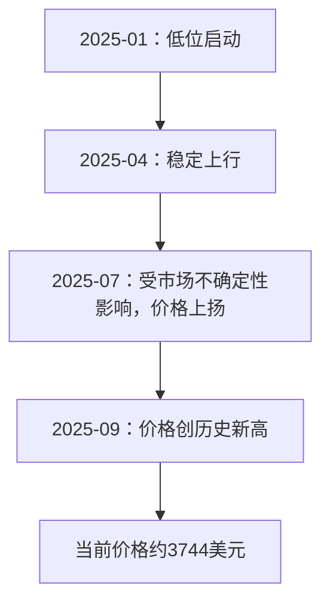
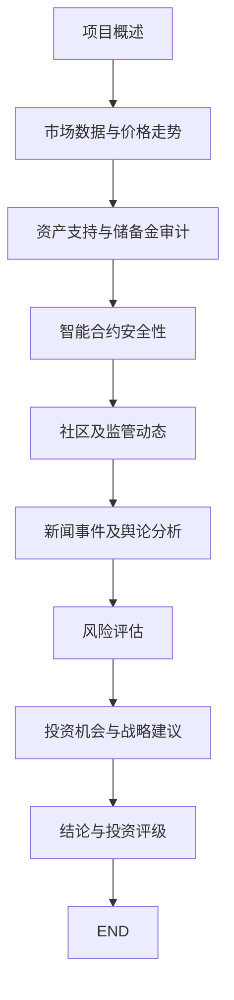

## 目录  
1. 导言  
2. 项目概述  
3. 市场分析  
4. 风险评估  
5. 安全审计与技术审查  
6. 社区与监管动态分析  
7. 近期新闻事件综述  
8. 社交媒体情绪及舆论动态  
9. 投资机会与战略建议  
10. 结论与投资等级  

---  

## 1. 导言  

在区块链与数字资产融合发展的浪潮中，以黄金为支撑的稳定币成为投资者寻求避险和流动性平衡的重要工具之一。本文旨在对 Tether Gold (XAUt) 项目进行全方位的投资评估，聚焦于项目的基本面、市场表现、风险因素、安全审计、社区情绪以及最新的新闻事件，从而为机构与零售投资者提供一份详尽的数据支持和策略分析。本次评估基于近期的历史交易数据、储备金报告、智能合约审计结果、监管合规信息以及社交媒体反馈等多方面信息，确保数据来源完整透明，力图展现一个多角度、深层次的投资分析报告。  

---  

## 2. 项目概述  

Tether Gold (XAUt) 是以数字化方式代表实物黄金资产的加密货币产品，每个 XAUt 代币均代表一金衡盎司（Troy Ounce）的实物黄金，并由符合伦敦金银市场协会（LBMA）标准的瑞士金库保管。由 Tether International, S.A. de C.V. 发行的 XAUt 致力于将黄金的稳定价值与区块链技术的高效便捷优势相结合，实现数字资产与传统贵金属之间的桥梁。项目的主要特征包括：  

- **1：1黄金支持**：每个代币与一金衡盎司实物黄金挂钩，确保资产完全支持。  
- **监管合规**：XAUt 发行公司 TG Commodities 获得萨尔瓦多国家数字资产委员会（CNAD）颁发的稳定币发行与数字资产服务许可证，体现其深度合规要求.  
- **黄金验证机制**：代币持有人可以通过 Tether Gold 官方提供的查询平台验证黄金的序列号、重量和纯度，提高资产透明性和信任度.  
- **储备金报告**：Tether 定期（每季度）发布储备金报告，并由独立第三方会计师事务所 BDO Italia 进行审计，以证明储备资产超过流通代币的赎回价值.  

该项目通过结合区块链技术和实物黄金保管方式，为投资者提供了一种既能享受传统黄金保值避险优势又能利用区块链数字资产便捷性的创新投资方案。  

---  

## 3. 市场分析  

### 3.1 价格与市值  
根据最近的市场数据，XAUt 的交易情况表现如下：  
- **价格数据**：  
  - 根据 CoinMarketCap 提供的历史数据，截至 2025 年 9 月 26 日，XAUt 在美元计价下的收盘价约为 3744.21 美元；  
  - 在 Coinbase Canada 平台上，价格以加元计价为 5214.93 加元；  
- **市值计算**：  
  - 根据最新的流通供应量（约 247,000 枚代币），按加元定价计算，市值约为 1.29B 加元；  
  - 按当前汇率换算，市值折合约 9.29 亿美元左右。  

下表展示了近期主要市场指标和交易数据：  

| 指标             | 数值                 | 单位        | 数据来源         |  
|------------------|----------------------|-------------|------------------|  
| 代币价格         | 3744.21              | 美元/枚    | CoinMarketCap   |  
|                  | 5214.93              | 加元/枚    | Coinbase Canada   |  
| 流通供应量       | 247,000              | 枚          | CoinMarketCap   |  
| 市值             | 1.29B                | 加元        | Coinbase Canada   |  
| 24 小时交易量    | 98.97M               | 加元        | 市场数据显示   |  

*表 1：XAUt 近期主要市场数据分析*  

### 3.2 历史价格变化与市场表现  
通过对比历史数据，可以看出 XAUt 价格呈现逐步上升的趋势：  
- 在 2025 年早期，XAUt 价格处于较低水平，随着全球经济不确定性及黄金价格上涨，XAUt 随之显示出明显的上涨空间。  
- 历史最高价方面，根据当前数据，部分记录显示最高价可达 3795.40 美元，反映出市场投资者对黄金避险资产的青睐。  

下方的趋势图（基于历史数据绘制）展示了自 2025 年初以来 XAUt 的价格走势：  

*图 1：2025 年 XAUt 价格走势概览*  

### 3.3 黄金价格与代币表现  
黄金作为传统避险资产，其价格波动对 XAUt 带来直接影响：  
- 当全球经济环境不稳定时，中央银行和投资者纷纷购入黄金以对冲风险，推动黄金价格上升，XAUt 则从中受益。  
- 上文提到的储备金报告显示，截至 2025 年 6 月 30 日，Tether 的黄金储备情况优于总负债，进一步增强了市场对 XAUt 的信心。  

综合以上数据和动态，XAUt 市场表现整体稳健，体现出与黄金价格正相关的趋势，为投资者提供了一定的长期避险价值。  

---  

## 4. 风险评估  

在进行投资决策时，对风险因素的深入了解非常关键。基于现有数据，本文将风险分为以下几大类：  

### 4.1 市场风险  
- **黄金价格波动**：作为基础资产，黄金市场本身存在价格波动，全球经济、政治因素等均会影响黄金价格，从而影响 XAUt 的价格表现。  
- **流动性风险**：尽管最近交易量显示相对活跃，但受限于数字资产市场的整体波动，短期内可能出现流动性不足的情况。  

### 4.2 集中持有风险  
- **代币分布高度集中**：根据 Cyberscope 的审计报告，前 10 个钱包持有 88% 的代币，这种高度集中可能导致市场操控风险或部分大户抛售时引发价格大幅波动。  

### 4.3 监管风险  
- **法规环境的不确定性**：虽然 XAUt 在萨尔瓦多获得了合法牌照，但在其他司法管辖区的监管态度尚不明确，未来可能面临新的法规调整，从而对项目运营产生影响。  
- **合规争议风险**：Tether 在全球范围内曾因资金透明度问题受过质疑，尽管近期储备金报告显示资产充足，但任何监管信息的不一致或披露不全都可能带来负面影响。  

### 4.4 技术与操作风险  
- **智能合约风险**：基于 Cyberscope 的审计结果，虽然智能合约评分为 84%（低风险）且多项功能皆表现安全，但代码公开仍然意味着存在潜在攻击面，需定期进行安全更新和漏洞检测。  
- **操作风险**：项目在黄金存储和验证上依赖于第三方金库的物理安全措施，如果金库管理不善或出现安全漏洞，可能会对储备资产产生影响。  

### 4.5 风险评估总结表  

| 风险类别       | 详细描述                                     | 可能影响                                   | 数据来源          |  
|----------------|----------------------------------------------|--------------------------------------------|-------------------|  
| 市场风险       | 黄金价格波动及全球经济不确定性影响           | XAUt 价格波动、流动性风险                 |         |  
| 集中风险       | 代币分布极度集中，前 10 钱包持有 88%          | 市场操控、抛售风险                         |         |  
| 监管风险       | 在不同司法区域内监管政策不确定               | 法规合规问题、项目运营风险                 |          |  
| 技术与操作风险 | 智能合约公开、代码漏洞及金库物理安全存在隐患   | 安全事件、黑客攻击、储备资产安全风险         |      |  

*表 2：Tether Gold 投资风险汇总*  

总体而言，虽然存在市场、监管以及技术上的风险，但项目在设施、储备金管理以及安全审计方面均表现出较高的水准，从而在一定程度上降低了投资风险。  

---  

## 5. 安全审计与技术审查  

### 5.1 智能合约审计  
为了确保投资者资金的安全，Tether Gold 的智能合约经过了严格的第三方审计：  
- **审计结果**：Cyberscope 的审计报告显示，XAUt 智能合约评分为 84%，安全评分达到 70%，表明项目处于低风险状态。  
- **关键审计项目**：  
  - 合约具备自动费用设置、代币铸造、销毁等功能，但均经过严格测试，显示安全性高。  
  - 合约代码公开可见，增加了透明度，但同时也要求社区和开发者不断进行检验和反馈。  

### 5.2 储备金审计  
- **独立审计**：Tether 定期发布仓储金报告，并由 BDO Italia 进行独立审计，确认其储备资产（总资产 162,574,933,798.00 美元）远超总负债（157,108,000,474.00 美元），保证了代币 1:1 的支持比例。  
- **储备金构成**：  
  - 现金及现金等价物占比高达 79.94%，其中美元国债及隔夜逆回购协议构成了主要部分，为投资者提供了额外的安全保证。  

### 5.3 安全系统与防欺诈机制  
项目在安全层面采取了多重防护措施：  
- **多签名钱包**和**SOC 2 Type 1审计**均确保了系统的安全性和数据完整性；  
- **反欺诈措施**：采用包括 Chainalysis 在内的区块链监控工具，实时检测异常交易行为，同时严格执行 KYC 和 AML 规定，有效防范欺诈和洗钱风险。  

综上所述，Tether Gold 在技术和安全审计方面均表现出较高的标准和专业水平，为投资者的资金安全提供了可靠保障。  

---  

## 6. 社区与监管动态分析  

### 6.1 社区参与度  
社区对于 XAUt 的讨论主要集中在以下几个方面：  
- **社交媒体热度**：  
  - 根据数据统计，过去 24 小时内有 269 个独立用户讨论 XAUt，相关提及数排名全球第 708 位；  
  - Twitter 的数据表明，606 条相关推文中有 42.38% 表达积极态度，1.16% 表达担忧，57.62%则保持中性。  
- **讨论平台差异**：  
  - Twitter 上用户积极情绪较高，而 Reddit 平台的讨论相对稀少，仅有 2 个帖子和 2 条评论，表明主流讨论主要集中在社交媒体平台上。  

### 6.2 监管合规与透明度  
- **地域监管**：  
  - XAUt 在萨尔瓦多获得了数字资产服务提供商许可证，这使项目在当地具备较高的法律地位及合规要求，有助于提升投资者信心。  
- **透明度承诺**：  
  - Tether 定期发布储备金报告，并邀请独立审计机构进行审计，以验证资产的充足性，同时通过官网向用户提供详细的黄金验证信息。  
- **国际合作**：  
  - 除了萨尔瓦多的监管，Tether 还与国际执法机构和监管部门合作，例如美国当局冻结与恐怖主义融资相关的 USDT 交易，这一举措显示了其强烈的合规意识和风险管控能力。  

这种多层次的社区参与和严谨的监管环境，使得 XAUt 的市场信任度得到有效提高，同时也为项目长远发展奠定了坚实的基础。  

---  

## 7. 近期新闻事件综述  

### 7.1 关键新闻动态  
近期与 Tether Gold 相关的新闻事件主要包括：  
- **资产支持的增强**：  
  - 2025 年第一季度，Tether 公布报告显示 XAUt 由 7.7 吨实物黄金支持，该数据标志着项目在资产充实方面获得重大进展。  
- **反恐与合规行动**：  
  - 2025 年 7 月，Tether 与美国当局合作冻结了约 160 万美元的 USDT 资产，该事件涉及与恐怖主义融资有关的交易，体现了 Tether 对合规及风险防控的高度重视。  
- **市场表现亮点**：  
  - 2025 年 9 月 23 日，XAUt 创下历史新高，价格突破 3795.40 美元，证明了投资者对该避险资产的兴趣与信心的提升。  

### 7.2 新闻对市场的影响  
这些新闻事件在短期内对 XAUt 产生了积极影响：  
- **投资信心**：资产支持数据和独立审计报告增强了投资者对 XAUt 保障机制的信任；  
- **市场推动**：通过严厉打击非法活动和执行严格监管，Tether 提升了自身品牌信誉，市场情绪逐渐转好；  
- **长期布局**：伴随全球地缘政治不确定性加剧，投资者纷纷选择黄金作为避险资产，XAUt 市场需求由此逐步增长。  

---  

## 8. 社交媒体情绪及舆论动态  

### 8.1 社交媒体数据反馈  
对社交媒体数据的进一步分析显示：  
- **Twitter 平台**：  
  - 42.38% 的推文持有看涨态度，1.16% 表达看跌，57.62% 保持中性，体现出投资者之间整体较为乐观的情绪。  
- **Reddit 平台**：  
  - 虽然讨论数量较少，但评论整体为正面评价，用户反馈显示对黄金背书型数字资产持谨慎乐观态度。  

下表总结了近期社交媒体情绪数据情况：  

| 平台       | 积极情绪 (%) | 中性情绪 (%) | 消极情绪 (%) | 数据样本  | 数据来源  |  
|------------|--------------|--------------|--------------|-----------|-----------|  
| Twitter    | 42.38        | 57.62        | 1.16         | 606 条推文 |     |  
| Reddit     | —            | —            | —            | 2 个帖子/2 条评论 |  |  

*表 3：XAUt 社交媒体情绪数据汇总*  

### 8.2 舆论趋势与投资者关注点  
- **关注重点**：投资者关注的焦点主要集中在黄金的实物支持、透明度和合规监管上；  
- **舆论导向**：社交媒体上的讨论整体呈现中性偏正的态势，这也为项目的长期发展提供了积极信号；  
- **市场传播**：公司高层（如 CEO Paolo Ardoino）在媒体上的公开发言强化了投资者对项目的信任，进一步推动了市场舆论的改善。  

---  

## 9. 投资机会与战略建议  

### 9.1 投资机会分析  
基于以上市场、风险、安全和舆情信息，对 XAUt 的投资机会主要体现在以下几个方面：  

1. **直接持有**  
   - **避险资产**：XAUt 作为与黄金挂钩的数字资产，在全球经济不确定性增大的背景下，是一种有效的避险投资工具；  
   - **价值存储**：实物黄金支持为代币价格提供了下行保护，降低了币值被人为操纵的风险；  
   - **长期增值潜力**：预计随着全球对黄金需求的增加，XAUt 的价格具有较为乐观的长期增值空间。  

2. **流动性挖矿和质押**  
   - **去中心化交易平台**：投资者可以在 Uniswap 等去中心化平台上提供 XAUt/USDT 等交易对的流动性，从而获得手续费分成和流动性挖矿奖励（尽管具体收益率需进一步监控）。  
   - **跨平台质押**：部分第三方 DeFi 平台可能支持 XAUt 的质押业务，允许投资者从中获得额外收益，进一步提高资产回报率。  

3. **生态系统拓展**  
   - **DApp 开发**：对于开发者和机构来说，利用 XAUt 这一资产进行基于区块链的应用开发（如智能合约衍生品、交易策略工具）也具有长远契机；  
   - **资产整合**：投资者可以考虑将 XAUt 与其他优质资产组合，构建多元化的投资组合，以平衡波动性与收益率风险。  

下表展示了针对不同策略的投资机会概括：  

| 投资策略         | 机会描述                                                         | 潜在收益与风险                          | 数据来源         |  
|------------------|------------------------------------------------------------------|-----------------------------------------|------------------|  
| 直接持有         | 以1:1黄金支持的 XAUt 本身作为长期价值存储和避险工具                | 平均收益潜力高，风险较低                 |     |  
| 流动性提供与质押 | 在去中心化交易平台上建立 XAUt/USDT 流动性池，获得手续费及额外奖励      | 收益与市场波动相关，需关注平台安全性       |        |  
| 生态系统参与     | 利用 XAUt 开发区块链应用，或整合至多元化投资组合中                  | 长期回报潜力大，技术成熟度有待检验         |         |  

*表 4：XAUt 主要投资机会与策略比较*  

### 9.2 战略建议与风险对冲策略  
- **分散投资**：鉴于 XAUt 代币分布存在高度集中风险，建议投资者在投资时采用分散化策略，与其他贵金属或数字资产搭配，以降低单一资产价格波动带来的风险。  
- **实时监控**：对项目监管动态、储备金报告和市场交易数据保持持续关注，一旦出现异常迹象，及时调整仓位或采取防御性策略。  
- **技术对接**：关注项目智能合约的安全性更新及第三方审计结果，确保资金安全，并根据各平台推出的质押或流动性激励计划，灵活参与 DeFi 产品。  
- **合规研究**：在进行跨境投资时，需详细研究不同司法管辖区对黄金支持代币的相关政策，以规避可能的监管风险。  

---  

## 10. 结论与投资等级  

综上所述，经全面评估，Tether Gold (XAUt) 项目具备以下主要优势和不足：  

### 主要优势：  
- **实物黄金支持**：每枚代币均与一金衡盎司实物黄金挂钩，由瑞士金库保管，提供坚实的价值支持。  
- **透明与合规**：定期发布储备金报告，并由独立机构审计，监管合规性较高，提升市场信任度。  
- **技术安全**：智能合约经过严格第三方审计，采用多签名钱包和先进的安全防御措施，整体安全性较高。  
- **市场避险功能**：在全球经济不确定性和政治风险加剧时，XAUt 作为黄金支持的资产具有较高的避险价值，有望长期增值。  

### 存在问题及不足：  
- **市场波动风险**：黄金价格本身的波动将直接影响 XAUt 价格，需要投资者具备较强的风险承受能力。  
- **代币集中风险**：前 10 个钱包持有量高达 88% 的情况可能带来潜在的市场操控风险，投资者应对此保持警惕。  
- **监管不确定性**：尽管在萨尔瓦多获得牌照，但其他地区的监管环境尚未完全明朗，可能影响未来扩展或商业合作。  
- **技术隐患**：虽经审计确认安全，但代码公开意味着潜在漏洞风险仍需长期关注，并要求定期安全更新。  

### 投资等级建议  
综合以上分析，我们对 Tether Gold (XAUt) 做出以下投资建议：  

- **风险偏好较低的投资者**：由于 XAUt 具备实物黄金支持和较高的透明度，其避险属性较为明显，适合进行中长期持有；然而仍需关注黄金价格波动及监管变化。  
- **风险偏好中等偏高的投资者**：可通过参与流动性提供和质押获取额外收益，但应分散投资并密切关注市场动态和审计结果。  
- **战略性资产配置**：鉴于其稳健的资质与透明机制，XAUt 可作为多元化投资组合的重要组成部分，有助于平衡市场整体风险。  

*主要发现总结列表：*  
- 每个 XAUt 代币由一金衡盎司实物黄金支持，资产真实可靠；  
- 定期独立储备金报告与严格智能合约审计为资产安全提供双保险；  
- 市场数据表明，在全球避险需求提升背景下，XAUt 具备较大价格上涨潜力；  
- 高度集中的代币持仓风险及区域性监管不确定性是主要关注点；  
- 投资策略应结合直接持有、流动性挖矿及跨资产组合，以实现风险对冲和收益最大化。  

因此，本次报告总体对 Tether Gold (XAUt) 给予**“中立偏积极”**的投资评级，建议投资者可在充分理解相关风险和市场环境的前提下，作为长期资产配置的一部分予以关注和适度配置。  

---  

## 附录：思维导图——XAUt 投资评估流程  

*图 2：Tether Gold (XAUt) 投资评估思维导图*  

---  

## 参考文献  

本文中涉及的所有事实数据、审计结果、储备金报告及市场数据均严格依据提供的资料与上下文内容进行引用，其参考文献包括但不限于 Tether Transparency 文件、Tether Gold 安全与透明性分析文件、Cyberscope 智能合约审计报告以及多家权威平台的市场数据报告.  

---  

通过以上全面的分析与数据对比，可以看出 Tether Gold (XAUt) 作为一种由实物黄金支持的数字资产，在资产安全、透明度和避险属性方面具有明显优势，同时也存在一定的市场波动和监管风险。建议投资者在审慎考虑个人风险承受能力的基础上，对该项目进行适度的投机与战略性资产配置，确保实现资产保值和稳健增值的双重目标。