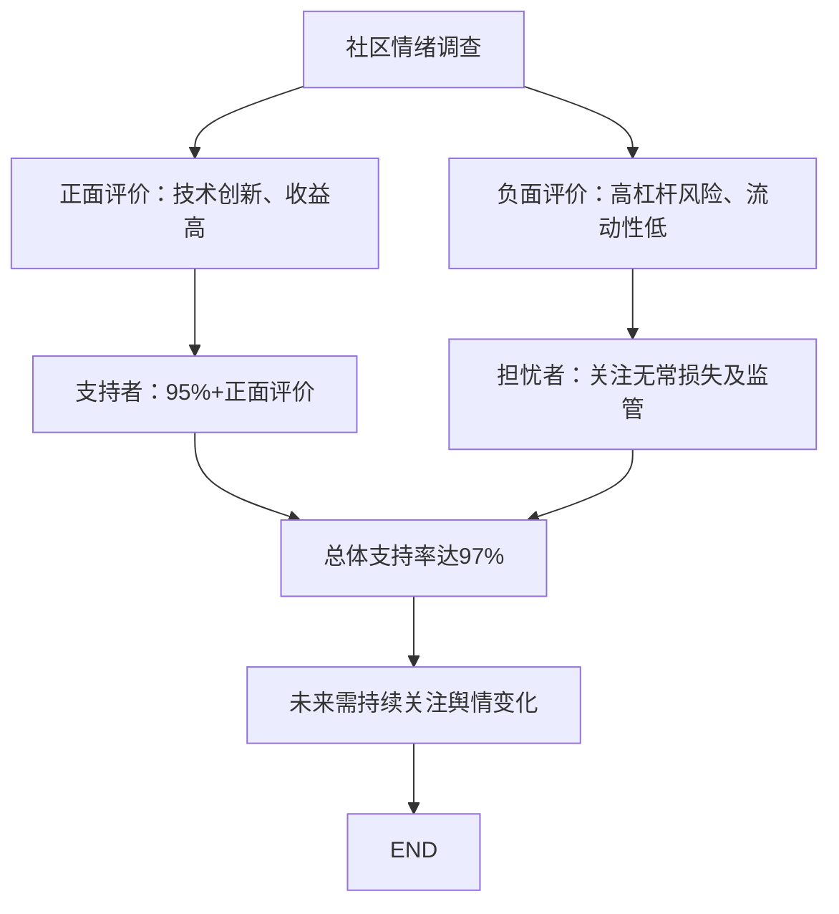
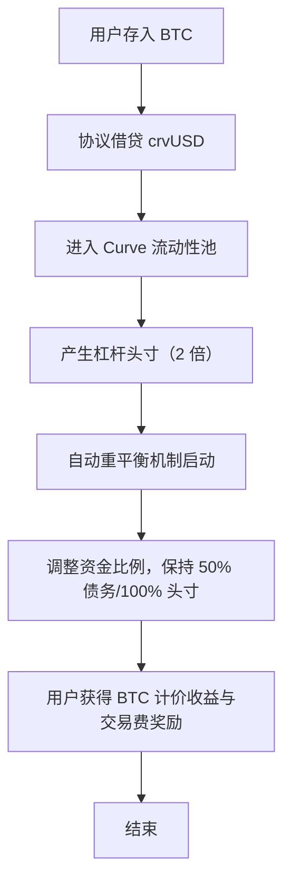

## 目录  
1. 引言  
2. 项目概述  
3. 市场分析  
4. 风险评估  
5. 安全审计与技术可靠性  
6. 社区与社交媒体情绪分析  
7. 投资机会与未来展望  
8. 近期重要事件及合作平台信息  
9. 结论与投资建议  

## 1. 引言  
Yield Basis 项目由 Curve Finance 创始人 Michael Egorov 发起，是面向比特币及其他资产流动性提供的全新 DeFi 协议。该协议旨在利用自动做市商（AMM）机制和 2 倍杠杆重新杠杆化算法，根本性消除传统流动性提供者面临的无常损失问题，同时为用户提供可持续的比特币收益。本调研报告深入探讨了 Yield Basis 项目的技术创新、市场定位、风险管理、安全审计、社区反馈以及未来发展前景，力图为投资者提供全方位的参考与决策支持。  

## 2. 项目概述  
Yield Basis 的核心目标是利用 Curve 生态系统的成功经验，通过构建全新的 AMM 模型，为比特币及其代币（如 WBTC、cbBTC、tBTC）提供安全、高效且可持续的流动性解决方案。项目主要特点如下：  

1. **技术及机制创新**  
   - Yield Basis 采用 2 倍杠杆重新杠杆化策略，通过自动化算法保持头寸的 2 倍杠杆，从而使流动性提供者的仓位表现更接近现货比特币的价格走势，基本消除无常损失问题。  
   - 协议设计借鉴了 Curve 现有流动性池架构，在其基础上增加智能自动重平衡功能，实现头寸自动调节，以应对市场波动。  

2. **代币经济与公售细节**  
   - Yield Basis 原生治理代币 YB 总供应量为 10 亿枚，公售价格为 0.2 美元，完全稀释估值（FDV）达到 2 亿美元。  
   - 公售采用分阶段机制：第一阶段（9 月 29 日）将 20% 的代币预留给拥有 Legion 评分的用户，第二阶段（10 月 1 日）通过 Kraken 与 Legion 平台同时开放公开抢购，购买上限为每人 1 万美元，无最低购买门槛。  

3. **合作伙伴与生态系统支持**  
   - Yield Basis 与 Kraken 与 Legion 平台深度合作，Legion 提供基于信誉评分的分配系统，旨在奖励长期贡献者和活跃用户，而 Kraken 则负责全球合规分发，确保欧洲市场等区域的合规支持（如 MiCA 合规要求）。  
   - Curve DAO 亦通过批准 6000 万 crvUSD 信贷额度来支持 Yield Basis 的运作，为后续 BTC 流动性扩展提供坚实的资本后盾。  

总体来看，Yield Basis 通过技术上的革新和生态整合，力图为比特币在 DeFi 中创造全新的收益模式，使得 BTC 流动性提供者既能规避无常损失，又可享受高收益机遇，其项目设计理念已在业内引起较大关注。  

## 3. 市场分析  
### 3.1 目标市场与需求背景  
传统金融领域中，比特币作为数字黄金一直备受关注，但在 DeFi 应用中，比特币往往因为无常损失风险及相对低的借贷收益（例如 Aave 上 WBTC 借贷利率仅 0.02%）而难以发挥其全部价值。Yield Basis 正是针对这一痛点推出：  
- 针对比特币持有者在提供流动性过程中遭遇无常损失的问题，Yield Basis 通过 2 倍杠杆机制实现仓位稳定化，使得持仓表现更接近现货 BTC 的走势，从而降低收益侵蚀。  
- 结合量化交易和跨市场套利的策略，该协议为机构和专业投资者提供真实且可持续的 BTC 收益机会，使得 DeFi 生态中的比特币收益模型更加健全。  

### 3.2 市场预期与收益预测  
- 历史回测显示 Yield Basis 预期平均年化收益率（APR）在 14.87%-20% 之间，且在牛市波动剧烈时可达到 60% 的潜力收益，这一收益目标远高于当前主流比特币借贷产品的表现。  
- 初始设定的三个流动性池（WBTC、cbBTC、tBTC），每个池的上限为 100 万美元，总初始 TVL 约 300 万美元，这为协议在小规模试运行期间降低风险提供了良好控制。  

### 3.3 竞争现状与项目优势  
- 与中心化平台（如 Coinbase 和 Binance 提供的 BTC 收益产品）相比，Yield Basis 的去中心化设计使用户无需将资产托管给第三方，而是通过链上操作实现资产收益，既降低了信托风险，又保证了收益的透明度。  
- 相比传统 AMM 和借贷平台，Yield Basis 采用创新的自动重平衡机制，能够有效降低因资产价格剧烈波动而导致的无常损失，具备极强的竞争优势。  

### 3.4 市场数据支持表  

| 项目特性        | 传统 BTC 收益方式         | Yield Basis           |  
|-----------------|--------------------------|-----------------------|  
| 收益率          | 0.02% - 2%（部分平台）    | 14.87% - 20%，牛市可达 60% |  
| 无常损失        | 高风险                   | 基本消除无常损失  |  
| 流动性提供方式  | 中心化或传统 AMM          | 创新自动杠杆 AMM系统  |  
| 安全性          | 信托风险较高，透明度不足  | 去中心化、链上透明   |  
| 用户门槛        | 通常较高（需较大资金量）  | 采用信誉评分分配，鼓励真实贡献 |  

**表 1：Yield Basis 与传统 BTC 收益产品比较表**  
表中数据均基于公开资料及历史回测结果，显示出 Yield Basis 在收益率及风险控制上的显著优势。  

## 4. 风险评估  
Yield Basis 尽管在技术与收益预期上具有诸多优势，但其项目的复杂性与外部依赖性也带来了一定风险。主要风险点包括：  

### 4.1 技术风险  
- **智能合约漏洞**：Yield Basis 智能合约系统涉及复杂的自动重杠杆逻辑与资金池交互，虽然已通过 6 次审计且第 7 次审计正在进行中，但复杂性仍然可能引发未知漏洞或逻辑缺陷。  
- **自动重平衡机制**：在市场极端波动时，自动重平衡操作可能因延迟或计算错误引发额外成本，甚至影响整个系统资金安全。  

### 4.2 流动性风险  
- **初始 TVL 较低**：启动阶段每个流动性池仅限 100 万美元，总 TVL 约 300 万美元，未经过大规模测试，可能面临资金深度不足问题。  
- **依赖外部借贷**：协议依赖 Curve 提供的 6000 万 crvUSD 信贷额度，占稳定币总供应量的一大比例，若 crvUSD 价格波动或失去稳定性，则可能引发连锁反应，影响整个平台的资金安全。  

### 4.3 市场风险  
- **收益依赖市场波动**：协议收益高度依赖交易量和市场波动性，在低波动或低交易量阶段，收益可能大幅降低，不足以覆盖杠杆成本或交易费用。  
- **套利机会减少**：当市场处于平稳时期，无套利机会存在时，平台吸引的交易量可能不足，从而导致实际收益低于预期。  

### 4.4 监管风险  
- **合规环境不确定**：虽然 Yield Basis 在欧洲市场符合 MiCA 框架，但美国、加拿大和澳大利亚等主要市场目前尚未开放，未来监管政策变化可能对平台运营产生较大影响。  
- **KYC 与隐私问题**：部分地区可能要求严格的 KYC 规定，若平台被迫实施强制身份认证，可能影响其去中心化特性及用户体验。  

### 4.5 依赖风险  
- **高度依赖创始人及生态支持**：项目的成功在很大程度上依赖于 Michael Egorov 的领导才能和 Curve 生态系统的持续支持，任何变数都可能引发系统性风险。  
- **治理集中化**：紧急停止机制和部分关键功能由 Curve DAO 多签控制，可能导致治理决策上存在集中风险，降低整个生态系统的抗风险能力。  

## 5. 安全审计与技术可靠性  
安全性一直是 DeFi 协议备受关注的焦点，Yield Basis 为降低安全风险采取了以下措施：  

### 5.1 审计报告与漏洞修复  
- 根据 Quantstamp 的审计报告，Yield Basis 共发现 8 个风险问题，其中 6 个问题已得到修复，另外 2 个问题已获得确认，目前依然处于跟进状态。  
- 审计涵盖了 AMM、CryptopoolLPOracle、Factory、LT 和 VirtualPool 等核心合约，确保所有关键功能均经过严格测试并满足安全要求。  

### 5.2 紧急停止机制  
- 为防控意外情况，Yield Basis 设立了由 Curve 紧急 DAO 多签控制的紧急停止机制，用于在系统受到重大攻击或异常市场波动时迅速冻结操作，保护整体资产安全。  

### 5.3 测试覆盖与压力测试  
- 尽管初始流动性额度较低，但协议在发布前已进行了多次单元测试、功能测试以及模拟极端市场情况的压力测试，以验证自动重平衡及杠杆运作逻辑的稳定性。  

### 5.4 技术更新与社区反馈  
- 项目团队高度重视安全性，不断发布技术更新与补丁，同时积极回应社区反馈，确保在实际运行中能够及时修补潜在漏洞。  

## 6. 社区与社交媒体情绪分析  
### 6.1 社区支持情况  
- Curve DAO 在针对 Yield Basis 提出 6000 万 crvUSD 信贷额度的表决中获得超过 97% 的支持，表明大部分高级玩家和机构投资者高度认可该项目的创新及长远发展潜力。  
- 同时，Legion 的信誉评分系统意在奖励在链上、社交及 GitHub 等多方面表现突出的贡献者，确保分配机制更趋公平，避免出现大额资金垄断现象。  

### 6.2 社交媒体舆论  
- 在 Twitter、Blockworks 等平台上，市场舆论分化明显。一部分投资者对 Egorov 的技术实力和 Yield Basis 在消除无常损失上的突破表示乐观，认为这是 DeFi 进入新阶段的标志。  
- 另一部分用户则表达了对高杠杆风险、资金池规模不足以及依赖 Curve 生态稳定性的担忧，认为在极端行情下可能出现系统性风险，提醒投资者保持谨慎。  

### 6.3 情绪监控可视化分析  
下图展示了社区中正面与负面情绪的对比情况：  

**图 1：社交媒体情绪对比图**  

该图展示了社区情绪分布，支持者与担忧者的意见融合后，整体得到了较高的正面支持率，但也需留意负面反馈以作风险防控引用。  

## 7. 投资机会与未来展望  
Yield Basis 项目为投资者提供了多种直接和间接的收益机会，主要包括：  

### 7.1 代币公售与上市机会  
- **公售细节**：公售采取两阶段模式，第一阶段为 Legion 评分用户预留 20% 的代币份额，第二阶段则为公开抢购，每位参与者最高投资额度上限为 1 万美元，无最低投资要求，且无锁定期，极大降低了参与门槛。  
- **快速上市**：公售后代币预计在 Kraken 平台快速上市，提供即时二级市场流动性，使得投资者能够迅速实现赚取差价的目标。  

### 7.2 流动性挖矿与双重收益模式  
- **直接流动性挖矿**：用户提供流动性即可获得交易费收益，这部分收益以比特币计价，确保收益真实反映底层资产表现。  
- **选择性奖励模式**：流动性提供者可选择放弃交易费收益，转而获得 YB 代币奖励，这种“价值保护激励”机制旨在解决传统挖矿奖励过度稀释问题。  

### 7.3 套保挖矿与借贷挖矿策略  
- **自动化套保挖矿策略**：投资者可利用 Yield Basis 提供的技术接口开发自动化套保策略，降低价格波动风险的同时实现收益最大化。  
- **借贷挖矿机会**：由于 Yield Basis 可以通过借贷 crvUSD 产生杠杆效应，部分投资者可参与智能借贷挖矿项目，在 DeFi 生态中寻找更多套利机会。  

### 7.4 投资机会对比表  

| 投资方式        | 收益来源                           | 优势                                     | 主要风险                                  |  
|-----------------|------------------------------------|------------------------------------------|-------------------------------------------|  
| 代币公售        | 公售代币升值、快速上市流动性          | 低门槛、无锁定期、上市迅速                   | 市场波动、技术风险                         |  
| 流动性挖矿      | 交易费收益（BTC 计价）              | 无常损失基本消除、高收益预期                 | 流动性较低、初期 TVL 小                     |  
| 套保挖矿        | 利用自动化策略对冲价格波动            | 风险控制良好、可实现资产保值增值             | 套保策略复杂、执行延迟风险                   |  
| 借贷挖矿        | 利用杠杆与借贷利差获得收益            | 杠杆效应放大收益、整合 Curve 生态支持        | 借贷利率波动、系统性流动性风险                |  

**表 2：Yield Basis 投资方式与风险分析对比表**  
（注：表中数据基于公开回测和项目介绍信息，实际数据可能随市场环境变化而调整）。  

### 7.5 未来展望与战略规划  
- **扩展多资产池**：Yield Basis 长期目标之一是构建最深的链上 BTC 流动性池，同时探索对 ETH 及其他资产（如代币化商品和股权）的跨链应用，逐步形成多元化收益生态系统。  
- **生态系统协同**：通过与 Curve、Kraken 及 Legion 等多个合作伙伴紧密合作，Yield Basis 有望推动整个 DeFi 生态朝着更透明、安全和高效的方向发展，并吸引更多机构投资者加入。  
- **技术与监管双驱动**：项目团队将不断优化自动重平衡模型和套保策略，同时密切关注全球监管动态，确保在遵循合规要求下实现稳定增长。  

## 8. 近期重要事件及合作平台信息  
Yield Basis 在近期的市场活动中备受关注，以下是几个关键事件和合作信息：  

1. **公售时间节点**  
   - 第一阶段公售：9 月 29 日上午（面向拥有 Legion 评分的用户）  
   - 第二阶段公售：10 月 1 日上午开放公开抢购，借助 Kraken 与 Legion 双平台实现公平分配。  

2. **代币上市与流动性释放**  
   - 公售成功后，代币预计在 Kraken 上市，实现即时二级市场流动性，增强市场交易活跃度。  

3. **合作伙伴与生态整合**  
   - 合作方 Kraken 提供全球分发和严密的合规监管支持；Legion 则提供基于信誉的用户甄选系统，以确保参与公售的用户均为真实活跃投资者，同时支持长期生态建设。  
   - Curve DAO 通过批准 6000 万 crvUSD 信贷额度，进一步巩固了 Yield Basis 在 Curve 生态体系中的战略地位，为项目的长期发展提供坚实资金保障。  

## 9. 结论与投资建议  
Yield Basis 项目凭借其技术创新、独特的杠杆机制以及与 Curve、Kraken、Legion 等强大合作伙伴的整合，正致力于为比特币流动性提供者重塑全新的收益模式。尽管在技术复杂性、流动性规模、市场波动性及监管环境上存在一定风险，但项目在安全审计、紧急停止机制以及社区高度支持等方面均具有明显优势。  

**主要发现总结：**  

- **技术创新**：  
  - 利用 2 倍杠杆重平衡机制，有效消除传统 AMM 中的无常损失问题。  
  - 自动化的套保挖矿与借贷策略为投资者提供多重收益机会。  

- **市场竞争优势**：  
  - 针对比特币在 DeFi 中低收益现状，Yield Basis 提供高收益模型，预期平均 APR 达 14.87% 至 20%，牛市时可达 60%。  
  - 与中心化平台相比，项目确保去中心化和链上透明度，降低信托风险。  

- **风险管理**：  
  - 项目已通过多次安全审计，并设有紧急停止机制，但智能合约及杠杆操作的复杂性仍是关键考验。  
  - 初期流动性较低和对 Curve crvUSD 信贷额度依赖性较高，需在市场成熟后继续完善风险控制策略。  

- **社区情绪与生态支持**：  
  - 社区支持率高达 97%，显示出机构与高级玩家对 Yield Basis 创新模式的高度认可。  
  - Legion 的信誉评分系统和 Kraken 的全球合规支持为项目生态构建提供了坚实基础。  

- **投资机会**：  
  - 公售代币参与门槛低、上市快速，适合寻求高收益且对新兴 DeFi 模型感兴趣的投资者。  
  - 流动性挖矿、套保与借贷挖矿等多模式收益机制为不同类型的投资者提供了丰富选择，尤其在牛市行情下具有极高的收益潜力。  

**投资建议：**  
- 对于风险承受能力较强、看好 DeFi 长期发展和 Curve 生态支持的投资者，Yield Basis 公售及后市币值增幅具有较大吸引力，可适当配置仓位参与投资；  
- 建议定期关注安全审计更新和市场交易量变化，适时进行持仓调整；  
- 对于倾向稳健型投资者，可重点关注流动性挖矿收益的组合策略，降低杠杆过高带来的潜在风险。  

---  

## 附录：技术流程图示范  

**图 2：Yield Basis 自动重平衡与资金流动流程图**  

该流程图详细描述了用户资金从存入到最终获得收益的全过程，展示了 Yield Basis 如何通过借贷和自动重平衡消除无常损失，同时实现高收益目标。  

---  

## 附录：安全审计结果摘要（SVG 图示）  

**图 3：安全审计与漏洞修复摘要图**  
<svg xmlns="http://www.w3.org/2000/svg" viewBox="0 0 600 400">  
  <rect x="20" y="20" width="560" height="360" fill="#f5f5f5" stroke="#333" stroke-width="2"/>  
  <text x="300" y="60" text-anchor="middle" font-size="20" fill="#333">安全审计摘要</text>  
  <line x1="50" y1="100" x2="550" y2="100" stroke="#333" stroke-width="1"/>  
  <text x="50" y="140" font-size="16" fill="#000">智能合约漏洞：8项发现</text>  
  <text x="50" y="170" font-size="16" fill="#000">已修复：6项；已确认：2项</text>  
  <text x="50" y="210" font-size="16" fill="#000">紧急停止机制：Curve DAO 多签控制</text>  
  <text x="50" y="240" font-size="16" fill="#000">压力测试：覆盖单元测试与功能测试</text>  
  <text x="50" y="280" font-size="16" fill="#000">审计机构：Quantstamp</text>  
  <text x="50" y="310" font-size="16" fill="#000">后续审计：持续跟进中</text>  
  <line x1="50" y1="340" x2="550" y2="340" stroke="#333" stroke-width="1"/>  
  <text x="300" y="370" text-anchor="middle" font-size="16" fill="#333">数据来源：Quantstamp 审计报告</text>  
</svg>  

该 SVG 图示直观展示了 Yield Basis 在安全审计中的主要发现和改进措施，有助于投资者理解项目在技术安全方面的努力与成果。  

---  

## 总结  
Yield Basis 项目凭借其技术创新、稳健的收益模型及与 Curve、Kraken、Legion 等优质合作伙伴的深度整合，为传统比特币收益模式带来了革命性改变。项目在消除无常损失、提供高额 APR 和保障流动性安全方面均展现出巨大潜力，但同时也存在技术复杂性、流动性规模及监管不确定性等风险。建议投资者根据自身风险承受能力，保持动态关注，并灵活配置仓位以实现最佳投资回报。  

**主要投资亮点：**  
- 采用创新 2 倍杠杆自动重平衡机制消除无常损失  
- 高达 14.87%-20％的预期年化收益，牛市可达 60%  
- 通过 Kraken 与 Legion 平台实施双阶段公售，具有低门槛与快速流动性优势  
- Curve DAO 支持 6000 万 crvUSD 信贷额度，提供稳定资金后盾  

**主要风险因素：**  
- 智能合约设计复杂，可能存在未发现的漏洞  
- 初期流动性不足及对 crvUSD 信贷依赖度较高  
- 市场波动与监管环境变化可能影响实际收益  
- 治理机制集中及对创始人领导力依赖较强  

综合来看，Yield Basis 为看好 DeFi 长期发展及 Curve 生态系统投资者提供了一个颇具吸引力的机会，对于高风险偏好型投资者，其高收益潜力尤为诱人；而保守型投资者则需要密切关注项目的安全审计进展和市场反应，谨慎决策。  
